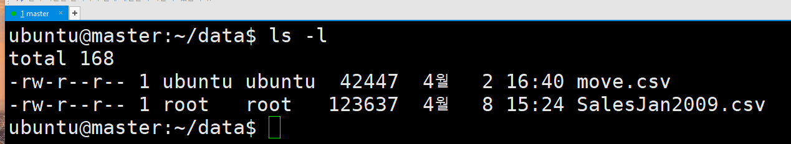
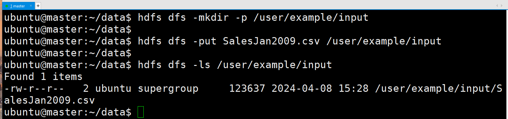

# 데이터 로드 및 스파크 실행

---
### 단계1: SalesJan2009.csv
```shell
# 파일 다운로드 
sudo wget https://raw.githubusercontent.com/good593/course_data_engineering/main/hadoop%20ecosystem/samples/7.%20Pig%20%EC%82%AC%EC%9A%A9%ED%95%98%EA%B8%B0/SalesJan2009.csv

# 파일 조회 
ls -l
```


---
### 단계2: put SalesJan2009.csv to hadoop
```shell
# 없으면, 실행 
hdfs dfs -mkdir -p /user/example/input
# put data to hadoop
hdfs dfs -put SalesJan2009.csv /user/example/input
# 조회 
hdfs dfs -ls /user/example/input
```


---
### 단계3: SparkSession
```python
import pyspark
from pyspark.sql import SparkSession
spark = SparkSession.builder.master("yarn") \
                    .appName('SparkByExamples.com') \
                    .getOrCreate()
                    
print(spark.sparkContext)
print("Spark App Name : "+ spark.sparkContext.appName)
```
---
# 문제
- 상품별 가장 많이 판매된 나라이름과 가장 적게 판매된 나라이름 조회

---
### 단계1: 데이터 로드 on pyspark
```python
df = spark.read.format("csv").option("header", True)\
    .load("/user/example/input/SalesJan2009.csv")
    
df.printSchema()
df.show(truncate=False)
```
---
### 단계2: 데이터 클린징
- 필요한 컬럼만 조회
- 빈값 제거 
```python
from pyspark.sql.functions import trim

df = df.select("Product", "Country")\
        .withColumn("Product", trim(df.Product))\
        .withColumn("Country", trim(df.Country))
        
df.printSchema()
df.show()
```
---
### 단계3: 상품별 나라별 판매수량
```python
df_groupby_count = df.groupby("Product", "Country").count()

df_groupby_count.show()
```
---
### 단계4: 상품별 Min/Max 구하기 
```python
from pyspark.sql.functions import min, max

df_product_min_max = df_groupby_count.groupby("Product")\
    .agg(
        min("count").alias("Product_min"),
        max("count").alias("Product_max")
    )
    
df_product_min_max.show()
```
---
### 단계5: Join count with min/max
```python
df_join = df_groupby_count.alias("t1")\
    .join(df_product_min_max.alias("t2")\
        , df_groupby_count.Product == df_product_min_max.Product, "left")\
    .select(col("t1.*"), col("t2.Product_min"), col("t2.Product_max"))\

df_join.show()
```
---
### 단계6: 가장 적게 판매된 나라 조회 
```python
from pyspark.sql.functions import collect_set

df_country_min = df_join.filter(
    col("count") == col("Product_min")
).select("Product", "Country")

df_country_min = df_country_min.groupBy("Product").agg(collect_set("Country")\
    .alias("Country_min"))
    
df_country_min.show(truncate=False)
```
---
### 단계7: 가장 많이 판매된 나라 조회 
```python
df_country_max = df_join.filter(
    col("count") == col("Product_max")
).select(col("Product"), col("Country").alias("Country_max"))

df_country_max.show()
```
---
### 단계8: 상품별 가장 많이 판매된 나라이름과 가장 적게 판매된 나라이름 조회
```python
df_result = df_country_min.alias("t1").join(df_country_max.alias("t2"), df_country_min.Product == df_country_max.Product , "left")\
.select("t1.Product", "t1.Country_min", "t2.Country_max")

df_result.show(truncate=False)
```


