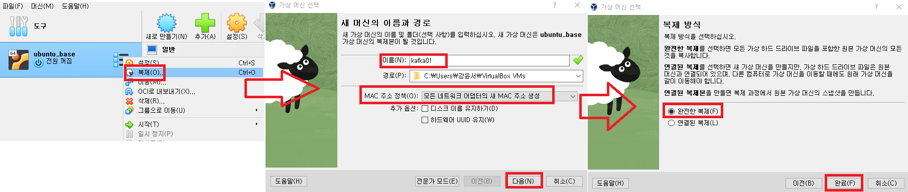
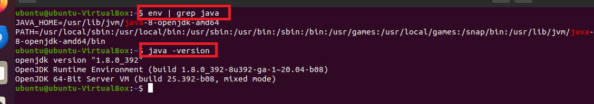
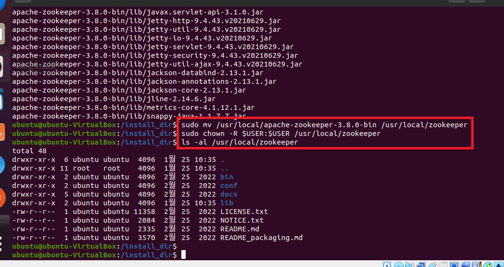
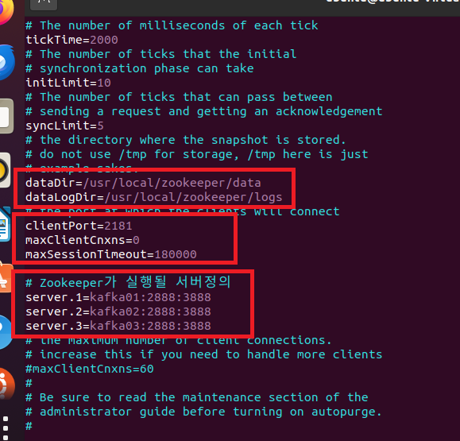
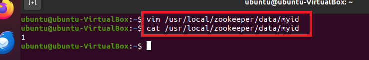

### 단계1: kafka01 인스턴스 생성 
- 이름: kafka01



---
- 네트워크: 어댑터에 브리지 


---
### 단계2: kafka01 인스턴스 시작


---
### 단계3: java 설치 확인 
```shell
# java 버전 확인 
java -version
# java 환경설정 확인 
env | grep java
```


---
### 단계4: Zookeeper 설치
```shell
# 설치 관리용 디렉토리 이동
cd /install_dir
# Zookeeper 3.8.0 설치
sudo wget https://archive.apache.org/dist/zookeeper/zookeeper-3.8.0/apache-zookeeper-3.8.0-bin.tar.gz
# Zookeeper 3.8.0 압축 해제
sudo tar -xzvf apache-zookeeper-3.8.0-bin.tar.gz -C /usr/local
# Zookeeper 디렉토리 이름 변경
sudo mv /usr/local/apache-zookeeper-3.8.0-bin /usr/local/zookeeper

# owner(소유권)를 변경 
sudo chown -R $USER:$USER /usr/local/zookeeper
# owner(소유권)이 root로 변경되었는지 확인 
ls -al /usr/local/zookeeper
```
---


---
### 단계5: Zookeeper 환경설정
```shell
sudo vim ~/.bashrc
# profile에 아래 내용 추가 
export ZOOKEEPER_HOME=/usr/local/zookeeper

# 추가된 내용 활성화 
source ~/.bashrc
# 환경변수 확인 
env | grep zookeeper
```


---
### 단계6: zoo.cfg 파일 편집
```shell
# Zookeeper 설정 경로 이동
cd $ZOOKEEPER_HOME
# Zookeeper 설정 파일 복사
cp ./conf/zoo_sample.cfg ./conf/zoo.cfg 

# zoo.cfg 편집
vim ./conf/zoo.cfg

# 아래 내용 수정 후 저장
tickTime=2000
initLimit=10
syncLimit=5
dataDir=/usr/local/zookeeper/data
dataLogDir=/usr/local/zookeeper/logs
clientPort=2181
maxClientCnxns=0
maxSessionTimeout=180000
# Zookeeper가 실행될 서버정의
server.1=kafka01:2888:3888
server.2=kafka02:2888:3888
server.3=kafka03:2888:3888
```


---
### 단계7: data, logs 디렉토리 추가 
```shell
mkdir -p /usr/local/zookeeper/data
mkdir -p /usr/local/zookeeper/logs

ls -al
```


---
### 단계8: myid 설정
```shell
# myid 파일 편집
vim /usr/local/zookeeper/data/myid
# 아래 내용 수정 후 저장
1

cat /usr/local/zookeeper/data/myid
```



