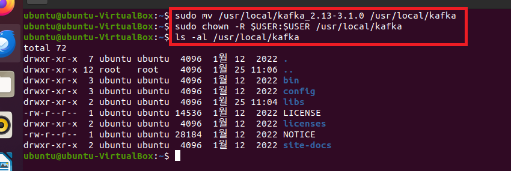
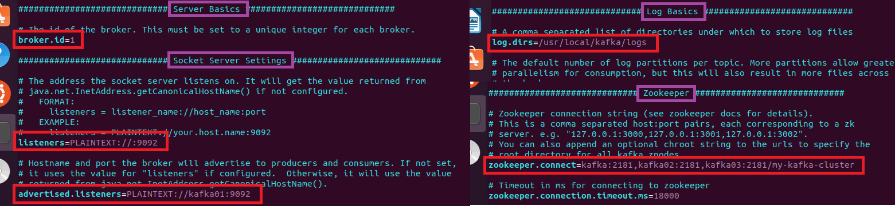
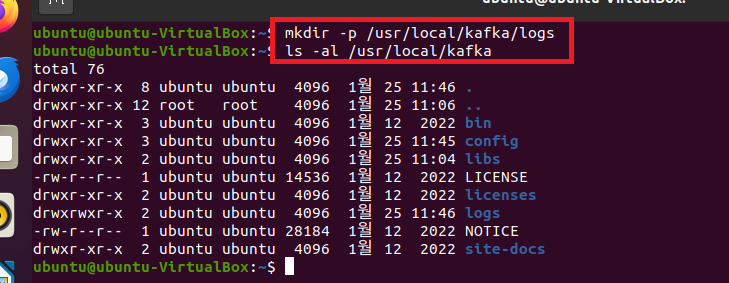

### 단계1: kafka 설치 
```shell
cd /install_dir
sudo wget https://archive.apache.org/dist/kafka/3.1.0/kafka_2.13-3.1.0.tgz
sudo tar -xzvf kafka_2.13-3.1.0.tgz -C /usr/local

sudo mv /usr/local/kafka_2.13-3.1.0 /usr/local/kafka
sudo chown -R $USER:$USER /usr/local/kafka
ls -al /usr/local/kafka
```


---
### 단계2: kafka 환경설정
```shell
sudo vim ~/.bashrc
# profile에 아래 내용 추가 
export KAFKA_HOME=/usr/local/kafka
# 카프카가 사용될때 사용되는 메모리 정의 
## -Xmx512m: 최대 512 / -Xms512m: 최소 512
export KAFKA_HEAP_OPTS="-Xmx512m -Xms512m"

# 추가된 내용 활성화 
source ~/.bashrc
# 환경변수 확인 
env | grep KAFKA
```


---
### 단계3: server.properties
```shell
cd $KAFKA_HOME/config
vim server.properties

# 아래내용 수정 
# zookeeper의 myid와 동일하게 설정 
broker.id=1 # 기존 0을 1로 수정 

# listeners: kafka 내부 통신용
listeners=PLAINTEXT://:9092 # 주석제거 
# advertiesd.listeners: kafka의 브로커 host
advertised.listeners=PLAINTEXT://kafka01:9092

# logs 디렉토리 설정 
log.dirs=/usr/local/kafka/logs

# kafka의 브로커가 바라보고 있는 모든 zookeeper host들 
zookeeper.connect=kafka01:2181,kafka02:2181,kafka03:2181/my-kafka-cluster
```
---


---
### 단계4: logs 디렉토리 생성  
```shell
mkdir -p /usr/local/kafka/logs
ls -al /usr/local/kafka
```



