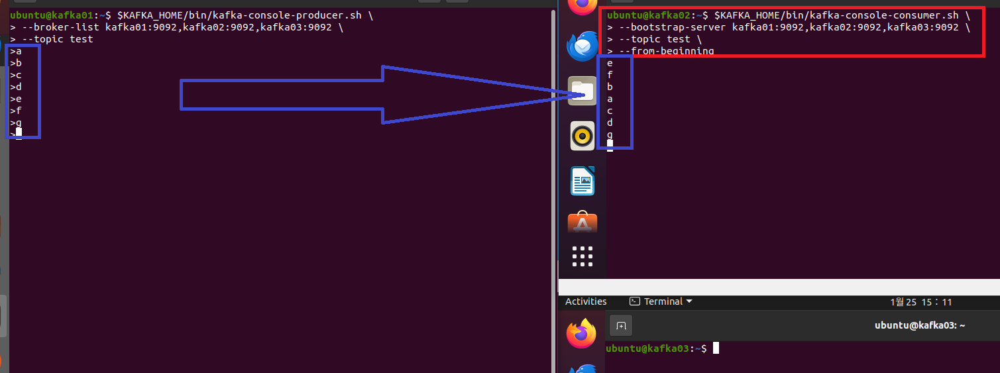
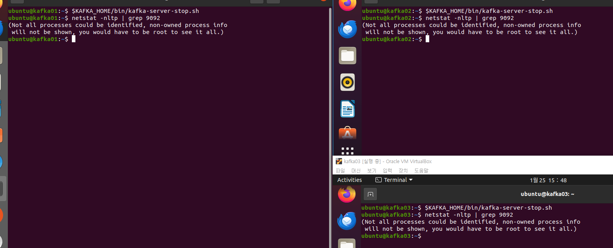

### 단계1: topics 생성
- `bootstrap-server`: broker server
- `partitions`: 크기만큼 데이터를 분할 
- `replication-factor`: 크기만큼 데이터 복제 
- `topic`: 토픽 이름 
```shell
$KAFKA_HOME/bin/kafka-topics.sh --create \
--bootstrap-server kafka01:9092,kafka02:9092,kafka03:9092 \
--partitions 3 \
--replication-factor 2 \
--topic test
```
---


---
### 단계2: log 확인 
- 총 6개 로그 생성: 3(partitions) x 2(replication)
```shell
cd $KAFKA_HOME/logs
ls
```


---
### 단계3: producer
```shell
$KAFKA_HOME/bin/kafka-console-producer.sh \
--broker-list kafka01:9092,kafka02:9092,kafka03:9092 \
--topic test
# 이후부터는 메세지등록 
a
b
c
d
e
f
g
```
---


---
### 단계4: consumer 
```shell
$KAFKA_HOME/bin/kafka-console-consumer.sh \
--bootstrap-server kafka01:9092,kafka02:9092,kafka03:9092 \
--topic test \
--from-beginning
# 이후 입려된 메세지확인(순서는 보장되지 않음) 
```
---


---
### 단계5: partition
- `partition`: 입력된 번호의 파티션 데이터 확인 
```shell
$KAFKA_HOME/bin/kafka-console-consumer.sh \
--bootstrap-server kafka01:9092,kafka02:9092,kafka03:9092 \
--topic test \
--partition 0 \
--from-beginning
```
---
- 각 파디션마다 등록된 데이터가 다름 
- 따라서 데이터의 순서를 보장할 수 없음 


---
### 단계6: 순서를 보장받을 수 있는 예제 
- partition을 1개만 지정함
- 다만, 그런경우 kafka의 분산처리 기능을 사용할 수 없음 
- 데이터의 유실을 막기위해 복제본(replication-factor)을 여러개 정의해야 함 

---
- topic 생성 
```shell
$KAFKA_HOME/bin/kafka-topics.sh --create \
--bootstrap-server kafka01:9092,kafka02:9092,kafka03:9092 \
--partitions 1 \
--replication-factor 2 \
--topic partitiontest
```
---


---
- producer
```shell
$KAFKA_HOME/bin/kafka-console-producer.sh \
--broker-list kafka01:9092,kafka02:9092,kafka03:9092 \
--topic partitiontest
# 이후부터는 메세지등록 
1
2
3
4
5
```
- consumer 
```shell
$KAFKA_HOME/bin/kafka-console-consumer.sh \
--bootstrap-server kafka01:9092,kafka02:9092,kafka03:9092 \
--topic partitiontest \
--from-beginning
```
---


---
### 단계7: kafka 중지  
```shell
$KAFKA_HOME/bin/kafka-server-stop.sh
# 확인 
netstat -nltp | grep 9092
```


---
### 단계8: zookeeper 중지 
```shell
$ZOOKEEPER_HOME/bin/zkServer.sh stop
# 확인 
$ZOOKEEPER_HOME/bin/zkServer.sh status
```


