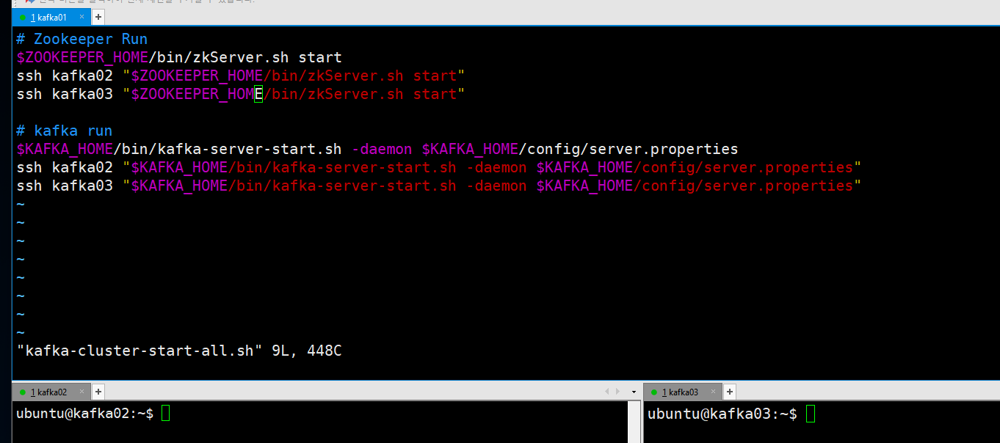
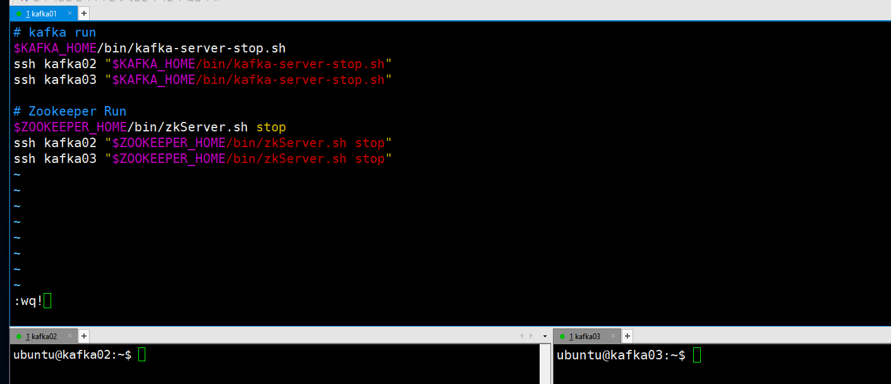
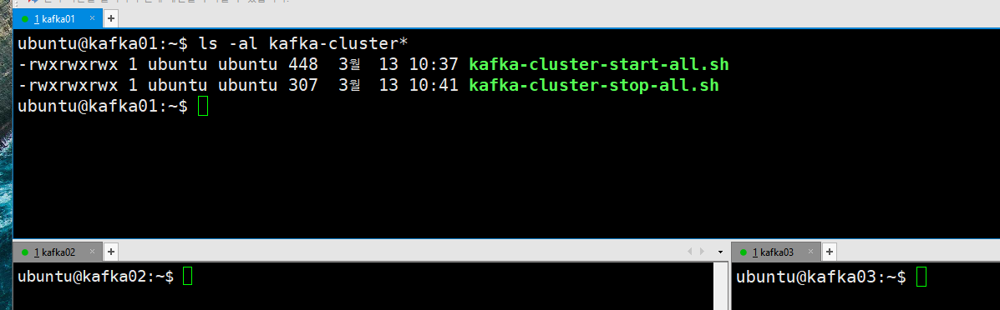
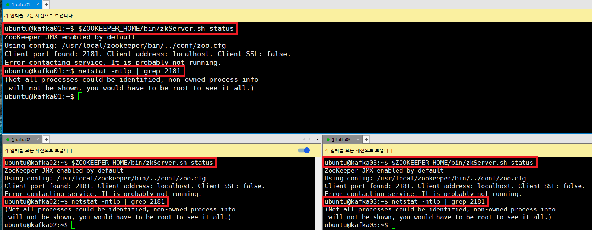
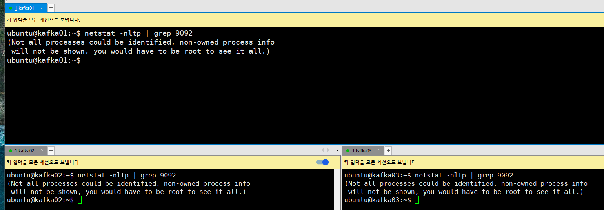

### 단계1: kafka01 > kafka-cluster-start-all.sh
```shell
# home 디렉토리로 이동
cd ~ 

# 쉘 스크립트 편집
vim kafka-cluster-start-all.sh

# 아래 내용 추가 후 저장
# Zookeeper Run
$ZOOKEEPER_HOME/bin/zkServer.sh start
ssh kafka02 "$ZOOKEEPER_HOME/bin/zkServer.sh start"
ssh kafka03 "$ZOOKEEPER_HOME/bin/zkServer.sh start"

# kafka run
$KAFKA_HOME/bin/kafka-server-start.sh -daemon $KAFKA_HOME/config/server.properties
ssh kafka02 "$KAFKA_HOME/bin/kafka-server-start.sh -daemon $KAFKA_HOME/config/server.properties"
ssh kafka03 "$KAFKA_HOME/bin/kafka-server-start.sh -daemon $KAFKA_HOME/config/server.properties"

```
---


---
### 단계2: kafka01 > kafka-cluster-stop-all.sh
```shell
# home 디렉토리로 이동
cd ~ 

# 쉘 스크립트 편집
vim kafka-cluster-stop-all.sh

# 아래 내용 추가 후 저장
# kafka run
$KAFKA_HOME/bin/kafka-server-stop.sh
ssh kafka02 "$KAFKA_HOME/bin/kafka-server-stop.sh"
ssh kafka03 "$KAFKA_HOME/bin/kafka-server-stop.sh"

# Zookeeper Run
$ZOOKEEPER_HOME/bin/zkServer.sh stop
ssh kafka02 "$ZOOKEEPER_HOME/bin/zkServer.sh stop"
ssh kafka03 "$ZOOKEEPER_HOME/bin/zkServer.sh stop"

```
---


---
### 단계3: kafka01 > 쉡 스크립트 접근 권한 설정
```shell
# 쉡 스크립트 접근 권한 설정
sudo chmod 777 kafka-cluster-start-all.sh
sudo chmod 777 kafka-cluster-stop-all.sh

# 확인 
ls -al kafka-cluster*
```


---
### 단계4: kafka-cluster-start-all.sh 실행 
```shell
. kafka-cluster-start-all.sh
```


---
- zookeeper 확인 
```shell
# 확인 
$ZOOKEEPER_HOME/bin/zkServer.sh status
# port 확인
netstat -ntlp | grep 2181
```


---
- kafka 확인 
```shell
# 확인 
netstat -nltp | grep 9092
```


---
### 단계5: kafka-cluster-stop-all.sh 실행 
```shell
. kafka-cluster-stop-all.sh
```


---
- zookeeper 확인 
```shell
# 확인 
$ZOOKEEPER_HOME/bin/zkServer.sh status
# port 확인
netstat -ntlp | grep 2181
```


---
- kafka 확인 
```shell
# 확인 
netstat -nltp | grep 9092
```


