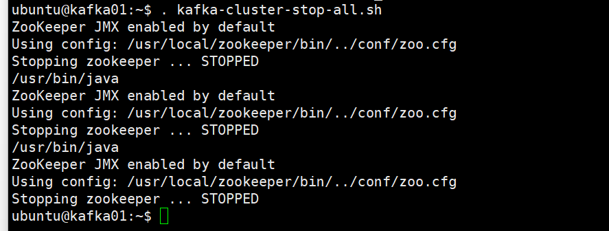

### 단계1: install kafka-python
```shell 
sudo apt-get install -y python3-pip
pip3 install kafka-python
```


---
### 단계2: kafka-cluster-start-all.sh
```shell
. kafka-cluster-start-all.sh
```


---
- 확인 
```shell
# zookeeper
netstat -ntlp | grep 2181
# kafka
netstat -nltp | grep 9092
```


---
### 단계3: topics 생성
```shell
$KAFKA_HOME/bin/kafka-topics.sh --create \
--bootstrap-server kafka01:9092,kafka02:9092,kafka03:9092 \
--partitions 1 \
--replication-factor 1 \
--topic employees
```


---
### 단계4: kafka_producer.py
```shell
# kafka_producer.py 파일 참고
vim kafka_producer.py
```
### 단계5: kafka_consumer.py
```shell
# kafka_consumer.py 파일 참고
vim kafka_consumer.py
# 확인 
la -al kafka*
```


---
### 단계6: 실행
- consumer 먼저 실행 
```shell
python3 kafka_consumer.py
```
- producer 이후에 실행 
```shell
python3 kafka_producer.py
```


---
### 단계7: kafka-cluster-stop-all.sh
```shell
. kafka-cluster-stop-all.sh
```


---
# 참고문서들 
- https://developer.confluent.io/get-started/python/#build-consumer
- https://towardsdatascience.com/getting-started-with-apache-kafka-in-python-604b3250aa05
- https://ioflood.com/blog/python-kafka/
- https://velog.io/@qlgks1/%EC%B9%B4%ED%94%84%EC%B9%B4-%ED%81%B4%EB%9F%AC%EC%8A%A4%ED%84%B0%EC%99%80-%ED%8C%8C%EC%9D%B4%EC%8D%AC#2-python--kafka-cluster
- https://kafkaide.com/learn/how-to-start-using-apache-kafka-in-python/
