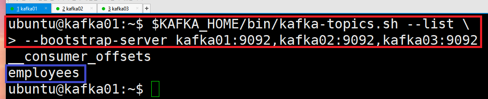
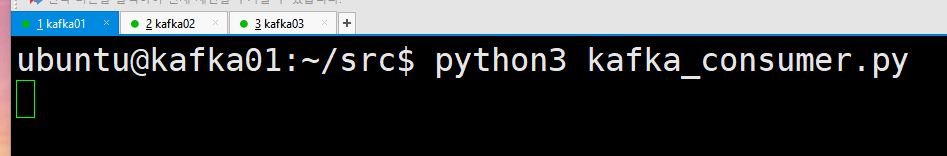
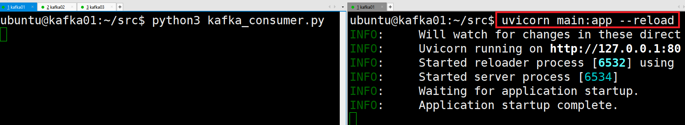
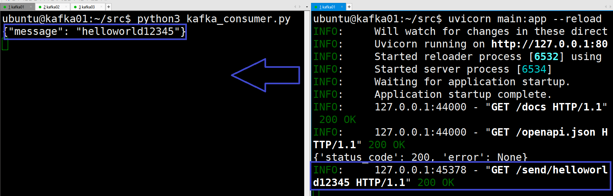

# [FastAPI](https://fastapi.tiangolo.com/ko/)
- FastAPI는 Python을 기반으로 개발된 현대적이고 빠른 웹 프레임워크로, 특히 API 개발에 초점을 맞추어 설계되었고 높은 성능과 직관적인 문법을 제공합니다.

---
### 단계1: FastAPI 설치 
```shell
# fastapi 설치 
pip install fastapi
# ASGI 서버 설치 
pip install "uvicorn[standard]"

# 화인
uvicorn --version
```


---
### 단계2: kafka-cluster-start-all.sh
```shell
. kafka-cluster-start-all.sh
```


---
- 확인 
```shell
# zookeeper
netstat -ntlp | grep 2181
# kafka
netstat -nltp | grep 9092
```


---
### 단계3: 토픽 확인 > employees
```shell
$KAFKA_HOME/bin/kafka-topics.sh --list \
--bootstrap-server kafka01:9092,kafka02:9092,kafka03:9092
```


---
### 단계4: kafka_consumer.py & kafka_producer.py 파일 확인 


---
### 단계5: main.py
```shell
# main.py 파일 참고
vim main.py
```


---
### 단계6: consumer 먼저 실행
```shell
python3 kafka_consumer.py
```


---
### 단계7: fastapi server 실행 
```shell
uvicorn main:app --reload
```


---
### 단계8: [Swagger UI](https://swagger.io/tools/swagger-ui/) 접속 
- Swagger UI란 개발자가 REST 웹 서비스를 설계, 빌드, 문서화, 소비하는 일을 도와주는 대형 도구 생태계의 지원을 받는 오픈 소스 소프트웨어 프레임워크이다.
- http://127.0.0.1:8000/docs


---
### 단계9: Test


---
### 단계10: Test 결과 확인 



