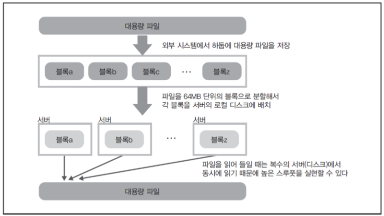

# [Hadoop](https://sodayeong.tistory.com/29)
- 하둡(Hadoop)이란 고가용성 분산형 객체 지향적 플랫폼(High Availability Distributed Object Oriented Platform)을 뜻합니다. 
- 하둡 기술은 바로 이런 장점을 개발자에게 제공합니다. 즉, 객체 지향적 작업을 병렬 분산하여 고가용성을 확보할 수 있습니다.

---
## 하둡 특성
1. 대용량 데이터 처리를 위한 병렬 분산 처리 소프트 웨어

---
2. 병렬 분산 처리 문제를 자동적으로 해결

---
3. 대규모 데이터를 처리하기 위한 구조

---

---
## 하둡의 구성 
`분산저장 → 분산처리`
- 하둡 파일 시스템(HDFS)을 이용해서 파일을 적당한 블록 사이즈(64MDD)로 나눠서 각 노드 클러스터(각각의 개별 컴퓨터)에 저장
- 데이터 유실의 위험이나 사람들이 많은 접근(Access)할 때 부하처리를 위해 각 블럭의 복사본(Replication)을 만들어 저장

`분산처리 → 병렬처리`
- MapReduce라는 프레임워크를 이용해서 계산
- 맵리듀스라는 프레임 워크는 Map(데이터처리)+Reduce(결과반환)라는 두 가지 형식으로 나누어짐
- Map 함수에서 데이터를 처리하고 Reduce 함수에서 원하는 결과값을 계산

---
## RDBMS vs Hadoop
- 정형 데이터 → RDBMS 저장 (RDBMS는 라이선스 비용이 비쌈)
→ RDBMS: 데이터가 저장된 서버에서 데이터를 처리하게 됨

- 비정형 데이터(사이즈가 큼) → Hadoop 저장
→ 하둡: 여러대의 서버에 데이터를 저장하고, 데이터가 저장된 각 서버에서 동시에 데이터 처리

---
# [하둡 코어 모듈](./hadoop_core.md)

---
# [하둡 아키텍처](./hadoop_architecture.md)

---
# [Hadoop 사용 사례](https://www.databricks.com/kr/glossary/hadoop) 
## 리테일 
규모가 큰 기업은 그 어느 때보다도 많은 고객 데이터를 손에 쥐고 있습니다. 하지만 표면적으로는 서로 관계가 없는 듯한 방대한 데이터 속에서 상관 관계를 찾아내기 어려운 경우가 많습니다. 영국 리테일러 M&S는 하둡 기반 Cloudera Enterprise를 배포하고 나서, 결과에 감탄했습니다.

Cloudera는 데이터를 관리하고 처리하는 데 하둡 기반 지원과 서비스를 사용합니다. M&S는 클라우드 기반 플랫폼을 구현하고 얼마 지나지 않아 데이터를 성공적으로 활용하면서도 예측 분석 성능이 훨씬 향상되었다는 것을 느꼈습니다.

웨어하우스 사용 효율이 향상되었고 수요가 "갑자기" 폭증했을 때 따라가지 못하는 현상을 줄여 시장 경쟁에서 엄청난 우위를 얻었습니다.

---
## Finance
하둡은 아마도 그 어떤 시스템보다도 금융 부문에 적합할 것입니다. 하둡 소프트웨어 프레임워크가 나온 지 얼마되지 않았던 초기에 위험 모델링과 관련된 고급 알고리즘을 처리하는 용도로 주로 사용되었습니다. 바로 이런 위험 관리만 있었더라면 2008년에 경기 침체로까지 이어진 신용 스왑 위기를 피하는 데 도움이 되었을 것입니다.

은행도 이 같은 원리가 고객 포트폴리오의 위험 관리에도 적용된다는 것을 깨달았습니다. 요즘에는 금융 기관이 금융 보안 관리와 고객 자산 성과를 개선할 목적으로 하둡을 구현하는 사례를 흔히 볼 수 있습니다. JPMorgan Chase도 하둡을 사용하여 전 세계에서 폭발적으로 증가하는 고객 데이터를 관리하는 금융 대기업 중 하나입니다.

---
## 의료 서비스 
국가에서 운영하든, 민간에서 운영하든, 규모와 관계없이 모든 의료 기관은 방대한 데이터와 고객 정보를 처리해야 합니다. 하둡 프레임워크를 사용하면 의사, 간호사, 간병인이 필요할 때 정보에 쉽게 액세스할 수 있고, 실천 가능한 인사이트를 제공하는 데이터를 쉽게 집계할 수도 있습니다. 이는 공공 보건, 진단 및 치료 개선 등에 적용할 수 있습니다.

학계 및 연구 기관에서도 하둡 프레임워크를 사용해서 연구 활동을 촉진합니다. 암을 비롯한 유전 질환 분야를 예로 들어보겠습니다. 인간 유전체의 지도가 밝혀졌는데, 모두 합치면 30억에 가까운 염기쌍이 존재합니다. 이론적으로는 그 어떤 질병이든 치료할 수 있는 모든 것이 우리 눈앞에 펼쳐져 있습니다.

하지만 복잡한 관계를 파악하기 위해서는 하둡과 같은 시스템이 있어야 대량의 정보를 처리할 수 있습니다.

---
## 보안 및 법 집행 
하둡은 국가 및 지역 보안의 효과를 향상하는 데도 도움이 됩니다. 여러 지역에서 발생하는 관련 범죄를 해결하려는 경우, 하둡 프레임워크로 두 개의 관계가 없는 듯한 사건을 연결하여 법 집행 기관의 절차를 간소화할 수 있습니다. 사건을 연결하는 데 걸리는 시간이 줄어들었기 때문에 법 집행 기관에서는 최대한 빠른 시일 내에 다른 기관과 국민에게 경고를 보낼 수 있습니다.

2013년에 미국 국가 보안국(NSA)에서는 오픈 소스 하둡 소프트웨어가 그동안 자신들이 사용했던 값비싼 솔루션보다 우수하다는 결론을 내렸습니다. 지금은 하둡 프레임워크를 사용해서 테러, 사이버 범죄 등의 위협을 탐지하는 데 도움을 받습니다.

---
# 하둡 이론 참고 문서 
- https://velog.io/@ha0kim/2021-03-02
- https://www.databricks.com/kr/glossary/hadoop
- https://wikidocs.net/22654
- https://han-py.tistory.com/361
- https://dataonair.or.kr/db-tech-reference/d-lounge/technical-data/?mod=document&uid=236860
- https://warm-uk.tistory.com/56
- https://sodayeong.tistory.com/29
- https://mangkyu.tistory.com/129
- https://dydwnsekd.tistory.com/3
