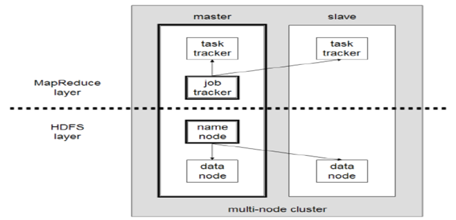
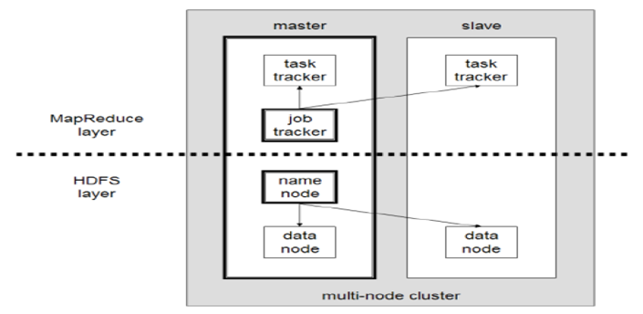

# [하둡 아키텍처](https://velog.io/@ha0kim/2021-03-02)

---
- `HDFS`의 경우 마스터를 네임노드라 부르고 슬레이브를 데이터노드라고 한다.
- `MapReduce`의 경우 마스터를 리소스매니저라고 부르고 슬레이브를 노드매니저라고 부른다.
- `MapReduce`프로그램을 실행하면 리소스매니저가 노드매니저에 일을 나눠주어 병렬로 실행하는 형태로 진행한다.
- `MapReduce`프로그램은 처리할 입력데이터를 `HDFS`에서 읽어들이고 처리된 데이터를 다시 `HDFS`에 출력한다.
- `HDFS`자체는 혼자서 독립적으로 분산파일시스템으로 쓰일 수 있지만 `MapReduce`프레임워크는 HDFS를 데이터 읽기/쓰기를 위해 필요하다.

---
# [하둡 세부 구조](https://mangkyu.tistory.com/129)

---
## Multi Layer 구조 
Hadoop에서 수행하는 역할은 크게 HDFS에 파일을 저장하는 역할과 데이터를 처리하는 역할로 나누어진다. 그리고 이에 맞게 Layer가 다음과 같이 나누어 설계되었다.

---
- MapReduce Layer: MapReduce를 수행하기 위한 Layer
    - Job Tracker: 사용자로부터 Job을 요청 받고 Task Tracker에 작업 할당
    - Task Tracker: Job Tracker로부터 할당 받은 작업을 Map-Reduce하여 결과 반환
- HDFS Layer: 파일을 저장하기 위한 Layer
    - Name Node: 작업을 해야 하는 파일을 Block으로 나누어 Data Node에 전달
    - Data Node: 전달받은 파일의 읽기/쓰기 등을 실제로 수행

---
## Master Slave 구조 
Hadoop은 기본적으로 Master-Slave 구조를 지니며, Master 노드는 1대의 노드로 구성된다.

---
- Master Node: DFS(Distrbuted File System, 분산 파일 시스템)에 대한 정보들을 지니고 있으며, 자원 할당을 조절한다. Master Node는 2가지 Daemon을 통해 이를 처리한다.
    - Name Node: DFS를 관리하고, 어떤 Data Block이 클러스터에 저장되어 있는지 알려준다.
    - Resource Manager: 스케줄링 및 Slave Node의 처리를 실행한다.
- Slave Node는 실제 데이터를 가지고 있으며, job을 수행하는데 Data Node와 Node Manager를 통해 이를 처리한다.
    - Data Node: NameNode에 물리적으로 저장된 실제 데이터를 관리한다.
    - NodeManager: 노드의 Task를 실행한다.

