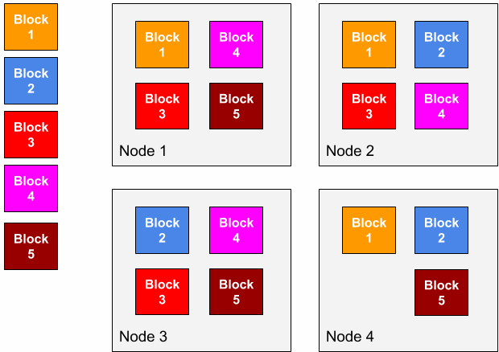
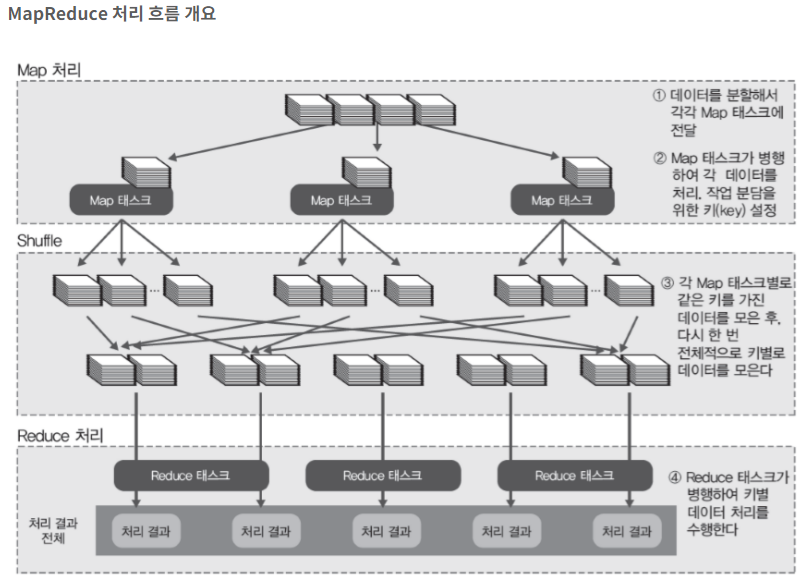

# [하둡 코어 모듈](https://www.databricks.com/kr/glossary/hadoop) 

- 하둡 코어 모듈에는 총 4가지가 있지만, 그 중에서 가장 중요한 것은 HDFS(분산파일시스템)와 MapReduce(분산처리시스템)이다. 
- 즉 HDFS는 데이터 저장을 MapReduce는 데이터 처리를 담당한다고 생각하면 된다. 

---
- `HDFS(Hadoop Distributed File System)`: HDFS는 Java 기반 시스템의 일종으로, 클러스터 내 여러 노드에 걸쳐 대규모 데이터 세트를 내결함성 있는 방식으로 저장할 수 있게 해줍니다.
- `MapReduce`: MapReduce는 프로그래밍 모델 겸 대규모 데이터 세트의 병렬식 처리를 위해 쓰이는 빅데이터 처리 엔진입니다. 
- `YARN(Yet Another Resource Negotiator)`: YARN은 클러스터 리소스 관리, 작업 계획, 그리고 하둡에서 실행되는 작업 예약에 쓰입니다.
- `Hadoop Common`: Hadoop Common은 다른 Hadoop 모듈을 지원하는 여러 라이브러리와 유틸리티를 총망라한 일련의 서비스를 제공합니다.

---
## [HDFS(Hadoop Distributed File System)](https://wikidocs.net/23582)
- 네임노드
    - 네임노드의 역할은 메타데이터 관리와 데이터노드의 관리이다.
- 데이터노드
    - 데이타노드는 파일을 저장하는 역할을 합니다. 파일은 블록단위로 저장됩니다. 

---
- 파일 일기
    - 네임노드에 파일이 보관된 블록 위치 요청 
    - 네임노드가 블록 위치 반환 
    - 각 데이터 노드에 파일 블록을 요청 

---
- 파일 쓰기 
    - 네임노드에 파일 정보를 전송하고, 파일의 블록을 써야할 노드 목록 요청 
    - 네임노드가 파일을 저장할 목록 반환 
    - 데이터 노드에 파일 쓰기 요청 

---
### [파일 블럭](https://mangkyu.tistory.com/129)
- Hadoop은 파일을 Block(블록)이라는 단위로 나누어 관리하는데, 1개의 파일은 여러 개의 블록으로 나뉘어 여러 Node에 Replication(복제)된다.

이러한 이유는 노드의 Failure를 극복하기 위함인데, 예를 들어 1번 Node에만 Block 1이 저장되었다고 할 때, Node1이 고장나면 Node1에 저장된 Block1을 구할 수 없다. 
- 하지만 Block1을 Node2에도 복제하면 Node1이 작동하지 않을 때에도 Node2로부터 Block1에 대한 정보를 얻을 수 있다. 
- 이러한 Node Failure에 대응하기 위해 Hadoop은 하나의 블록을 여러 개의 Node에 복제하고 있다. 

---
- Block의 저장은 NameNode와 DataNode에 의해 처리되는데, NameNode가 저장할 Block을 특정 Node에 저장하라고 명령을 전달하면, 노드의 DataNode는 전달 받은 블록을 자신의 Node에 저장한다.

---
## [맵리듀스(MapReduce)](https://sodayeong.tistory.com/29)
흩어져있는 데이터를 수직화하여 그 데이터를 각각의 종류별로 모으고(Map) -> 필터링과 sorting을 거쳐 데이터를 뽑아내는(Reduce) 분산처리 기술과 관련 프레임워크를 의미한다.

- 맵(Map)
    - 흩어져 있는 데이터를 연관성 있는 데이터들로 분류하는 작업. (key, value의 형태)
- 리듀스(Reduce)
    - Map에서 출력된 데이터에서 중복 데이터를 제거하고 원하는 데이터를 추출하는 작업

---

---
### [맴리듀스 처리예시](https://mangkyu.tistory.com/129)
예를 들어 위와 같은 텍스트 파일에서 단어의 개수를 count하는 문제(WordCount)를 해결한다고 할 때, 해당 과정은 아래의 순서로 수행된다. 

---
1. 단어의 개수를 세기 위한 텍스트 파일들을 HDFS에 업로드하고, 각각의 파일은 블록단위로 나누어 저장된다.
2. 순차적으로 블록을 입력으로 받는데, Spitting 과정을 통해 블록 안의 텍스트 파일을 한 줄로 분할한다.
3. line을 공백 기준으로 분리하고, Map(line_num, line) 연산을 통해 (vocabulary, 1개)의 리스트를 반환한다.
4. Shuffling 과정을 통해 연관성있는 데이터들끼리 모아 정렬한다.
5. Reduce(단어, 개수)를 수행하여 각 블록에서 특정 단어가 몇번 나왔는지를 계산한다.
6. 이후에 결과를 합산하여 HDFS에 파일로 결과를 저장한다.
