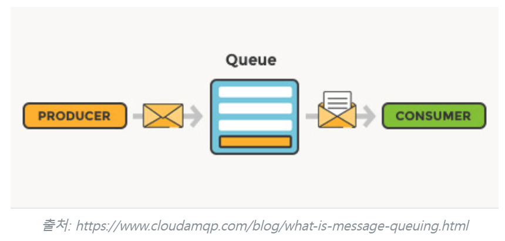
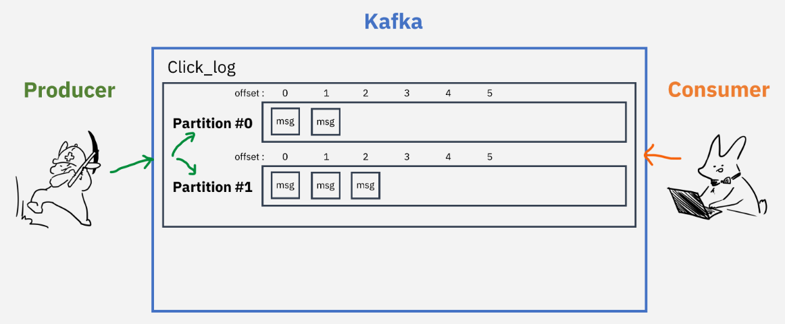
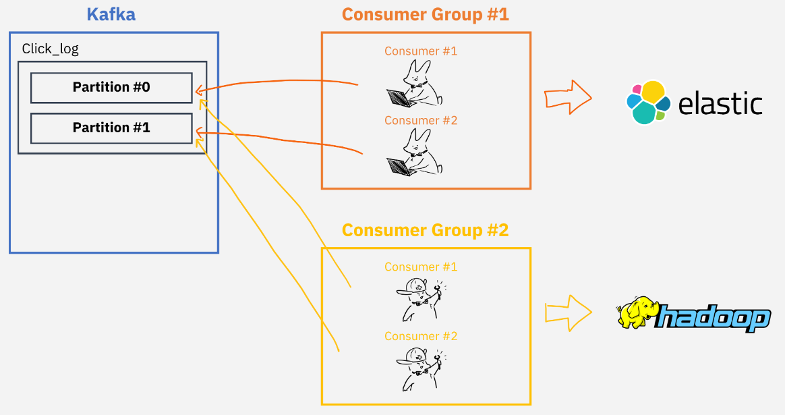

# [카프카는 무엇이고, 왜 사용하는 것 일까?](https://hudi.blog/what-is-kafka/)
## 메시지 큐
- 메시지 큐는 분산화된 환경에서 발신자와 수신자 사이에서 메시지를 전송하고, 수신하는 기술을 의미한다.

---
### 메시지큐를 사용하는 이유 
- 메시지 큐를 사용하면 발신자와 수신자가 서로를 직접 알 필요 없으므로 느슨한 결합(decoupling)을 만들어낼 수 있다.
- 발신자, 수신자 서로가 서로에게 의존하지 않으므로, 각자는 독립적으로 확장(scalable)될 수 있다.
- 수신자 서비스가 당장 장애 상황이더라도 발행된 메시지는 모두 메시지 큐에 남아있으므로 결국 발신자가 발생한 모든 메시지는 소비자 서비스에게 전달된다는 보장성(guarantees)를 갖는다.
- 메시지 큐를 사용하면 비동기 통신(asynchronous)을 구현할 수 있다.

---
## 카프카 
- 카프카는 높은 확장성과 내결함성, 대용량 데이터 처리, 실시간 데이터 처리에 특화되어 있는 오픈소스 메시징 시스템이다.
- 카프카는 링크드인에서 최초로 개발되었으며, 현재는 아파치 재단에서 오픈소스로 관리하고 있다. 

---
- 아래 그림은 카프카가 등장하기 이전의 링크드인의 아키텍처이다. 
- 각 서비스 혹은 데이터 저장소가 End-To-End 로 연결되어 아주 복잡한 구조를 가지고 있다. 
- 이런 구조는 시스템을 확장하기 어려운 구조이다.

---
- 카프카가 등장한 이후의 아키텍처이다. 
- 모든 이벤트와 데이터의 흐름이 카프카를 중심으로 모이고 퍼진다. 
- 이벤트/데이터가 발생했다면 발생 주체가 카프카로 해당 이벤트/데이터를 전달한다. 
- 그리고 해당 이벤트/데이터가 필요한 곳에서 직접 가져다 사용한다.

---
### 카프카 특징 
- `높은 처리량과 낮은 지연시간`: 카프카는 대용량 데이터를 실시간으로 처리할 수 있도록 설계되었다.
- `메시지 내구성`: 카프카의 메시지는 메모리가 아닌 디스크에 영구적으로 저장된다. 
- `분산 아키텍처`: 카프카 클러스터 내부에 여러대의 브로커 서버를 구성하여 높은 확장성(scalability)과 내결함성(fault tolerance)을 갖는다.
- `Pull 기반 메시지 소비`: 카프카는 컨슈머가 능동적으로 브로커로부터 메시지를 가져오는 Pull 방식을 취했다. 

---
### 카프카 아키텍처

---
# [Kafka 기본구성](https://gruuuuu.github.io/integration/kafka-concept/)
### Topic
- Kafka에 전달되는 메세지 스트림의 추상화된 개념을 Topic이라고 부릅니다.
- 이벤트를 만들어내는 Producer가 어떤 Topic에 데이터를 적재할건지, Consumer는 어떤 Topic에서 데이터를 읽을건지(구독할건지) 정하게 됩니다.
- Topic은 여러개 생성할 수 있으며, 각각의 메세지를 목적에 맞게 구분할 때 사용합니다.

---
### Partition
- 각 Topic은 내부에 더 세분화된 단위인 Partition을 가지고 있습니다.
- 메세지가 들어오면 순차적으로 추가되며, Consumer가 메세지를 읽을 때에는 Queue의 선입선출(FIFO)과 비슷하게 오래된 메세지부터 읽게됨
- Queue와 다른 점은 레코드를 읽어도 사라지지 않는다는 점

---
Topic은 하나 이상의 Partition을 가질 수 있는데, 여러개의 Partition을 가지고 있는 경우를 생각해보겠습니다.
- 데이터를 적재할 시, 키값을 지정해주어 특정 Partition에만 데이터 적재 가능
- 키값을 지정해주지 않았을 경우, Round-robin방식으로 데이터 적재
- Partition을 늘리는 것은 가능하지만 줄일수는 없음 (없애려면 Topic 전체를 삭제)

---
### Broker
- Broker는 Kafka가 설치되어있는 서버의 단위입니다.
- 원본은 leader partition, 복제본은 follower partition으로 부르며 이를 합쳐서 ISR(In Sync Replica)라고 부름

---
### Producer
Producer는 데이터를 만들어내고 Kafka Topic에 데이터를 적재시키는 주체입니다.
- 특정 Topic으로 데이터를 publish
- kafka broker로 데이터를 전송할때 성공여부를 알려주고, 실패하면 재시도 가능
### Consumer
- Consumer는 Kafka Topic에서 데이터를 읽어오는 주체입니다.

