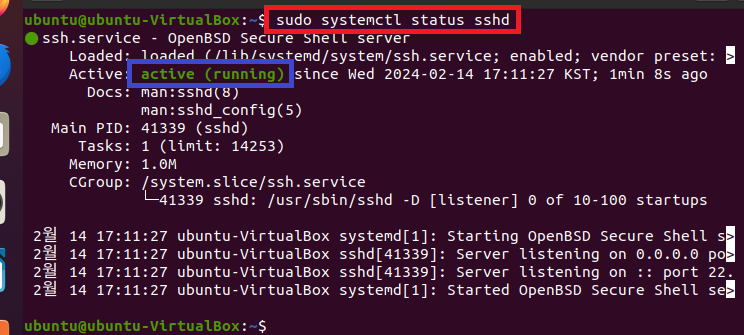
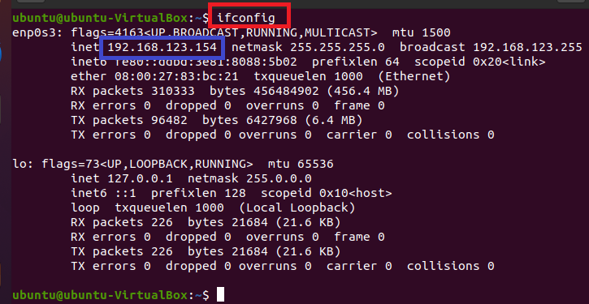
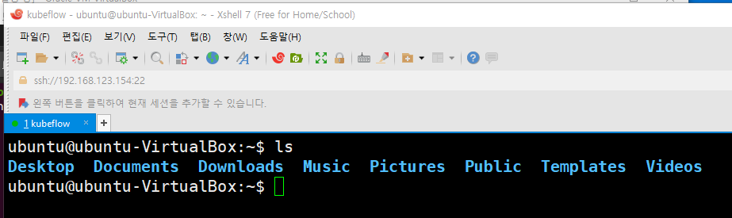

### 단계1: 인스턴스 생성 
- [추천사양](https://v0-3.kubeflow.org/docs/started/getting-started-minikube/)
- 강의사양
    - CPU: 6 core / RAM: 12288 GB
    - DISK: 최소 100 GB / 추천 150GB


---
### 단계2: 네트워크 > 어댑터에 브리지


---
### 단계3: update & install
```shell
sudo apt-get -y update
sudo apt-get -y upgrade
sudo apt-get -y dist-upgrade
sudo apt-get install -y vim wget unzip ssh openssh-* net-tools socat git
```

---
### 단계4: ssh start 
- xshell과 연결하기 위해서 실행 
```shell
sudo service ssh start
sudo systemctl status sshd
```


---
### 단계5: ifconfig
- ip: 192.168.123.154
```shell
ifconfig
```


---
### 단계6: Xshell 접속 



