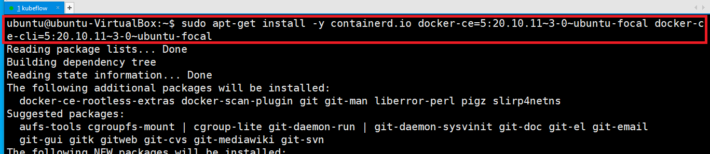
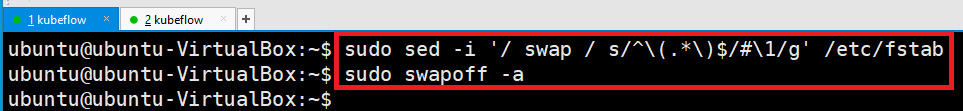
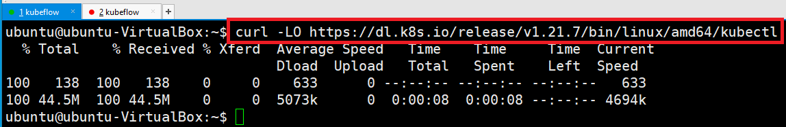

# Install Docker

---
### 단계1: 도커 설치에 필요한 APT 패키지들을 설치
```shell
sudo apt-get update && sudo apt-get install -y ca-certificates curl gnupg lsb-release
```
### 단계2: 도커의 공식 GPG key를 추가
```shell
curl -fsSL https://download.docker.com/linux/ubuntu/gpg | sudo gpg --dearmor -o /usr/share/keyrings/docker-archive-keyring.gpg
```
### 단계3: apt 패키지 매니저로 도커를 설치할 때, stable Repository에서 받아오도록 설정
```shell
echo \
"deb [arch=$(dpkg --print-architecture) signed-by=/usr/share/keyrings/docker-archive-keyring.gpg] https://download.docker.com/linux/ubuntu \
$(lsb_release -cs) stable" | sudo tee /etc/apt/sources.list.d/docker.list > /dev/null
```
---
### 단계4: 현재 설치할 수 있는 도커 버전을 확인
```shell
apt-cache madison docker-ce | grep 5:20.10.11~3-0~ubuntu-focal
```
### 단계5: 5:20.10.11~3-0~ubuntu-focal 버전의 도커를 설치
```shell
sudo apt-get install -y containerd.io docker-ce=5:20.10.11~3-0~ubuntu-focal docker-ce-cli=5:20.10.11~3-0~ubuntu-focal
```


---
### 단계6: 도커 설치 확인 
```shell
# 버전 확인
sudo docker --version
# 도커 실행 
sudo docker run hello-world
```


---
### 단계7: 도커 권한 변경 
- docker 관련 command를 sudo 키워드 없이 사용할 수 있게 하도록 다음 명령어를 통해 권한을 추가
```shell
sudo groupadd docker
sudo usermod -aG docker $USER
newgrp docker

# 도커 실행 
docker run hello-world
```


---
# Turn off Swap Memory
- kubelet 이 정상적으로 동작하게 하기 위해서는 클러스터 노드에서 swap이라고 불리는 가상메모리를 꺼 두어야 합니다.
```shell
sudo sed -i '/ swap / s/^\(.*\)$/#\1/g' /etc/fstab
sudo swapoff -a
```


---
# Install Kubectl
- kubectl 은 쿠버네티스 클러스터에 API를 요청할 때 사용하는 클라이언트 툴입니다. 
- 클라이언트 노드에 설치해두어야 합니다.

---
### 단계1: 현재 폴더에 kubectl v1.21.7 버전을 다운받습니다.
```shell
curl -LO https://dl.k8s.io/release/v1.21.7/bin/linux/amd64/kubectl
```


---
### 단계2: kubectl 을 사용할 수 있도록 파일의 권한과 위치를 변경합니다.
```shell
sudo install -o root -g root -m 0755 kubectl /usr/local/bin/kubectl

ls -l /usr/local/bin/kubectl
```


---
### 단계3: 설치 확인 
```shell
kubectl version --client
```


