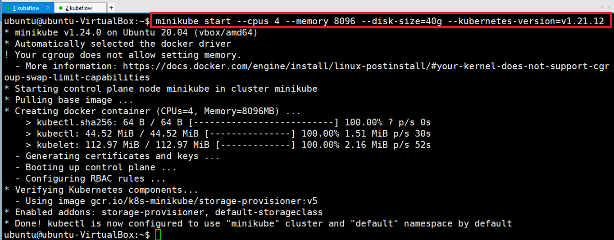
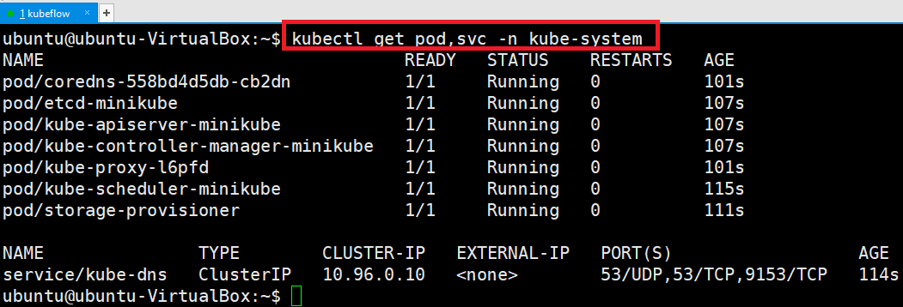
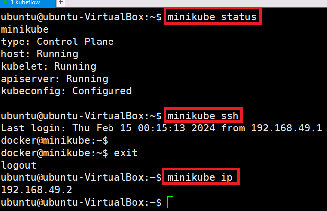
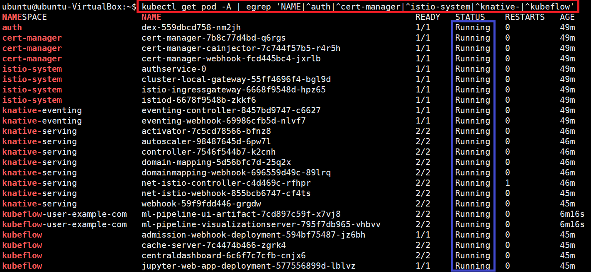
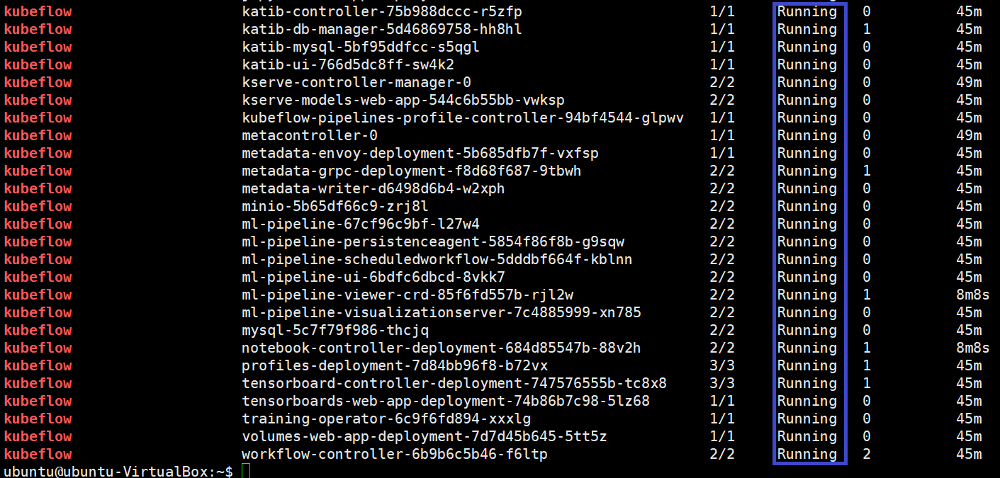
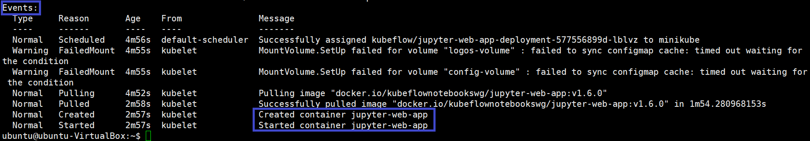
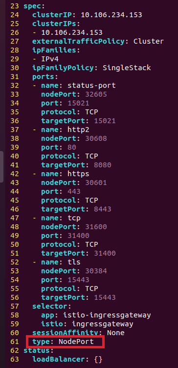
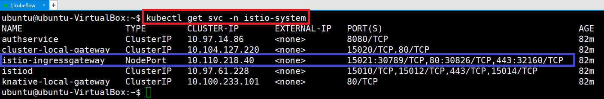
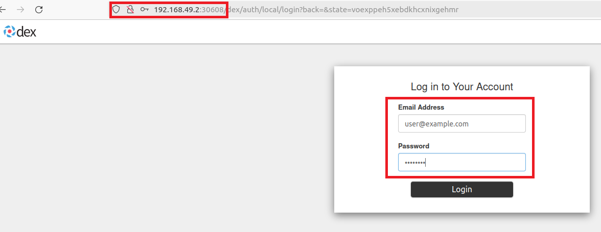
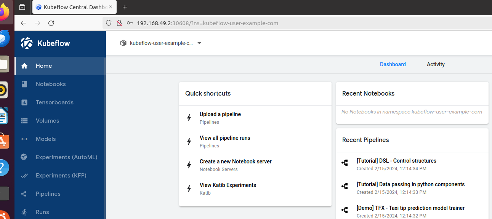

# Kustomize

---
### 단계1: 다운로드 
```shell
sudo mkdir /install_dir && cd /install_dir

sudo wget https://github.com/kubernetes-sigs/kustomize/releases/download/kustomize%2Fv4.5.6/kustomize_v4.5.6_linux_amd64.tar.gz

ls -al
```


---
### 단계2: kustomize 설치 
```shell
# 압축 해제
sudo tar -zxvf kustomize_v4.5.6_linux_amd64.tar.gz
sudo mv kustomize /usr/local/bin/kustomize
sudo chmod 777 /usr/local/bin/kustomize

kustomize version
```


---
# Minikube

---
### 단계1: v1.24.0 버전의 Minikube 바이너리를 설치
```shell
wget https://github.com/kubernetes/minikube/releases/download/v1.24.0/minikube-linux-amd64
sudo install minikube-linux-amd64 /usr/local/bin/minikube

ls -l /usr/local/bin/minikube
minikube version
```


---
### 단계3: Start minikube cluster
- 실행되고 있는 cluster가 있는 경우, 삭제  
```shell
minikube stop
minikube delete
```
- cluster 시작
```shell
minikube start --cpus 4 --memory 8096 --disk-size=70g --kubernetes-version=v1.21.12
```

---


---
### 단계4: 생성한 파드와 서비스를 확인
```shell
kubectl get pod,svc -n kube-system
```


---
### 단계5: minikube 기본명령어
```shell
# 상태확인
minikube status
# ssh 접속 
minikube ssh
# ip 확인 
minikube ip
```


---
# kubeflow

---
### 단계1: kubeflow v1.6.0 설치
```shell
git clone -b v1.6.0 https://github.com/kubeflow/manifests.git
cd manifests

while ! kustomize build example | kubectl apply -f -; do echo "Retrying to apply resources"; sleep 10; done
```


---
### 단계2: 설치결과 > pods 확인 
- 전부 Running으로 올라오는데는 시간이 걸린다. 
```shell
kubectl get pod -A | egrep 'NAME|^auth|^cert-manager|^istio-system|^knative-|^kubeflow'
```


---


---
### 단계3: 설치결과 > 오류 확인 
- 만약 오류 또는 Pending이 오래 지속된다면, 아래 명령어를 통해 진행상황(또는 오류)를 볼수 있음
- 명령어: kubectl describe po -n <네임스페이스명> <파드명>
```shell
kubectl describe po -n kubeflow jupyter-web-app-deployment-577556899d-lblvz
```


---
- 명령어: kubectl logs -f <파드명> -n <네임스페이스명>
```shell
kubectl logs -f pod/random-qwllpfh9-mgqtd -n moey920 --all-containers
```


---
### 단계4: 설치결과 > Error 제거 및 다시 실행 
- 명령어
```shell
# default namespace
kubectl get pods | grep Error | awk '{ print $1 }' | xargs kubectl delete pod

# specific namespace
kubectl get pods -n <namespace> | grep Error | awk '{ print $1 }' | xargs kubectl delete pod -n <namespace>

# all namespace
kubectl get pods -A | grep Error | awk '{ print $1 }' | xargs kubectl delete pod -A
```
- 예제 
```shell
kubectl get pods -n kubeflow | grep Error | awk '{ print $1 }' | xargs kubectl delete pod -n kubeflow
```


---
### 단계3: 설치결과
```shell
kubectl get services --namespace istio-system
```


---
### 단계4: istio-ingressgateway가 pending인 경우 
- LoadBalancer -> NodePort
```shell
kubectl edit service istio-ingressgateway -n istio-system
```


---
- 변경된 내용 확인 
```shell
kubectl get svc -n istio-system
```


---
### 단계4: virtualbox > dashboard url 확인
```shell
minikube service list
```


---
### 단계5: virtualbox > Kubeflow dashboard 접속
- dashboard url: http://192.168.49.2:30608
- Email / Password: user@example.com / 12341234



---


---
# kubeflow stop & start

---
### 단계1: stop
```shell
minikube stop
kubectl get svc -n istio-system
```


---
### 단계2: start
```shell
minikube start
kubectl get svc -n istio-system
```


