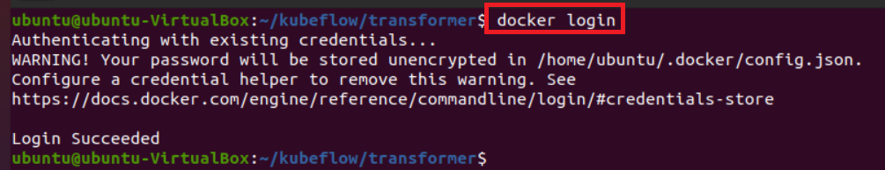
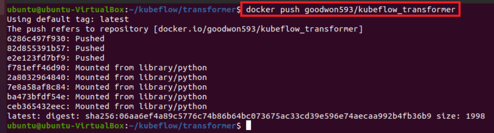

# [Transformer](https://kserve.github.io/website/0.11/modelserving/v1beta1/transformer/torchserve_image_transformer/#implement-prepost-processing-with-kserve-model-api)
- Pre-processing: URL을 NumPy 배열로 변환한 다음 부동 소수점 목록으로 변환
- Post-processing: 원시 예측을 레이블이 있는 예측으로 변환


---
# 예제
- 참고: kserve
- 용량/성능 부족으로 실행할 수 없음

---
### 단계1: 디렉토리/파일 생성
- transformer 디렉토리
  - custom_transformer  Dockerfile  requirements.txt
- custom_transformer 디렉토리
  - ImageNetLabels.txt  transformer.py


---
### 단계2: build Dockerfile > 이미지 생성
```shell
# 이미지 생성
docker build -t goodwon593/kubeflow_transformer:latest .
# 이미지 확인
docker images
```


---
### 단계3: docker 로그인 
```shell
docker login
```


---
### 단계4: 도커허브로 이미지 업로드 
```shell
docker push goodwon593/kubeflow_transformer
```


---
### 단계5: Model Server 생성
```yaml
apiVersion: "serving.kserve.io/v1beta1"
kind: "InferenceService"
metadata:
  annotations:
    sidecar.istio.io/inject: "false"
  name: "mobilenet-v2-transformer"
spec:
  predictor:
    serviceAccountName: 'sa'
    tensorflow:
      image: "tensorflow/serving:2.5.1"
      storageUri: "s3://kserve-test/models/mobilenet_v2"
  transformer:
    containers:
      - image: "goodwon593/kubeflow_transformer:latest"
```


