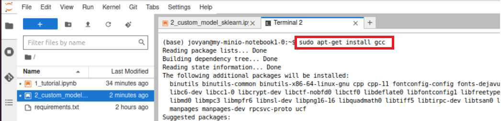
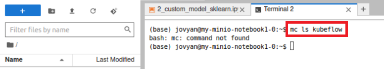
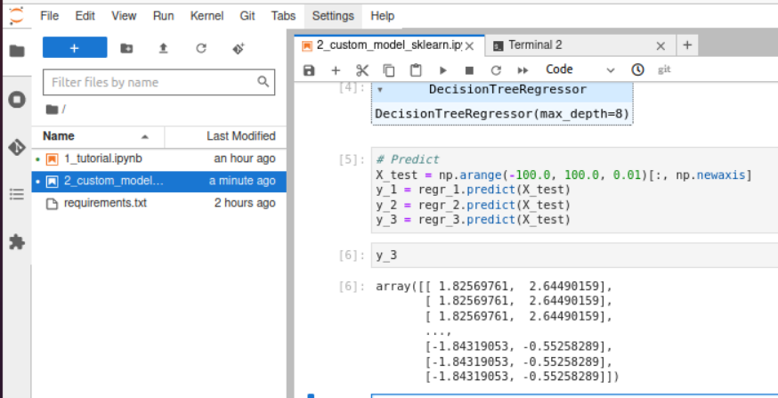
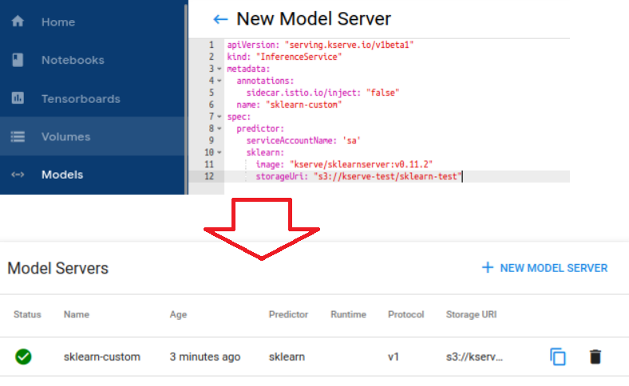
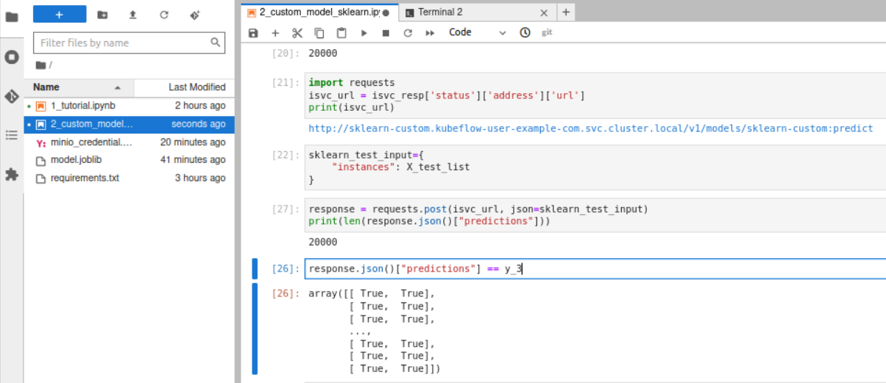

# [KServe Data Plane](https://kserve.github.io/website/0.9/modelserving/data_plane/)
- Transformer: Predictor Service에 대한 데이터 전/후처리
- Predictor: Data를 Model에게 전달한 후 추론 결과 전달 
- Explain: 추론 결과에 대한 추가 설명 전달 


---


---
# 예제1
- 참고소스: kserve/2_custom_model_sklearn.ipynb 

---
### 단계1: Notebook > gcc 설치 
```shell
sudo apt-get install -y gcc
```


---
### 단계2: bucket list 조회
- 만약 아래와 같이 조회가 안된다면, 설치 
```shell
mc ls kubeflow
```


---
### 단계2: 모델학습 


---
### 단계3: 학습모델 저장 
- minio에 학습모델 저장 


---
### 단계4: minio_credential.yaml 생성 
- kserve에서 minio에 접속할 수있도록 설정 
- 참고문서: kserve/minio_credential.yaml


---
### 단계5: apply minio_credential.yaml 
```shell
kubectl apply -f minio_credential.yaml
```


---
### 단계6: Model Server 생성 
- SKerve에 저장된 모델의 InferenceService 생성
```yaml
apiVersion: "serving.kserve.io/v1beta1"
kind: "InferenceService"
metadata:
  annotations:
    sidecar.istio.io/inject: "false"
  name: "sklearn-custom"
spec:
  predictor:
    serviceAccountName: 'sa'
    sklearn:
      image: "kserve/sklearnserver:v0.11.2"
      storageUri: "s3://kserve-test/sklearn-test"
```
---


---
### 단계7: 저장된 모델을 이용하여 예측  
- SKerve가 minio에서 저장된 모델을 불러와서 예측 



---
### 단계8: 모델서버(pod)에 마운트된 모델 확인
- 모델 서버 접속 
```shell
kubectl get po -n kubeflow-user-example-com
kubectl exec -it sklearn-custom-predictor-default-00001-deployment-7c9b49757jtwq -n kubeflow-user-example-com /bin/bash
```


---
- 마운트된 모델 확인 
```shell
cd /mnt/models
ls
```

