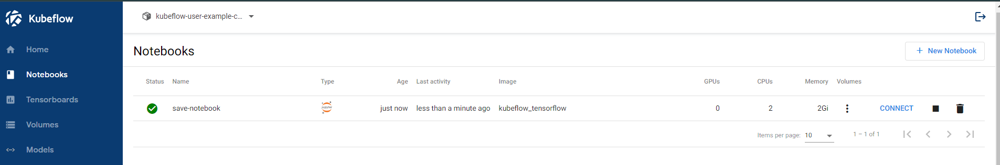

### 단계1: Create Notebook
- Docker Image: goodwon593/kubeflow_tensorflow
- CPU / RAM: 2 / 2
- Data Voumes: workspace



---
### 단계2: Notebook > gcc 설치 
```shell
sudo apt-get install -y gcc
```


---
### 단계3: bucket list 조회
- 만약 아래와 같이 조회가 안된다면, [MinlO설치하기](./6.%20Storage%20-%20MinIO.md) 
```shell
mc ls kubeflow
```


---


