# Key Pair

---
### 단계1: EC2 > Key Pair 
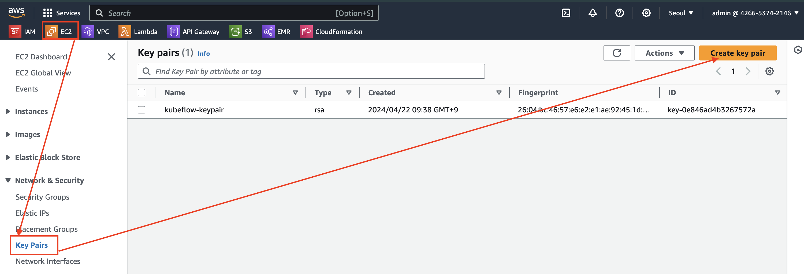

---
### 단계2: Create key pair
- Name: `kubeflow-tutorial`
- Key apir type: `RSA`
- file format: `.pem`

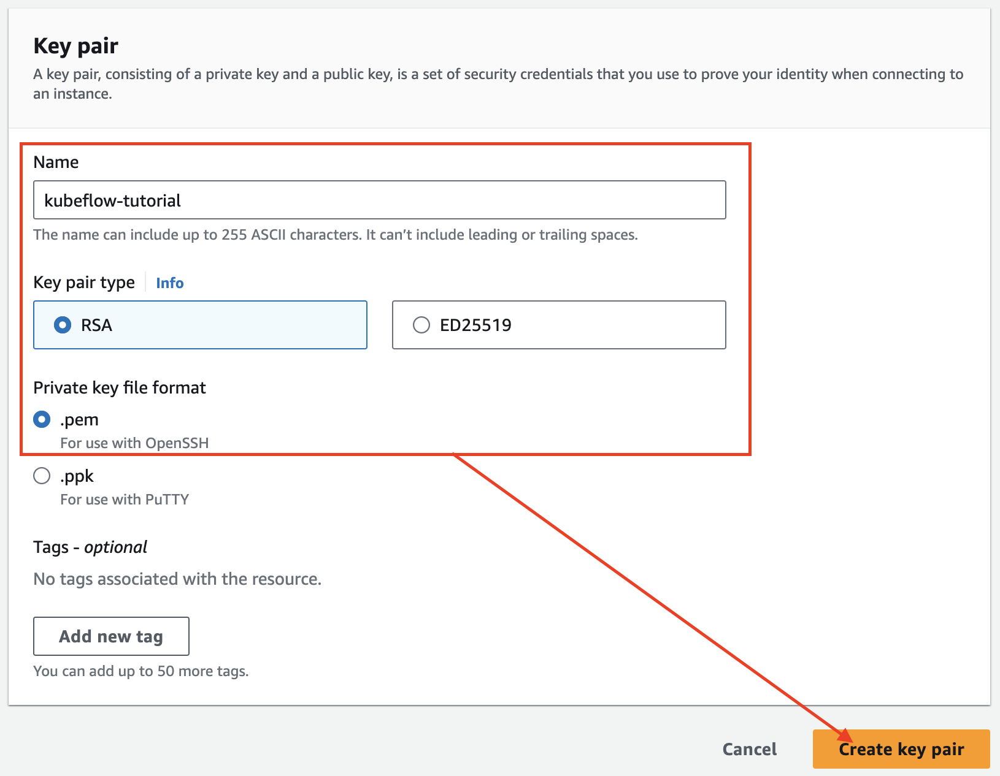

---
### 단계3: key pair > kubeflow-tutorial
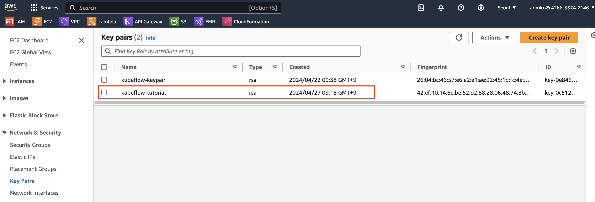

---
### 단계4: copy key pair to identity
```shell
cd Downloads # 다운로드 폴더 이동 
ls # key pair 확인 
# 만약 identity 폴더가 없다면, 생성하기 
mv kubeflow-tutorial.pem ~/identity # identity 폴더로 이동 
ls ~/identity # 이동된 key pair 확인 
```
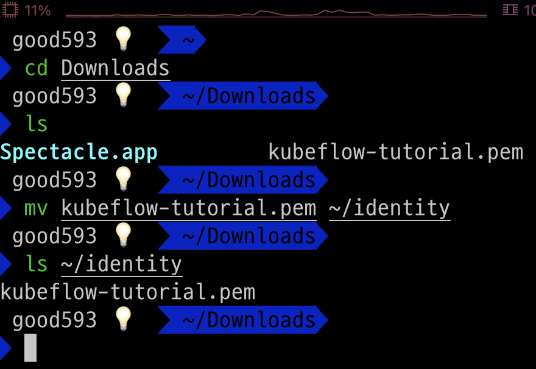

---
### 단계5: (윈도우는 제외) 권한 변경 
```shell
ls -l ~/identity # 권한 확인
chmod 600 ~/identity/kubeflow-tutorial.pem # 권한 변경 
ls -l ~/identity # 권한 확인
```
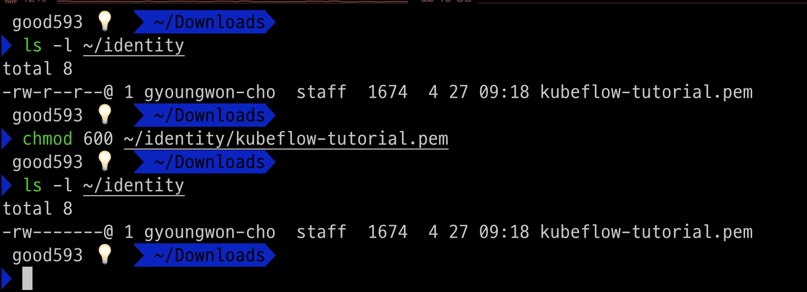

---
# Security Groups

---
### 단계1: EC2 > Security Groups
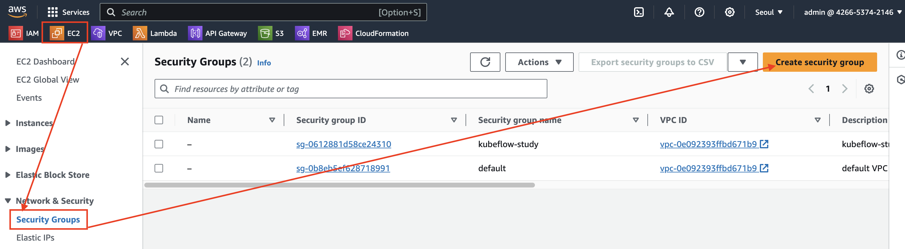

---
### 단계2: Security Groups > Basic details
- Name: `kubeflow-tutorial-sg`
- Description: `kubeflow-tutorial-sg`

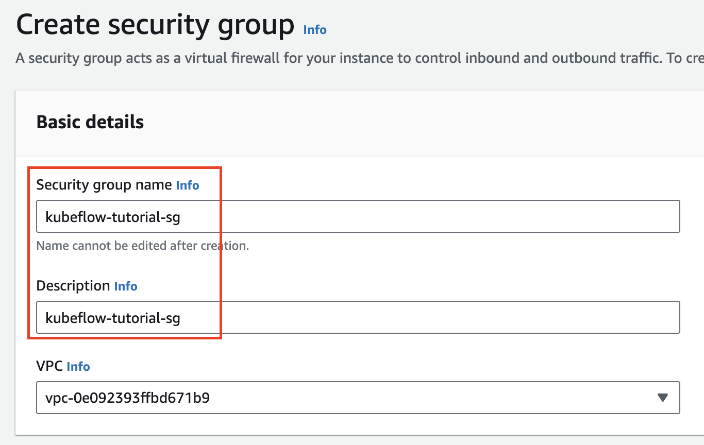

---
### 단계3: Security Groups > rules
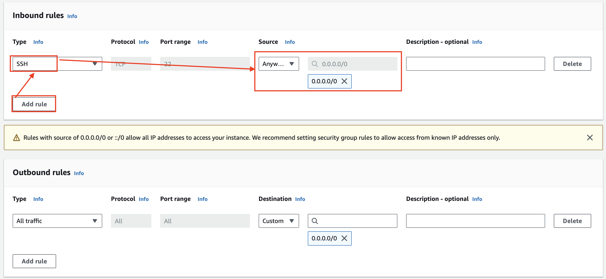

---
### 단계4: Create Security Groups 
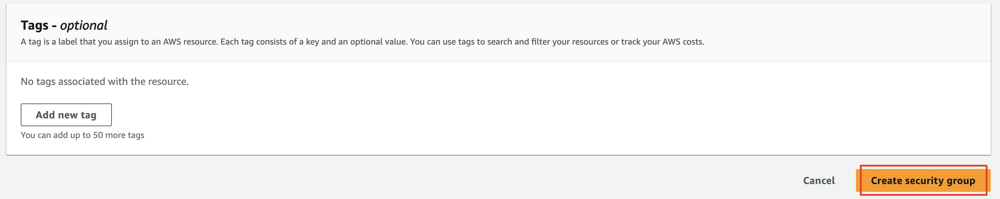

---
### 단계5: Security Groups > kubeflow-tutorial-sg
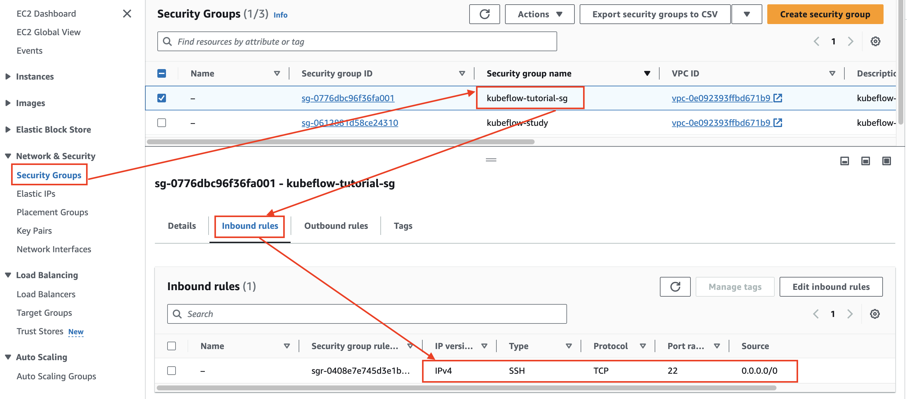

---
# EC2 Instance

---
### 단계1: EC2 > Instance
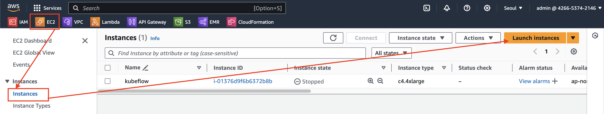

---
### 단계2: Name & OS Image
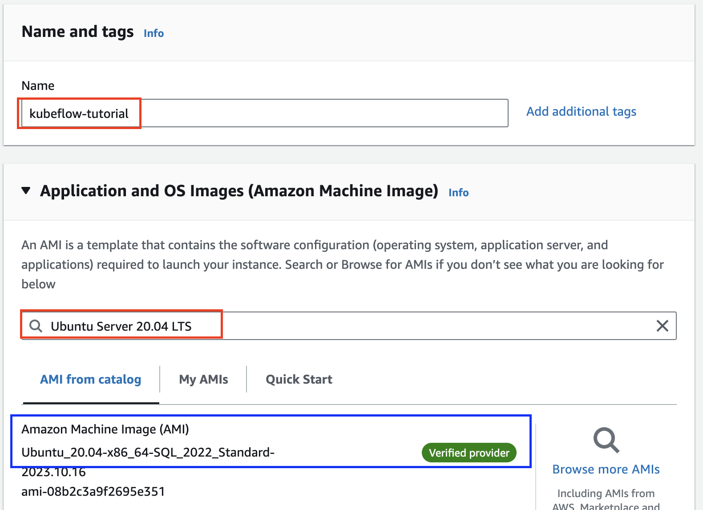

---
### 단계3: Instance type & Key pair
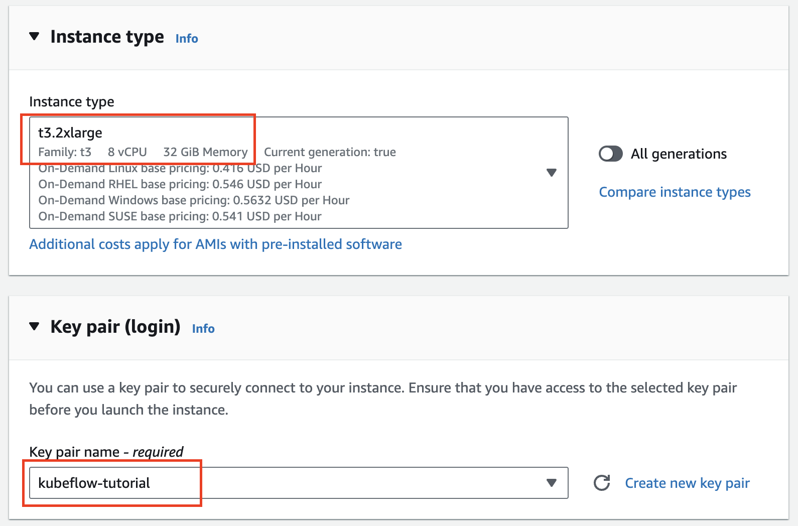

---
### 단계4: Network
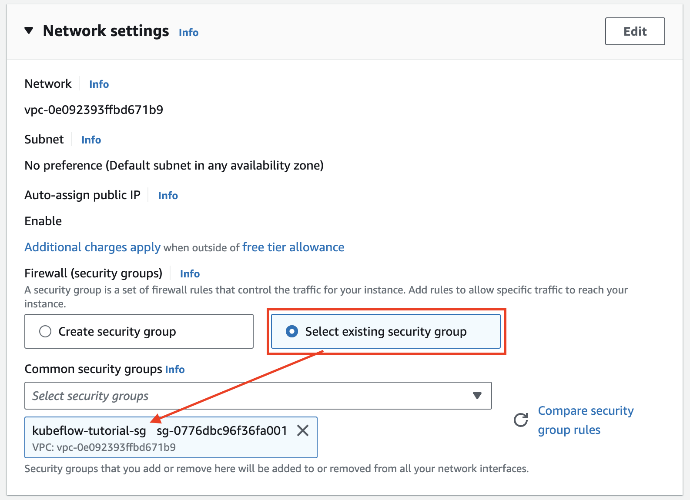

---
### 단계5: Storage & Launch instance
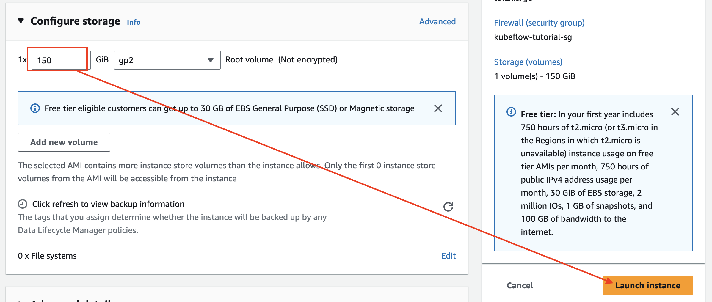

---
# EC2 Instance 접속

---
### 단계1: Public IPv4
- Instance state: Running

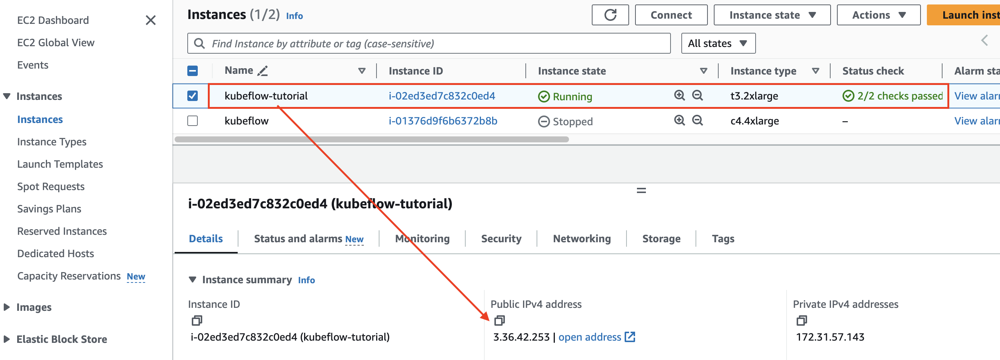

---
### 단계2: config
```shell
vim ~/.ssh/config
# 아래내용 참고하여 작성
Host kubeflow-tutorial
        # aws Public IPv4 address
        HostName 3.36.42.253
        User ubuntu
        # aws key pair
        IdentityFile ~/identity/kubeflow-tutorial.pem
```
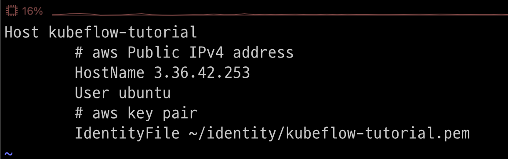

---
### 단계3: EC2 Instance 접속
```shell
ssh kubeflow-tutorial
```
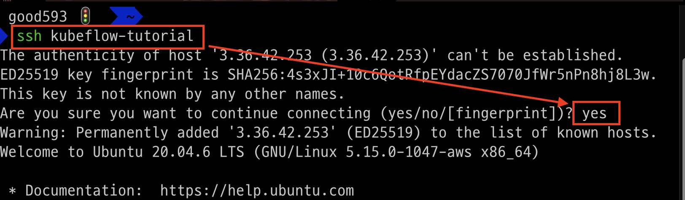

