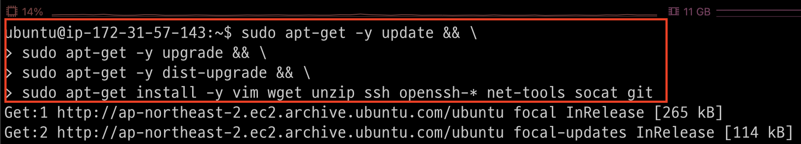
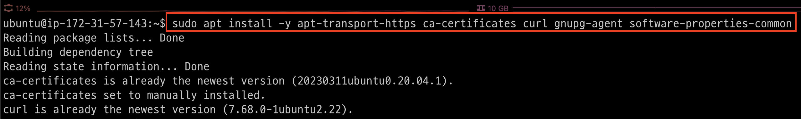
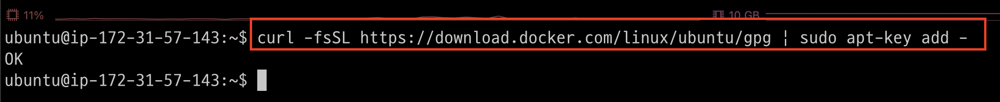
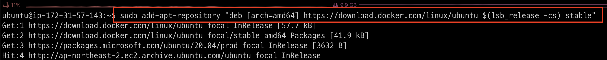
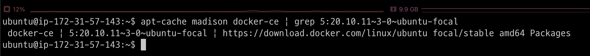
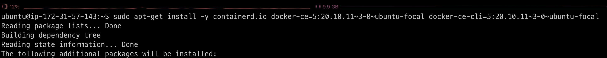
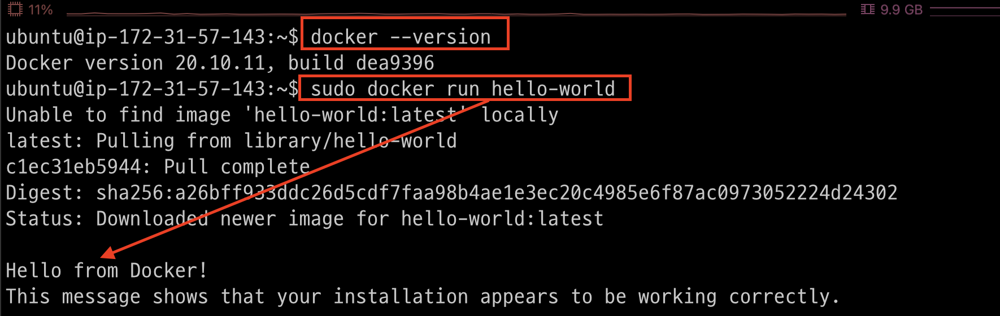
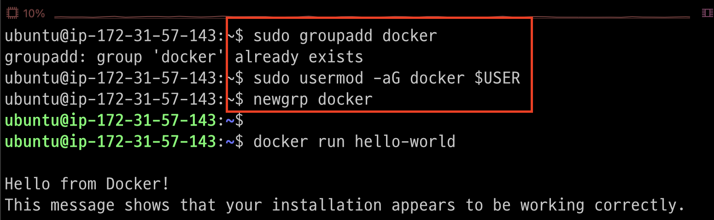
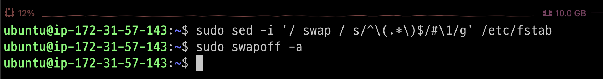

# update & upgrade & install 
```shell
sudo apt-get -y update && \
sudo apt-get -y upgrade && \
sudo apt-get -y dist-upgrade && \
sudo apt-get install -y vim wget unzip ssh openssh-* net-tools socat git
```


---
# Install Docker

---
### 단계1: 도커 설치에 필요한 APT 패키지들을 설치
```shell
sudo apt install -y apt-transport-https ca-certificates curl gnupg-agent software-properties-common
```


---
### 단계2: 도커의 공식 GPG key를 추가
```shell
curl -fsSL https://download.docker.com/linux/ubuntu/gpg | sudo apt-key add -
```


### 단계3: Docker APT 리포지토리를 시스템에 추가
```shell
sudo add-apt-repository "deb [arch=amd64] https://download.docker.com/linux/ubuntu $(lsb_release -cs) stable"
```


---
### 단계4: 현재 설치할 수 있는 도커 버전을 확인
```shell
apt-cache madison docker-ce | grep 5:20.10.11~3-0~ubuntu-focal
```


### 단계5: 5:20.10.113-0ubuntu-focal 버전의 도커를 설치
```shell
sudo apt-get install -y containerd.io docker-ce=5:20.10.11~3-0~ubuntu-focal docker-ce-cli=5:20.10.11~3-0~ubuntu-focal
```


---
### 단계6: 도커 설치 확인
```shell
# 버전 확인
docker --version
# 도커 실행 
sudo docker run hello-world
```


---
### 단계7: 도커 권한 변경
- docker 관련 command를 sudo 키워드 없이 사용할 수 있게 하도록 다음 명령어를 통해 권한을 추가
```shell
sudo groupadd docker
sudo usermod -aG docker $USER
newgrp docker

# 도커 실행 
docker run hello-world
```


---
# Turn off Swap Memory
- kubelet 이 정상적으로 동작하게 하기 위해서는 클러스터 노드에서 swap이라고 불리는 가상메모리를 꺼 두어야 합니다.
```shell
sudo sed -i '/ swap / s/^\(.*\)$/#\1/g' /etc/fstab
sudo swapoff -a
```



