# Install Kubectl
- kubectl 은 쿠버네티스 클러스터에 API를 요청할 때 사용하는 클라이언트 툴입니다.
- 클라이언트 노드에 설치해두어야 합니다.

---
### 단계1: 현재 폴더에 kubectl v1.21.7 버전을 다운받습니다.
```shell
curl -LO https://dl.k8s.io/release/v1.21.7/bin/linux/amd64/kubectl
ls
```
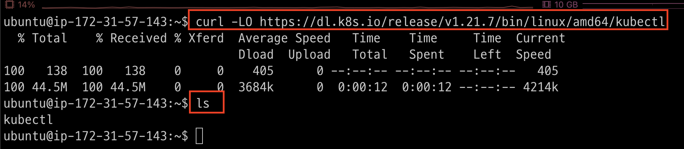

---
### 단계2: kubectl 을 사용할 수 있도록 파일의 권한과 위치를 변경합니다.
```shell
sudo install -o root -g root -m 0755 kubectl /usr/local/bin/kubectl
ls -l /usr/local/bin/kubectl
```
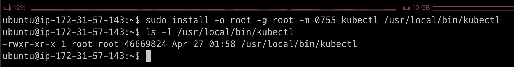

### 단계3: 설치 확인
```shell
kubectl version --client
```
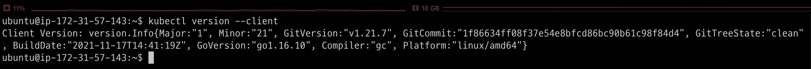

---
# [Kustomize](https://kubernetes.io/ko/docs/tasks/manage-kubernetes-objects/kustomization/)
- Kustomize는 kustomization 파일을 통해 쿠버네티스 오브젝트를 사용자가 원하는 대로 변경하는(customize) 독립형 도구이다.

---
### 단계1: kustomize 다운로드 
```shell
sudo mkdir /install_dir && cd /install_dir
sudo wget https://github.com/kubernetes-sigs/kustomize/releases/download/kustomize%2Fv4.5.6/kustomize_v4.5.6_linux_amd64.tar.gz
ls -l
```
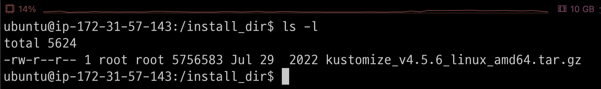

---
### 단계2: kustomize 설치
```shell
# 압축 해제
sudo tar -zxvf kustomize_v4.5.6_linux_amd64.tar.gz
sudo mv kustomize /usr/local/bin/kustomize
sudo chmod 777 /usr/local/bin/kustomize
kustomize version
```
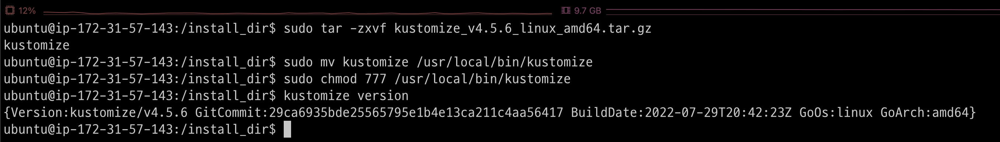

---
# [Minikube](https://kubernetes.io/ko/docs/tutorials/hello-minikube/)
- minikube는 macOS, Linux 및 Windows에서 로컬 쿠버네티스 클러스터를 쉽고 빠르게 세팅할 수 있는 도구이다.
- [Minikube 사용법](https://nice-engineer.tistory.com/entry/Kubernetes-minikube%EB%9E%80-%EC%84%A4%EC%B9%98-%EB%B0%8F-%EC%82%AC%EC%9A%A9%EB%B2%95)

---
### 단계1: v1.24.0 버전의 Minikube 바이너리를 설치
```shell
cd # 홈 디렉토리로 이동 
sudo wget https://github.com/kubernetes/minikube/releases/download/v1.24.0/minikube-linux-amd64
sudo install minikube-linux-amd64 /usr/local/bin/minikube

ls -l /usr/local/bin/minikube
minikube version
```
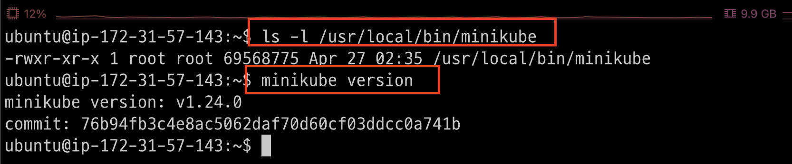

---
### 단계2: start kubernetes by minikube
```shell
minikube start --cpus 6 --memory 20240 --disk-size=100g --kubernetes-version=v1.21.12
```
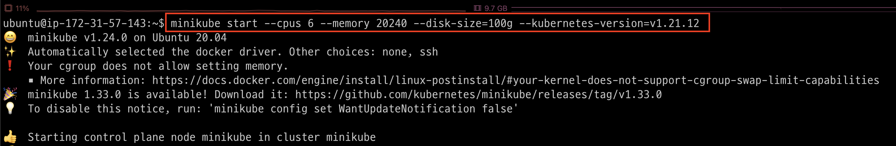

---
### 단계3: kubernetes
```shell
kubectl get all -n kube-system
```
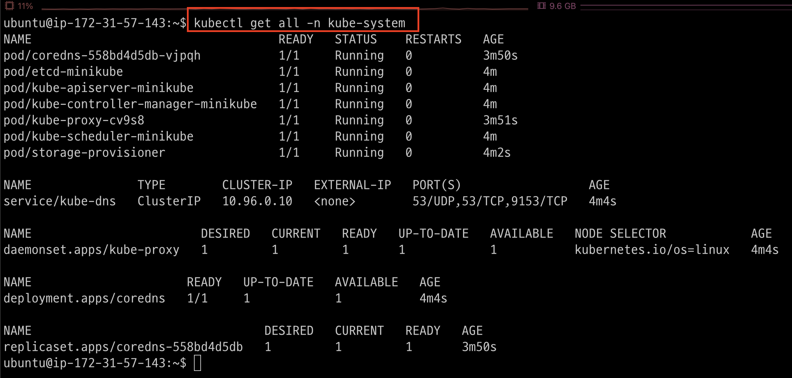

---
# kubeflow 

---
### 단계1: kubeflow v1.6.0 설치
```shell
cd # 홈 디렉토리로 이동 
git clone -b v1.6.0 https://github.com/kubeflow/manifests.git
cd manifests

while ! kustomize build example | kubectl apply -f -; do echo "Retrying to apply resources"; sleep 10; done
```
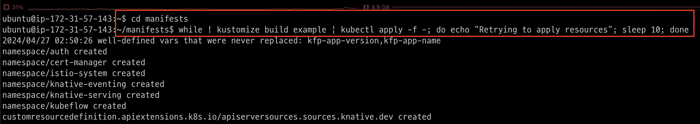

---
### 단계2: 설치결과 > pods 확인
- 전부 Running으로 올라오는데는 시간이 걸린다.
```shell
kubectl get pod -A | egrep 'NAME|^auth|^cert-manager|^istio-system|^knative-|^kubeflow'
```


---


---
### 단계3: 만약 Error 발생하면, Error 제거
- 전부 Running으로 올라오는데는 시간이 걸린다.
```shell
kubectl get pods -n kubeflow | grep Error | awk '{ print $1 }' | xargs kubectl delete pod -n kubeflow
```


---
### 단계4: istio-ingressgateway 수정
```shell
kubectl get services --namespace istio-system
```
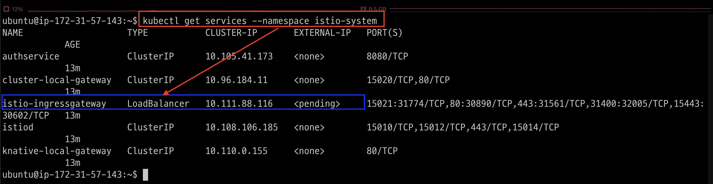

---
- 수정: LoadBalancer -> NodePort
```shell
kubectl edit service istio-ingressgateway -n istio-system
```
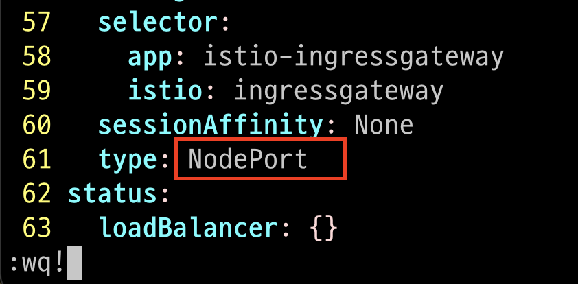

---
- 변경된 내용 확인
```shell
kubectl get svc -n istio-system
```
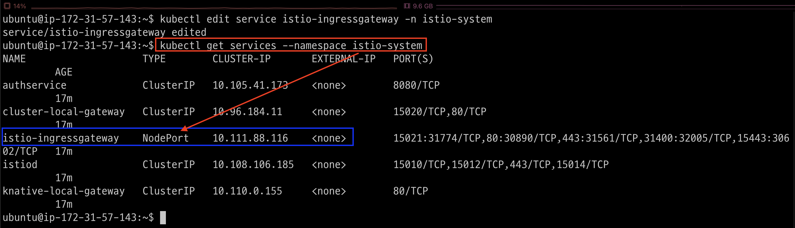

