### 단계1: minikube service > istio-ingressgateway
```shell
minikube service list
```
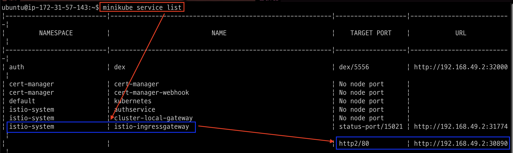

---
### 단계2: port forward
- 계속 유지가 되어야만 dashboard에 접속이 가능 
```shell
kubectl port-forward svc/istio-ingressgateway -n istio-system 8080:80 --address '0.0.0.0'
```
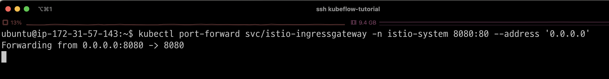

---
### 단계3: aws security group 
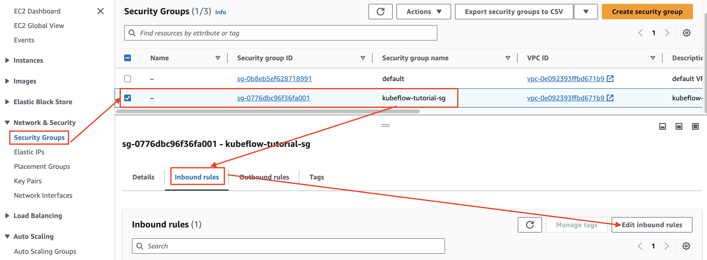

---
### 단계4: Edit inbound rules 
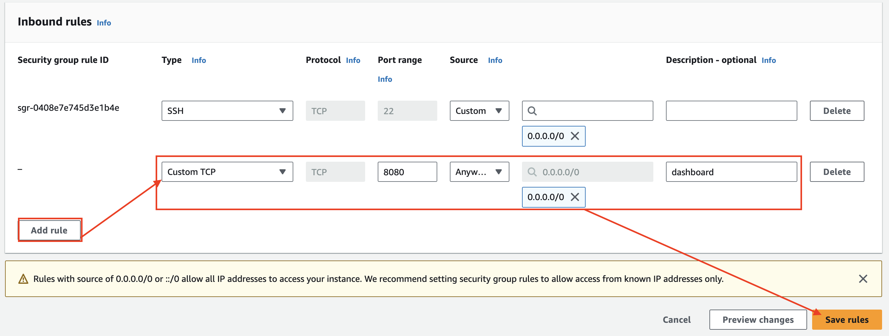

---
### 단계5: 확인 
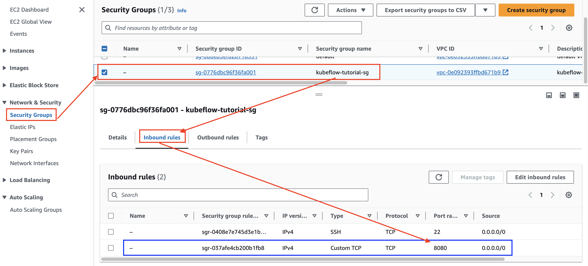

---
### 단계6: Public IPv4
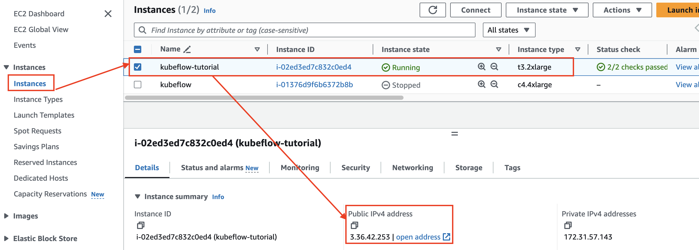

---
### 단계7: 로그인 > `http://[Public IPv4 address]:8080`
- Email / Password: `user@example.com / 12341234`

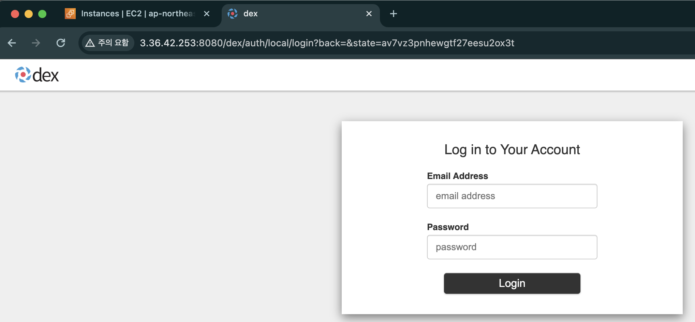

---
### 단계8: 접속
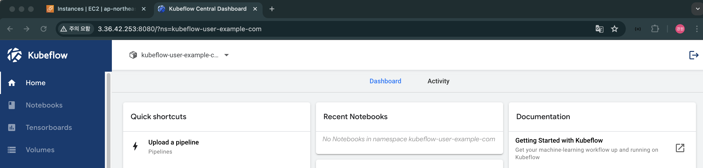

---
# kubeflow stop

---
### 단계1: port forward > stop
- stop: `Ctrl + c`

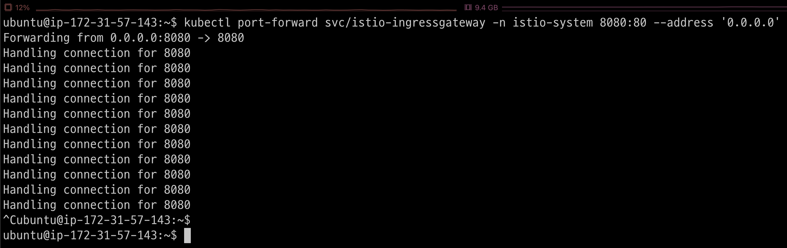

---
### 단계2: minikube > stop
```shell
minikube stop
minikube status
```
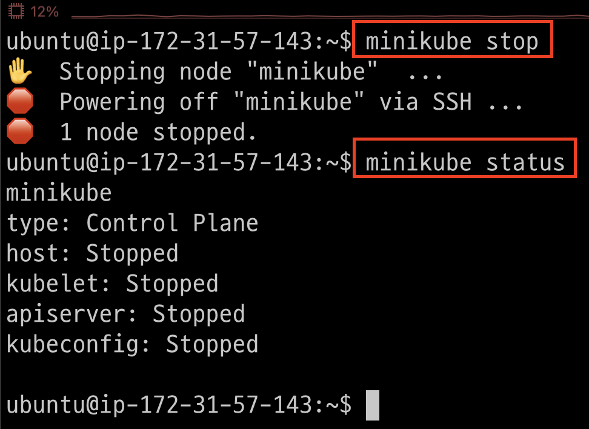

---
### 단계3: EC2 Instance > stop


---
# kubeflow start

---
### 단계1: EC2 Instance > start
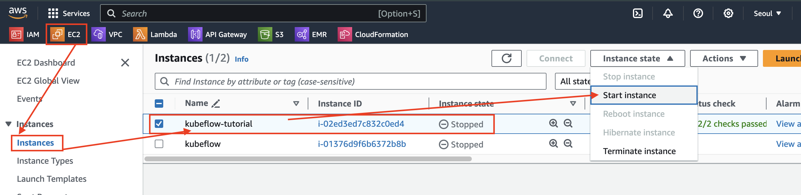

---
### 단계2: Public IPv4
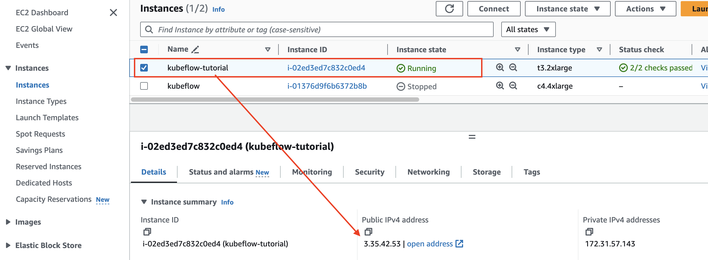

---
### 단계3: config 수정
```shell
vim ~/.ssh/config
# Public IPv4 변경내용 수정 
```


---
### 단계4: EC2 Instance 접속
```shell
ssh kubeflow-tutorial
```


---
### 단계5: minikube > start
```shell
minikube start
```
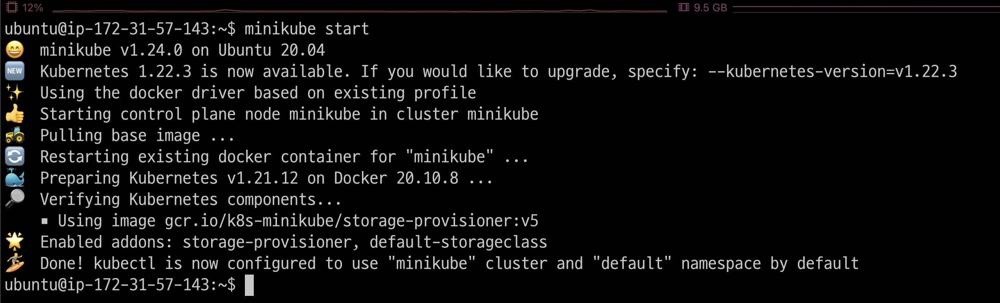

---
### 단계6: port forward
- 계속 유지가 되어야만 dashboard에 접속이 가능 
```shell
kubectl port-forward svc/istio-ingressgateway -n istio-system 8080:80 --address '0.0.0.0'
```
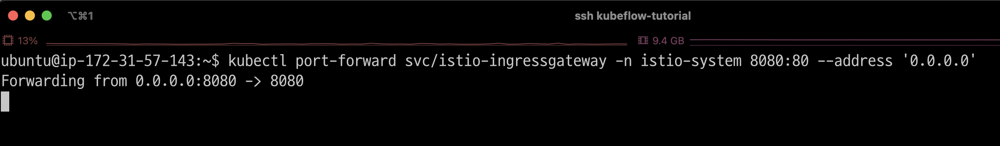

---
### 단계7: 로그인 > `http://[Public IPv4 address]:8080`
- Email / Password: `user@example.com / 12341234`


