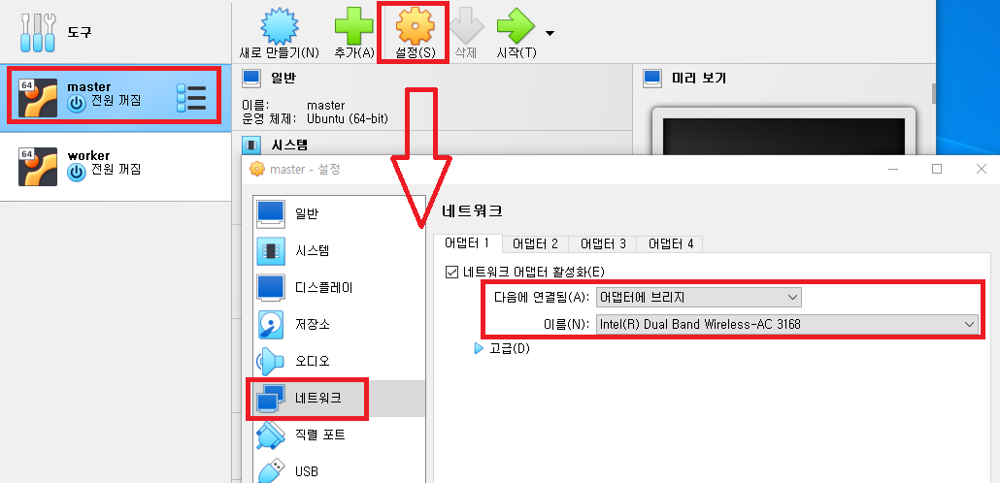

### 단계1: master 인스턴스 생성
- 기본메모리: 8192MB
- 프로세서: 4
- 저장소: 100GB

---
### 단계2: 네트워크 > 어댑터에 브리지


---
### 단계3: update & install
```shell
sudo apt-get -y update
sudo apt-get -y upgrade
sudo apt-get -y dist-upgrade
sudo apt-get install -y vim wget unzip ssh openssh-* net-tools chrony
```


---
### 단계3: ssh start 
- [오류발생시](https://blog.msalt.net/326)
- xshell과 연결하기 위해서 실행 
```shell
sudo service ssh start
sudo systemctl status sshd
```


---
### 단계4: hostname & 재기동 
```shell
sudo hostnamectl set-hostname master
hostname
``` 


---
### 단계5: root 계정 접속 
```shell
sudo passwd root # 비번 설정 
su - root # root 계정 접속
```


---
### 단계6: ifconfig
- ip: 192.168.123.108
```shell
ifconfig
```


---
### 단계7: Xshell 접속 


