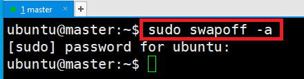
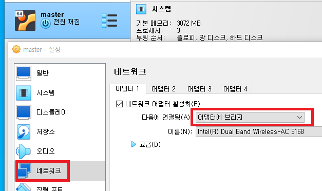
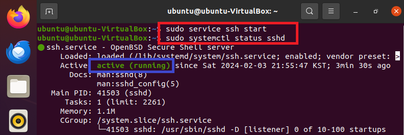
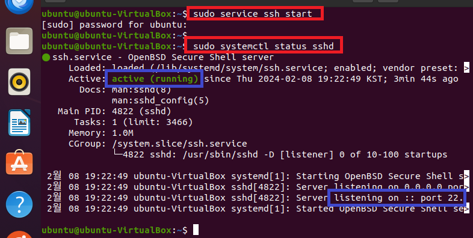
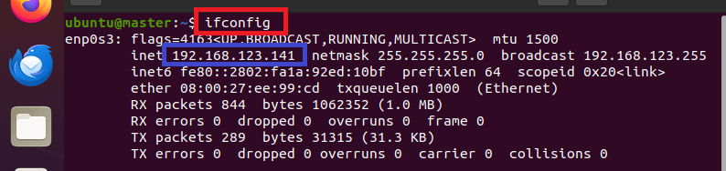
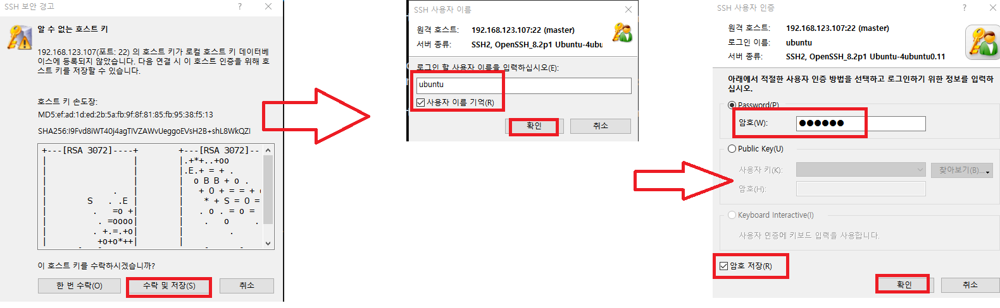
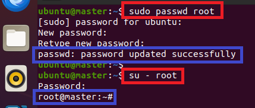
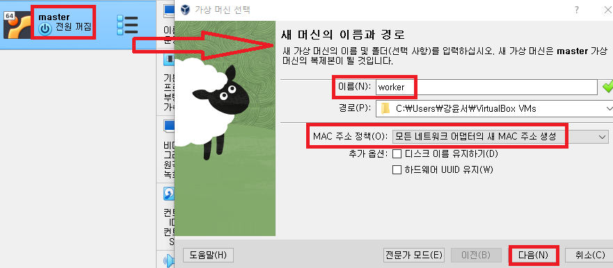

### 단계1: worker 인스턴스 생성 
- 프로세서: 4 / 메모리: 4096MB
- 저장소: 50GB



---
### 단계2: 네트워크 설정 
- 어댑터에 브리지 


---
### 단계3: 업데이트 및 필수 라이브러리 설치 
```shell
sudo apt-get -y update && \
sudo apt-get -y upgrade && \
sudo apt-get -y dist-upgrade && \ 
sudo apt-get install -y vim wget unzip ssh openssh-* net-tools
```


---
### 단계4: ssh start 
- xshell과 연결하기 위해서 실행 
```shell
sudo service ssh start
sudo systemctl status sshd
```


---
### 단계5: ip 확인 
```shell
ifconfig # ip: 192.168.123.108
```


----
### 단계6: xshell 세션 생성  


---


---
- 접속 성공 


---
### 단계7: hostname 설정 
```shell
sudo hostnamectl set-hostname worker
hostname
``` 



