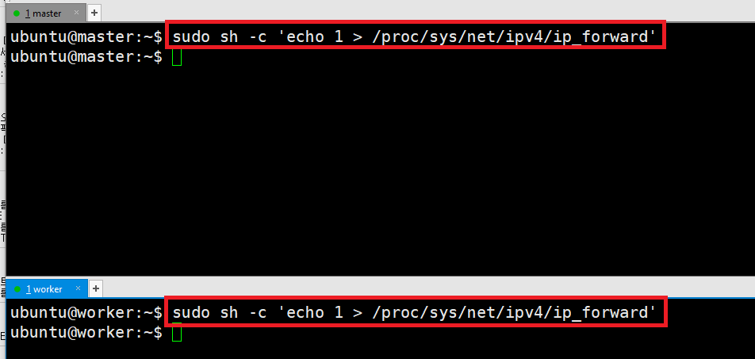
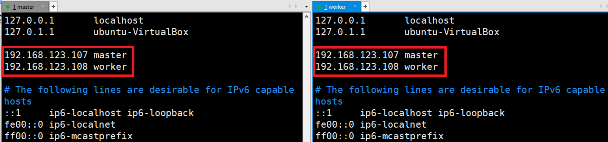
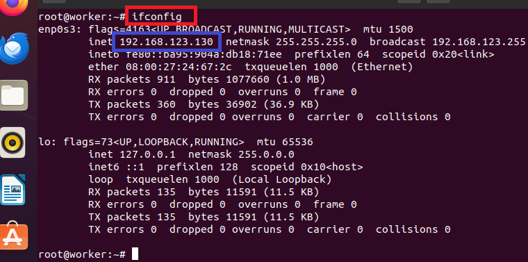
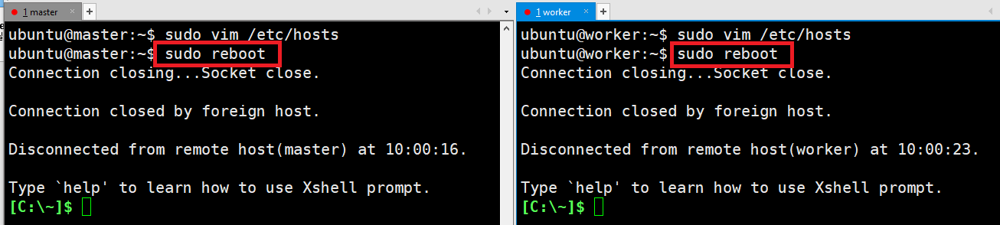
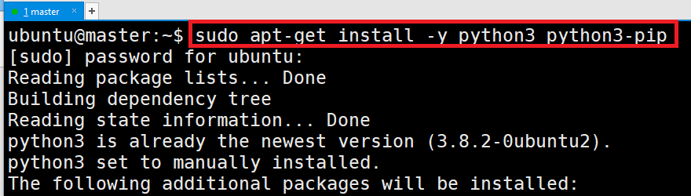

#  Server Configure
- Kubernetes 설치전 서버 환경 세팅 
- master & worker 모두 세팅 

---
### 단계1: swap off
- K8s에서는 swap 기능이 켜져 있으면 문제가 발생할 수 있으므로 꺼줘야 한다.
```shell
sudo swapoff -a
# 재부팅되더라도 유지될 수 있도록 아래와 같이 swap 부분을 주석 처리해준다.
sudo vim /etc/fstab 
```


---
### 단계2: ip_forward
- 가상화 머신끼리 패킷을 주고받을 수 있도록 ip_forward 기능을 켜줘야 한다.
```shell
sudo sh -c 'echo 1 > /proc/sys/net/ipv4/ip_forward'
```


---
### 단계3: hosts
- 서버끼리 서로 알 수 있도록 hosts 정보도 등록해주자.
```shell
sudo vim /etc/hosts
# 아래내용 ip 수정 후 입력 
192.168.123.107 master
192.168.123.108 worker
```


---
### 단계4: ssh-key 생성
- 서버간 연결을 위해 ssh-key 생성 및 등록 과정이 필요하다.
```shell
ssh-keygen # 중간에 enter 3번 입력 
```


---
### 단계5: copy key
- ssh-key 인증을 통해 master에서 worker로 접속할 수 있도록 하기 위한 과정이다.
```shell
ssh-copy-id ubuntu@master
ssh-copy-id ubuntu@worker
```

---
### 단계6: 재부팅 
```shell
sudo reboot
```


---
# Kubernetes 설치
- Kubespray를 이용해서 Kubernetes 설치를 진행하도록 하겠다.

---
### 단계1: python 설치 
```shell
sudo apt-get install -y python3 python3-pip
```



