# [사전작업](https://github.com/kubeflow/manifests?tab=readme-ov-file#prerequisites)


---
## 1. kustomize

---
### 단계1: kustomize 5.0.3
```shell
# 설치파일 관리용 디렉토리 생성
sudo mkdir /install_dir && cd /install_dir
# 다운로드 
sudo wget https://github.com/kubernetes-sigs/kustomize/releases/download/kustomize%2Fv5.0.3/kustomize_v5.0.3_linux_amd64.tar.gz
```
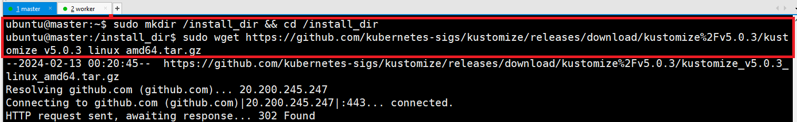

---
### 단계2: kustomize 설치 
```shell
# 압축 해제
sudo tar -zxvf kustomize_v5.0.3_linux_amd64.tar.gz
sudo mv kustomize /usr/local/bin/kustomize
sudo chmod 777 /usr/local/bin/kustomize

ls -al /usr/local/bin/kustomize
```


---
## 2. kubectl
- kubernetes 버전과 동일한 버전의 kubectl을 사용하는 것이 좋다.
- Kubernetes node가 아닌 다른 workspace에서 kubectl을 사용하기 위해서는 직접 설치를 해줘야 한다.
```shell
cd ~ # home 디렉토리로 이동 
curl -LO "https://dl.k8s.io/release/v1.25.6/bin/linux/amd64/kubectl"
sudo install -o root -g root -m 0755 kubectl /usr/local/bin/kubectl
```


---
## 3. kubernetes with default StorageClass
- NFS를 이용해서 StorageClass 설정을 진행 
- Kubeflow 설치 과정에서 약 4개의 PV(PersistentVolume) 생성을 하게 된다.
  - 10Gi 용량의 PV 2개
  - 20Gi 용량의 PV 2개
  - 60Gi 이상의 PV를 생성할 수 있는 환경이어야 하는 것이다.

---
### 단계1: install nfs
```shell
sudo apt-get -y install nfs-common nfs-kernel-server portmap
```
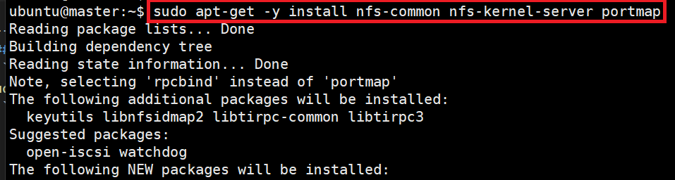

---
### 단계2: 디렉토리 생성
- NFS 용도의 디렉토리를 만들고 권한을 설정하자
```shell
sudo mkdir /srv/nfs
sudo chmod 777 /srv/nfs
ls -l /srv
```


---
### 단계3: 접근 가능 호스트 목록 등록
- 어디에서 접근할지 정의하자
```shell
sudo vim /etc/exports
# 자신의 ip를 확인 후 작성 
/srv/nfs 192.168.123.*(rw,sync,no_root_squash,no_subtree_check) worker(rw,sync,no_root_squash,no_subtree_check)
```


---
### 단계4: 서비스 리스타트 및 적용확인 
- 설정 적용을 위해 서비스 재시작!
```shell
sudo service nfs-kernel-server restart
showmount -e 127.0.0.1
```
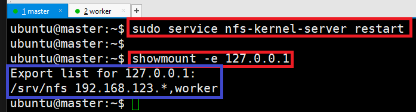

---
### 단계5: worker에서 NFS 테스트 
```shell
sudo apt-get install -y nfs-common
sudo mkdir /srv/nfs-client
```
- sudo mount -t nfs `<master ip>`:/srv/nfs /srv/nfs-client
```shell
sudo mount -t nfs 192.168.123.113:/srv/nfs /srv/nfs-client
```


---
1. worker에서 tmp.txt 파일 생성 
```shell
cd /srv/nfs-client
touch temp.txt
```
2. master에서 tmp.txt 파일 확인 
```shell
cd /srv/nfs
ls -al
```
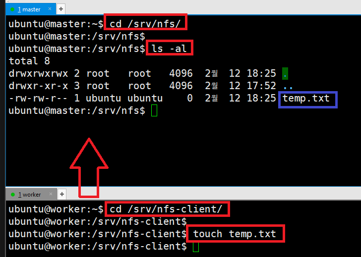

---
3. worker에서 umount
- sudo umount -t nfs `<master ip>`:/srv/nfs /srv/nfs-client
```shell
cd /srv
sudo umount -t nfs 192.168.123.113:/srv/nfs /srv/nfs-client
```
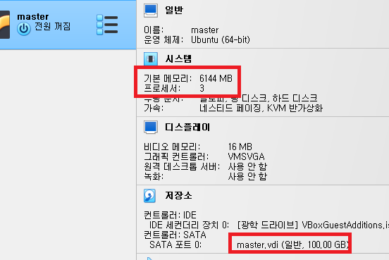

---
### 단계6: master > NFS Provisioner
- Kubernetes에서 NFS를 사용하기 위한 Provisioner를 설치하자.
- Helm을 이용하여 설치 
```shell
helm repo add nfs-subdir-external-provisioner https://kubernetes-sigs.github.io/nfs-subdir-external-provisioner/
```
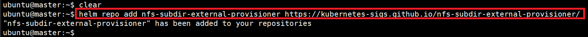

---
- ip 수정: `--set nfs.server=<master ip>`
```shell
helm install nfs-subdir-external-provisioner nfs-subdir-external-provisioner/nfs-subdir-external-provisioner --set nfs.server=192.168.123.113 --set nfs.path=/srv/nfs
```

- storageclass
```shell
kubectl patch storageclass nfs-client -p '{"metadata": {"annotations":{"storageclass.kubernetes.io/is-default-class":"true"}}}'
```


---
### 단계7: 확인 > Running
```shell
kubectl get pod
```
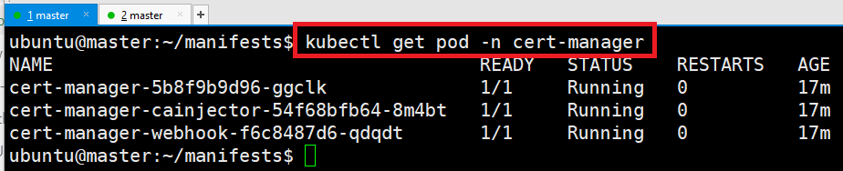

---
- 만약 계속 Pending이라면, describe을 통해 Events 확인 
- 명령어: kubectl describe pod <파드명>
```shell
kubectl describe pod nfs-subdir-external-provisioner-5f7484b6c7-6j5wm
```
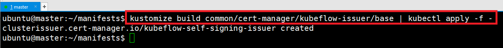

---
### 단계7: 테스트 > 생성 
```shell
kubectl create -f https://raw.githubusercontent.com/kubernetes-sigs/nfs-subdir-external-provisioner/master/deploy/test-claim.yaml -f https://raw.githubusercontent.com/kubernetes-sigs/nfs-subdir-external-provisioner/master/deploy/test-pod.yaml

kubectl get pod
```


---
- NFS 서버에 생성된 디렉토리와 SUCCESS 파일이 확인
```shell
cd /srv/nfs
ls -al
```
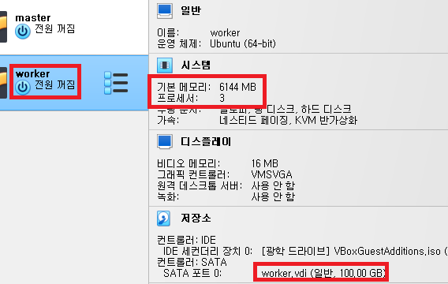

---
- storageclass 및 pvc 확인 
```shell
kubectl get storageclasses.storage.k8s.io
kubectl get pvc
```
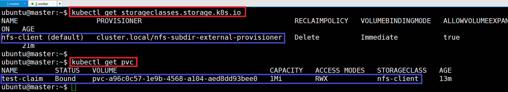

---
### 단계8: 테스트 > 삭제 
```shell
kubectl delete -f https://raw.githubusercontent.com/kubernetes-sigs/nfs-subdir-external-provisioner/master/deploy/test-claim.yaml -f https://raw.githubusercontent.com/kubernetes-sigs/nfs-subdir-external-provisioner/master/deploy/test-pod.yaml

kubectl get pod
```


---
- pod이 삭제가 되었지만, 생성된 디렉토리/파일은 유지됨.
- 필요 없어진 디렉토리/파일 삭제는 직접 수작업으로 NFS Server에서 진행
```shell
cd /srv/nfs
ls -al
```
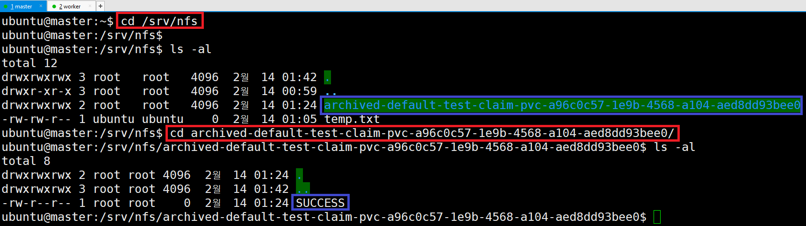

