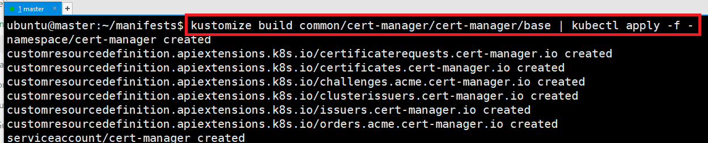
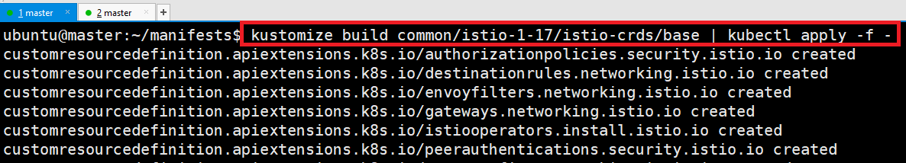
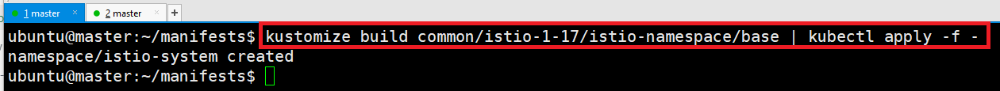
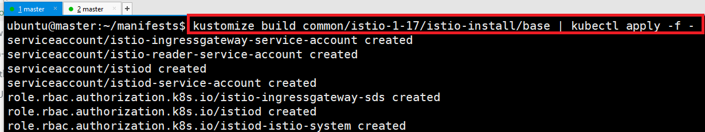
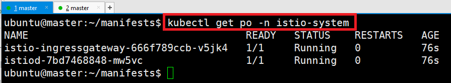
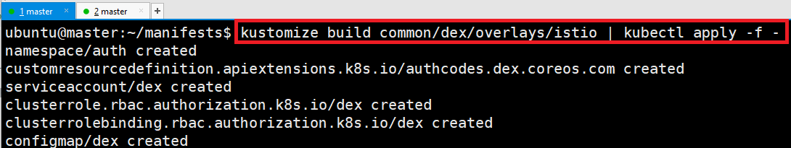
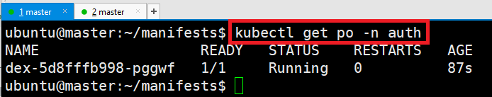
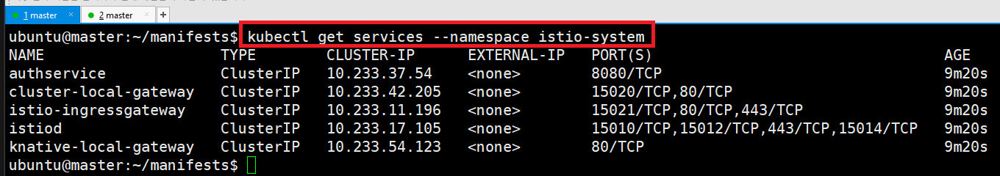
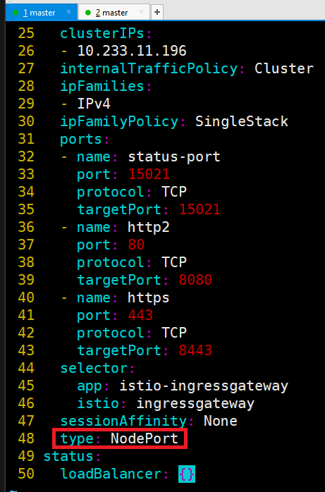

# 설치 전

---
### 단계1: manifests
```shell
git clone https://github.com/kubeflow/manifests.git 
```


---
# 설치 

---
## 전체 설치 방법 
- 최소 사양이상인 경우만 가능 
  - 기본메모리: 8192MB
  - 프로세서: 4
  - 저장소: 100GB(StorageClass: 60GB)
```shell
cd manifests 
while ! kustomize build example | kubectl apply -f -; do echo "Retrying to apply resources"; sleep 10; done
```


---
## [부분설치 방법](https://mlops-for-all.github.io/docs/setup-components/install-components-kf)

---
### 단계1: Cert-manager
```shell
cd manifests 
kustomize build common/cert-manager/cert-manager/base | kubectl apply -f -
```


---
- pod 가 모두 Running 이 될 때까지 기다립니다.
```shell
kubectl get pod -n cert-manager
```


---
- kubeflow-issuer
```shell
kustomize build common/cert-manager/kubeflow-issuer/base | kubectl apply -f -
```


---
### 단계2: Istio
```shell
kustomize build common/istio-1-17/istio-crds/base | kubectl apply -f -
```


---
- istio namespace 를 설치
```shell
kustomize build common/istio-1-17/istio-namespace/base | kubectl apply -f -
```


---
- istio 를 설치
```shell
kustomize build common/istio-1-17/istio-install/base | kubectl apply -f -
```


---
- pod 가 모두 Running 이 될 때까지 기다립니다.
```shell
kubectl get po -n istio-system
```


---
### 단계2: Dex
```shell
kustomize build common/dex/overlays/istio | kubectl apply -f -
```


---
- pod 가 모두 Running 이 될 때까지 기다립니다.
```shell
kubectl get po -n auth
```



---
# 설치 이후 

---
### 단계1: services 확인
```shell
kubectl get services --namespace istio-system
```


---
### 단계2: pods 확인 
- 전부 Running으로 올라오는데는 시간이 걸린다. 
```shell
kubectl get pod -A | egrep 'NAME|^auth|^cert-manager|^istio-system|^knative-|^kubeflow'
```


---
### 단계3: ClusterIP -> NodePort
- 웹 접근을 위해서는 현재 ClusterIP로 설정되어 있는 서비스를 NodePort로 변경 
```shell
kubectl edit service istio-ingressgateway -n istio-system
```


---
- 변경 내용 확인 
```shell
kubectl get services --namespace istio-system
```


