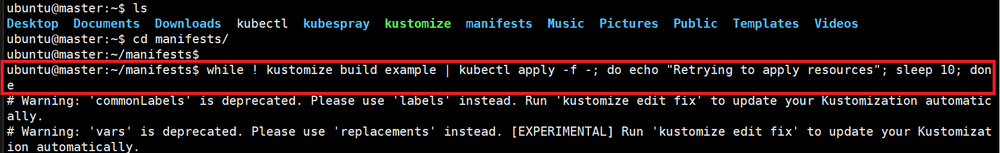

### 단계1: manifests
```shell
cd # 홈 디렉토리로 이동 

# git clone https://github.com/kubeflow/manifests.git 
git clone -b v1.6.0 https://github.com/kubeflow/manifests.git
```


---
### 단계2: 설치 
- 설치는 오래 걸리기 때문에 virtualbox에서 진행
- 전체설치 방법
```shell
cd manifests 
while ! kustomize build example | kubectl apply -f -; do echo "Retrying to apply resources"; sleep 10; done
```


- [부분설치 방법](https://mlops-for-all.github.io/docs/setup-components/install-components-kf)

---
### 단계3: pods 확인 
- 전부 Running으로 올라오는데는 시간이 걸린다. 
```shell
kubectl get pod -A | egrep 'NAME|^auth|^cert-manager|^istio-system|^knative-|^kubeflow'
```


---
- 만약 오류 또는 Pending이 오래 지속된다면, 아래 명령어를 통해 진행상황(또는 오류)를 볼수 있음
```shell
kubectl describe po -n <네임스페이스명> <파드명>
```


---
### 단계4: services 확인
```shell
kubectl get services --namespace istio-system
```


---
### 단계5: ClusterIP -> NodePort
- 웹 접근을 위해서는 현재 ClusterIP로 설정되어 있는 서비스를 NodePort로 변경 
```shell
kubectl edit service istio-ingressgateway -n istio-system
```


---
- 변경 내용 확인 
```shell
kubectl get services --namespace istio-system
```


