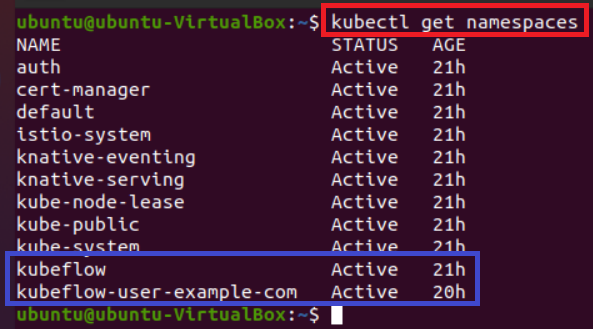
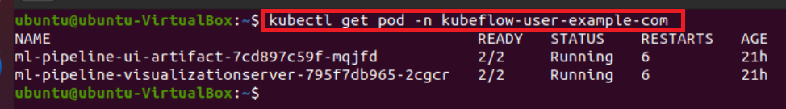
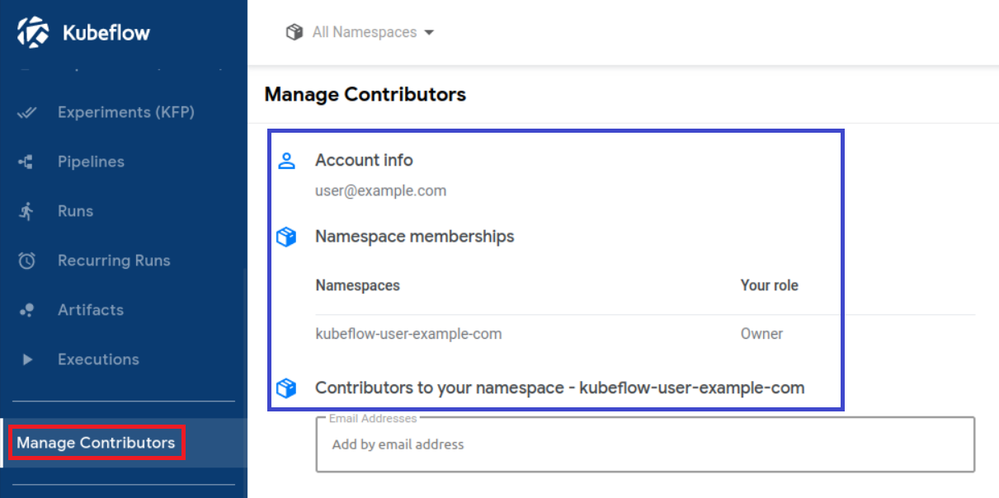
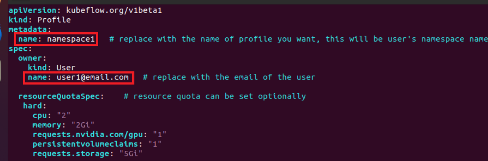
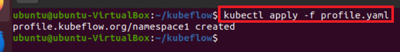
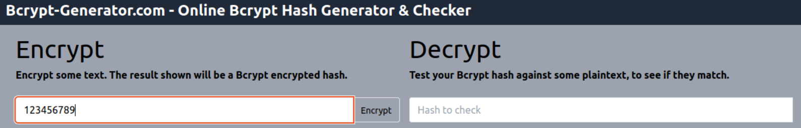
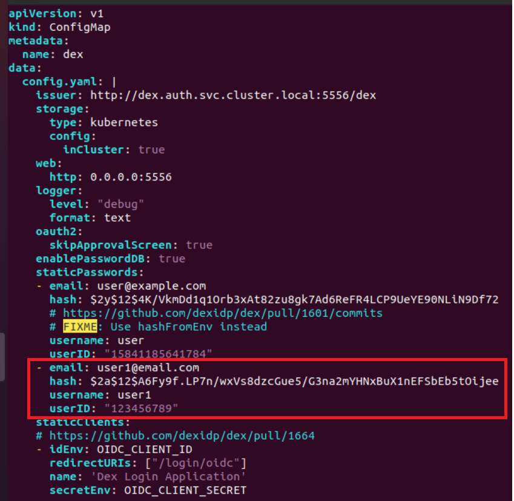
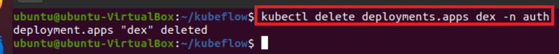

# Kubeflow 기본계정 정보
- Email: user@example.com
- Password: 12341234
- Namespace: kubeflow-user-example-com

---
### 단계1: Namespace 확인
- Kubernetes Object들을 논리적으로 구분 
```shell
kubectl get namespaces
```


---
### 단계2: kubeflow-user-example-com의 pod 확인 
```shell
kubectl get pod -n kubeflow-user-example-com
```


---
### 단계3: Kubeflow dashboard 확인 


---
# [Multi-User Design 예제](https://v1-5-branch.kubeflow.org/docs/components/multi-tenancy/getting-started/)

---
### 단계1: 연습용 디렉토리 생성
```shell
mkdir kubeflow
cd kubeflow
```


---
### 단계2: profile 작성
- yaml/profile.yaml 참고 
```shell
vim profile.yaml
```


---
### 단계3: profile 생성
```shell
kubectl apply -f profile.yaml
```


---
### 단계4: profile 확인
```shell
kubectl get profile -A
```


---
### 단계5: 비번을 hash값으로 변경
1. 접속: https://bcrypt-generator.com
2. 비번: 123456789


3. hash값 복사 


---
### 단계6: 계정 추가  
- yaml/config-map.yaml 참고
```shell
vim ~/manifests/common/dex/base/config-map.yaml
# 아래내용 추가 
- email: user1@email.com
  hash: 복사한 hash값
  username: user1
  userID: "123456789"
```


---
### 단계7: 수정내용 반영 
1. delete deployments.apps dex 
```shell
kubectl delete deployments.apps dex -n auth
```


---
2. build > deployments.apps/dex 생성 확인 
```shell
kustomize build ~/manifests/common/dex/overlays/istio | kubectl apply -f -
```


---
### 단계8: Kubeflow dashboard 로그인
- Email / Password: user1@email.com / 123456789


---


---


