# [Kubeflow Pipelines](https://www.kubeflow.org/docs/components/pipelines/v1/introduction/)
- Machine learning workflow
- 구성요소
  - UI: Experiment, Job 또는 Run을 관리하는 추적 
  - Engine: 단계별 ML 워크플로를 예약
  - SDK: Pipelines 및 Components를 정의하고 조작하기 
  - Notebook: SDK를 사용하여 시스템과 상호작용 

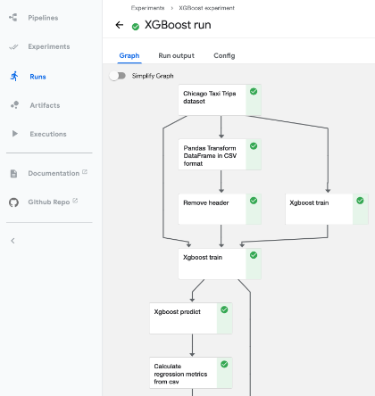

---
### [Airflow + MLflow vs Kubeflow Pipelines](https://aicurious.io/blog/2022-03-26-airflow-mlflow-or-kubeflow-for-mlops)
- MLOps 시스템의 전체 기능을 위해서는 Airflow를 MLflow와 결합해야 함.
- Kubeflow는 MLOps 시스템에 필요한 모든 기능을 거의 제공할 수 있음.

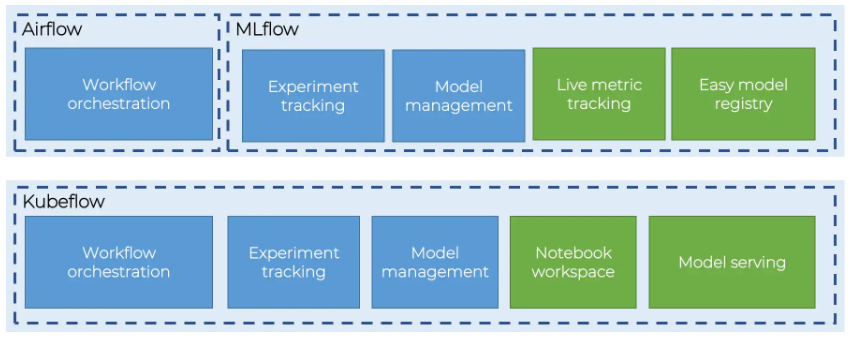

---
### [Kubeflow Component](https://www.kubeflow.org/docs/components/pipelines/v1/concepts/component/)
- Component Code
  - Client code: 작업을 제출하기 위해 엔드포인트와 통신하는 코드 
  - Runtime code: 실제 작업을 수행하고 일반적으로 클러스터에서 실행되는 코드
- [Component definition](https://www.kubeflow.org/docs/components/pipelines/v1/reference/component-spec/)
  - Metadata: 이름, 설명 등
  - Interface: 입력/출력 사양(이름, 유형, 설명, 기본값 등)
  - Implementation: 구성 요소 입력에 대한 일련의 인수 값이 주어지면 구성 요소를 실행하는 방법에 대한 사양
---
# 예제1
- pipeline/hello_world.ipynb

---
### 단계1: Notebook 생성 
- Name: my-pipeline-notebook1
- image: jupyter-scipy:v1.6.0 
- CPU: 1 / RAM: 1

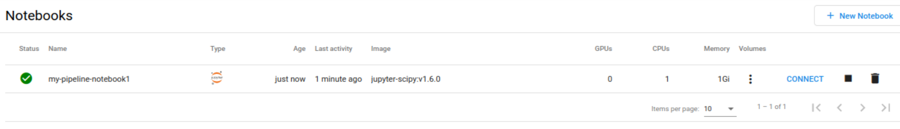

---
### 단계2: 0-1_hello-world-component.yaml
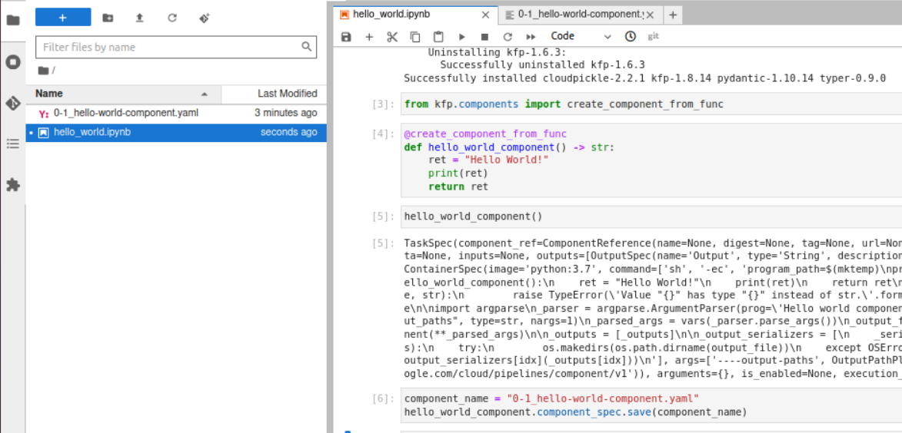

---
- 0-1_hello-world-component.yaml 내용 확인 

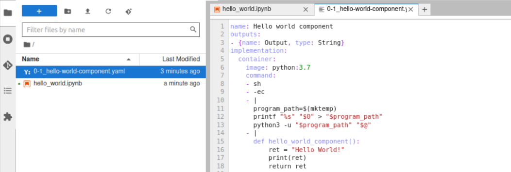

---
### 단계3: hello-world-pipeline.zip
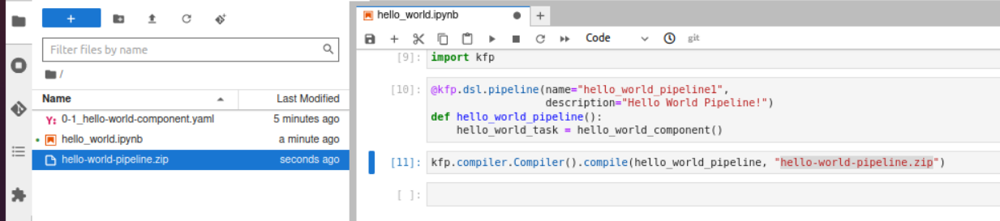

---
### 단계4: Upload Pipelines


---
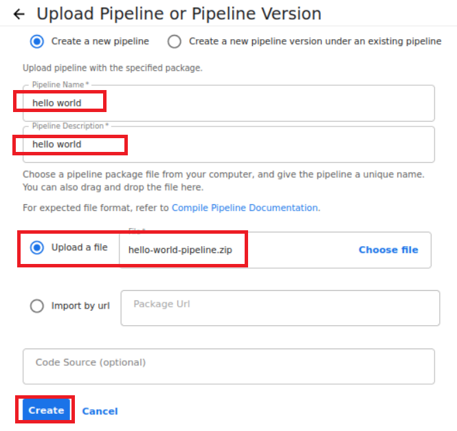

---
### 단계5: Create experiment
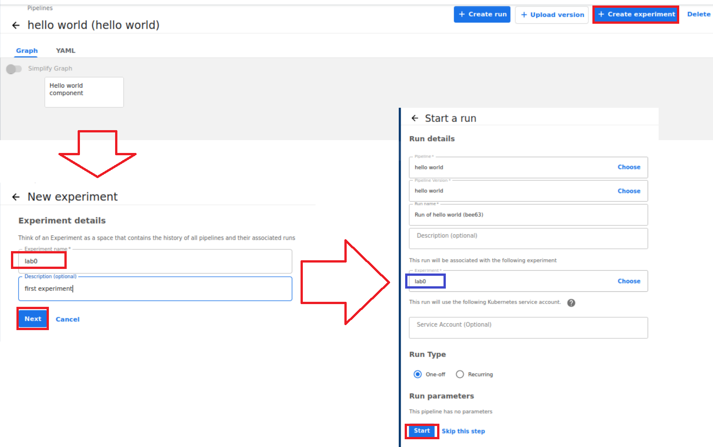

---
### 단계6: Run
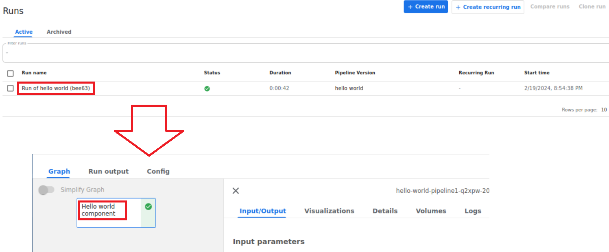

---
# 예제2
- 인증 예제 

---
### 단계1: Notebook 생성 
- Name: my-pipeline-notebook2
- image: jupyter-scipy:v1.6.0 
- CPU: 1 / RAM: 1


---
### 단계2: AuthorizationPolicy.yaml
- pipeline/AuthorizationPolicy.yaml
```shell
vim AuthorizationPolicy.yaml
kubectl apply -f AuthorizationPolicy.yaml
```
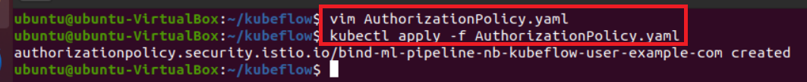

---
### 단계3: EnvoyFilter.yaml
- pipeline/EnvoyFilter.yaml
  - notebook-name 값을 사용하고 있는 Notebook명으로 변경 


---
### 단계4: Notebook > apply EnvoyFilter.yaml
```shell
kubectl apply -f EnvoyFilter.yaml
kubectl get EnvoyFilter -n kubeflow-user-example-com
```
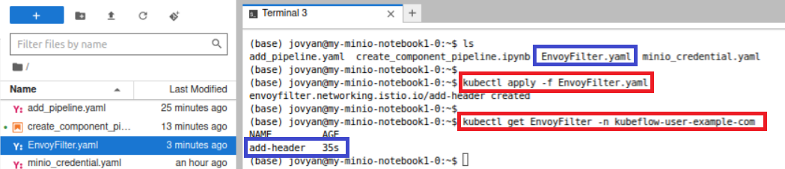

---
### 단계5: 결과 확인 


---
# 예제3
- PodDefault는 Notebook이 생성될 때 적용됨 
- pipeline/poddefault.yaml
- pipeline/create_pipeline.ipynb

---
### 단계1: poddefault.yaml
```shell
vim poddefault.yaml
kubectl apply -f poddefault.yaml
```
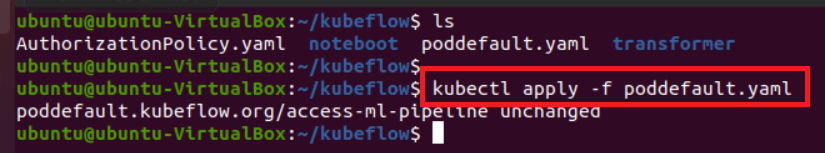

---
### 단계2: Notebook 생성 
- Name: my-pipeline-notebook3
- image: jupyter-scipy:v1.6.0 
- CPU: 1 / RAM: 1
- 중요: Allow access to Kubeflow Pipelines

---
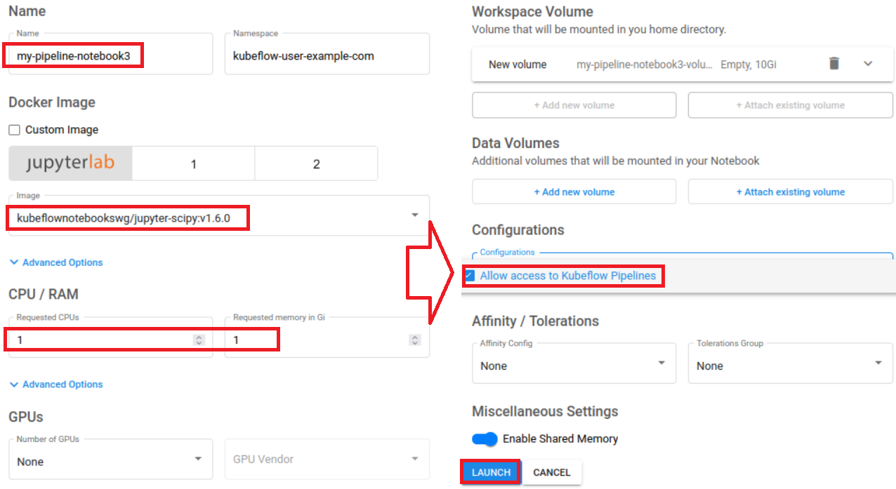

---
### 단계3: 인증 확인 


---
### 단계4: Create Pipeline
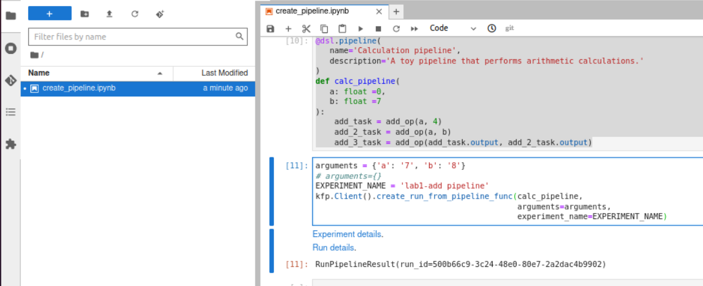

---
### 단계5: Run


