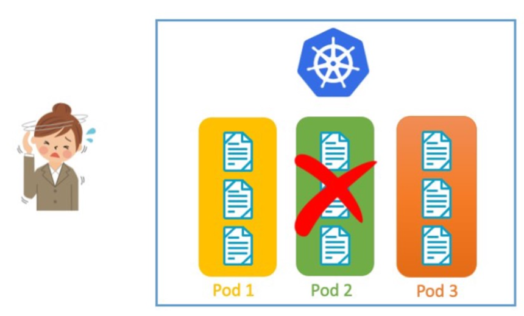
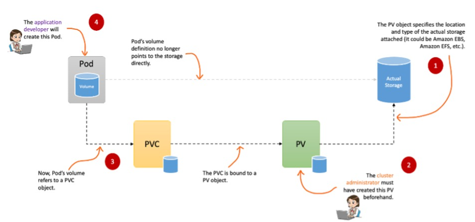
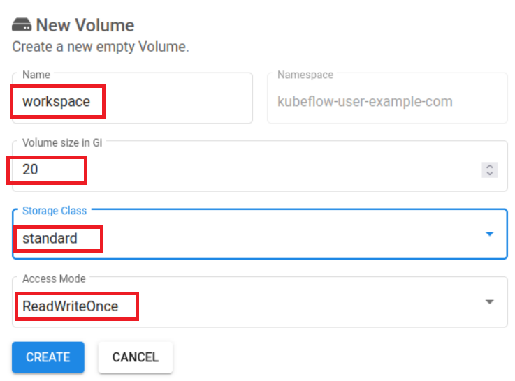
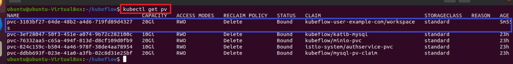

# [Kubernetes Persistent Volumes](https://aws.amazon.com/ko/blogs/tech/persistent-storage-for-kubernetes/)
- 상태 저장 애플리케이션이 올바르게 실행되기 위해서는 데이터가 저장되어 유지되고 읽을 수 있어야 합니다. 
- Kubernetes를 사용하여 상태 저장 애플리케이션을 실행할 때 컨테이너, 포드, 또는 노드 충돌이나 종료에 관계없이 상태가 유지되어야 합니다.
- 이를 위해서는 영구 스토리지, 즉 컨테이너, 포드, 또는 노드의 수명 후에도 지속되는 스토리지가 필요합니다.

---
### Kubernetes의 데이터 지속성
- 상태 저장 애플리케이션을 실행할 때, 영구 스토리지가 없으면 데이터는 포드 또는 컨테이너의 수명 주기에 연결됩니다. 포드가 충돌하거나 종료되면 데이터는 손실됩니다.



---
### 스토리지와 포드 분리: 영구 볼륨(Persistent Volumes)
- Kubernetes는 Persistent Volumes도 지원합니다. Persistent Volumes을 사용하면 애플리케이션, 컨테이너, 포드, 노드 또는 클러스터 자체의 수명 주기와 관계없이 데이터가 지속됩니다.
- Persistent Volume(PV)은 실제 스토리지 볼륨을 나타냅니다. Kubernetes는 PV를 포드에 연결하는데 필요한 추가 추상화 계층인 PersistentVolumeClaim(PVC)을 가지고 있습니다.



---
### 동적 프로비저닝(Dynamic provisioning)
- 동적 프로비저닝을 사용하면 PV객체를 생성할 필요가 없습니다. 대신에, PVC를 생성할 때 내부적으로 자동으로 생성됩니다. Kubernetes는 Storage Class라는 다른 객체를 사용하여 이를 수행합니다.


---
# 실습

---
### 단계1: Persistent Volumes 확인 
```shell
kubectl get pv -n kubeflow
```


---
### 단계2: PersistentVolumeClaim 생성 
- dashboard 로그인
  - Email: user@example.com / Password: 12341234
- Volumes > New Volume 클릭  


---
- Name: workspace
- Volume size: 10



---
- PersistentVolumeClaim 생성 확인 


---
### 단계3: Persistent Volumes 확인 
```shell
kubectl get pv -n kubeflow
```



