# [Noteboot Server](https://blog.kubesimplify.com/kubeflow-notebooks-ml-experimentation-made-easier-part-2)
Kubeflow Notebooks는 Pod 내에서 웹 기반 개발 환경을 실행하여 Kubernetes 클러스터 내에서 웹 기반 개발 환경을 실행하는 방법을 제공합니다.


---
### Kubeflow Notebooks 장점
- 노트북 컨테이너를 생성하고 로컬에서 실행하는 대신 클러스터에서 직접 실행할 수 있습니다.
- 사전 구성된 이미지 또는 사용자 정의 이미지를 사용하여 환경을 생성할 수 있으며, 이를 통해 환경이나 설치 문제가 아닌 현재 작업에 집중할 수 있습니다.
- JupyterLab, RStudio 및 VS Code를 즉시 지원하지만 다른 IDE도 사용할 수 있습니다.
- 마지막으로 Kubeflow의 역할 기반 액세스 제어 기능을 사용하면 쉽고 안전하게 노트북을 공유할 수 있습니다.

---
### Kubeflow Notebooks 스토리지 볼륨
- 각 노트북 컨테이너들은 PVC를 통해서 Dataset 및 Models 등을 공유할 수 있습니다. 


---
# 예제1

---
### 단계1: dashboard 접속
- dashboard 로그인
  - Email: user@example.com / Password: 12341234
- Notebooks > New Notebooks 클릭 

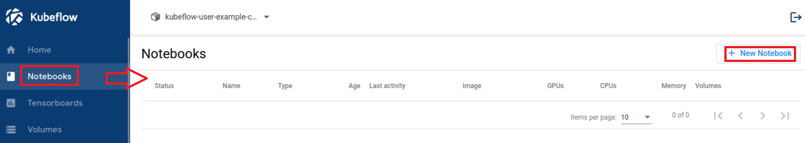

---
### 단계2: Notebooks 생성
- Name: my-notebook1
- image: jupyter-pytorch-full:v1.6.0 
- CPU: 1
- RAM: 1

---


---
### 단계3: Notebooks 확인
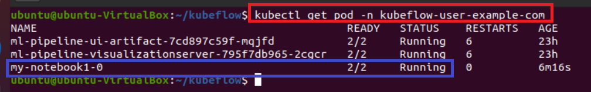

### 단계4: Pod 확인 
```shell
kubectl get pod -n kubeflow-user-example-com
```
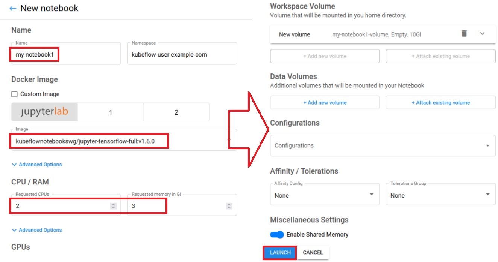

---
### 단계5: Persistent Volumes 확인 
```shell
kubectl get pv -n kubeflow
```
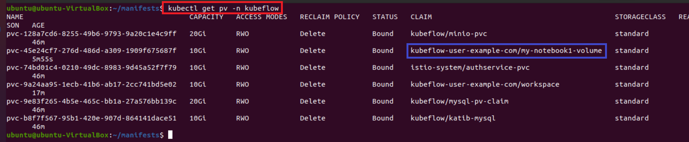

---
### 단계6: Notebooks 접속 
- my-notebook1 > connect

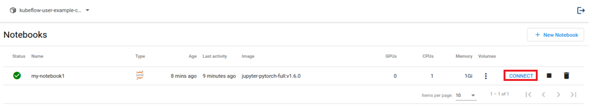

---
### 단계7: Nodebook 실행  
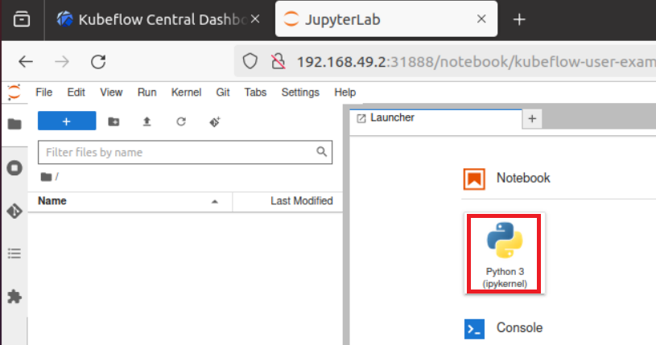

---
### 단계8: import torch
```shell
import torch
torch.__version__
```
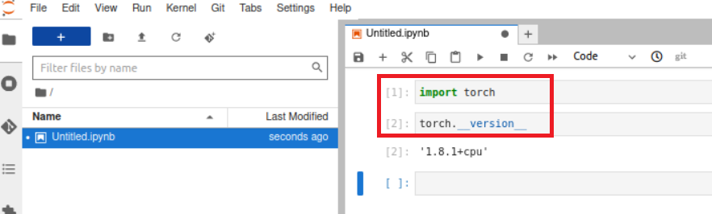

---
### 단계9: Nodebook stop


---
### 단계10: pod & pv 확인 
- pod 없음 / pv 있음 


---
# 예제2
- 생성한 workspace에 마운트하기 

---
### 단계1: Notebooks 생성
- Name: my-notebook2
- image: jupyter-pytorch-full:v1.6.0 
- CPU / RAM: 1 / 1
- Data Volumes
  - 기존에 만든 workspace 적용

---


---
### 단계2: Notebooks 확인
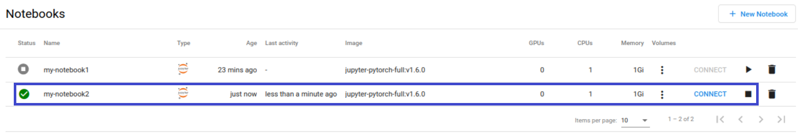

### 단계3: Pod 확인 
```shell
kubectl get pod -n kubeflow-user-example-com
```


---
### 단계4: Persistent Volumes 확인 
```shell
kubectl get pv -n kubeflow
```


---
### 단계5: my-notebook2 접속 > 마운트된 볼륨 확인 
- my-notebook1과는 달리 vol-1 폴더가 보임
- vol-1 폴더는 workspace와 연동된 폴더임 


---
### 단계6: vol-1 폴더에 파일 생성 
- 생성: sample1.txt > Hello World


---
### 단계7: workspace 디렉토리 및 파일 확인 
- [minikube 경우](https://velog.io/@moey920/Minikube%EC%9D%98-Dynamic-Provisioning-%EC%9D%B4%ED%95%B4%ED%95%98%EA%B8%B0)
  - minikube는 모든 PVC 요청을 StorageClass를 통해 처리하며, 이 StorageClass는 Kubernetes 객체로 쉽게 수정할 수 있지만 파일로는 접근 및 수정할 수 없습니다.
- NFC를 설정한 kubeflow인 경우
  - 기본 path: /opt/local-path-provisioner
  - 또는 아래 명령어롤 통해 확인 가능
```shell
# PV명 확인 
kubectl get pv -n kubeflow
# Path 확인
kubectl describe pv <PV명> -n kubeflow
```
---
- minikube인 경우 NFC를 설정하지 않으며, 접근할 수 없음 

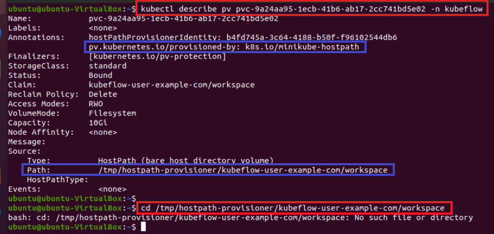

---
### 단계8: JupyterLab > Terminal 접속 
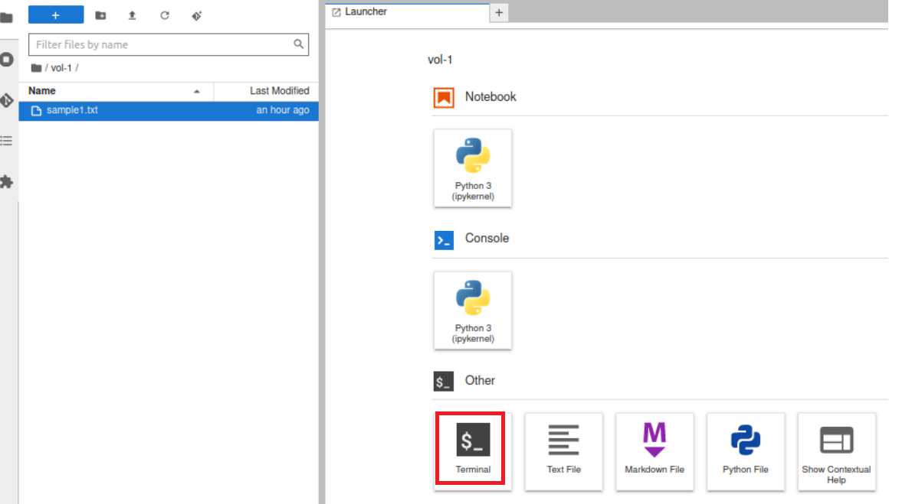

---
### 단계9: sudo 명령어 사용 > 오류 발생
- custom image에서만 sudo 권한을 사용용할 수 있음  
```shell
sudo ls
```
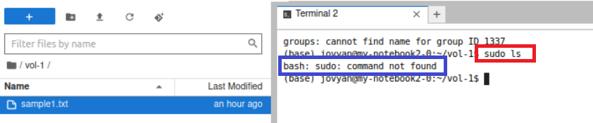

---
# Notebook 삭제 
- 용량이 부족할 수 있으므로 필요없는 Notbook 삭제하자 

---
### 단계1: Notebook Stop


### 단계2: Notebook Delete


---
### 단계3: Volumes Delete


### 단계4: pv 확인 


