# [Kubeflow Image Dependency Chart](https://v1-5-branch.kubeflow.org/docs/components/notebooks/container-images/)
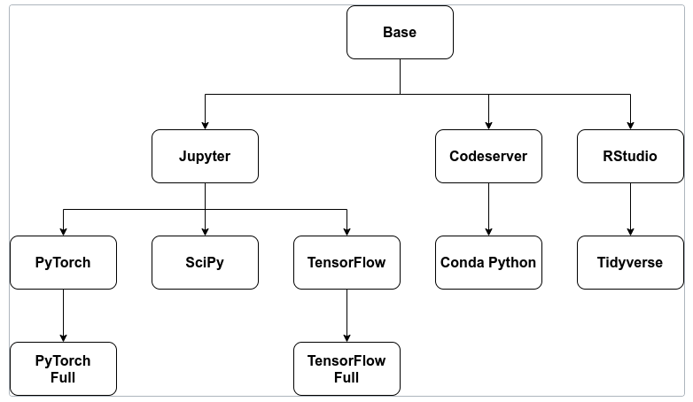

---
### Kubeflow Image 종류
- 위에서 보았듯이 Kubeflow Image는 크게 3개로 나눠짐 
  - Jupyter: Jupyterlab
  - Codeserver: 1
  - RStudio: 2


---
### [Kubeflow Dockerfiles](https://www.kubeflow.org/docs/components/notebooks/container-images/)
- kubeflow dockerfile을 이용하여 custom image를 생성할 수 있음

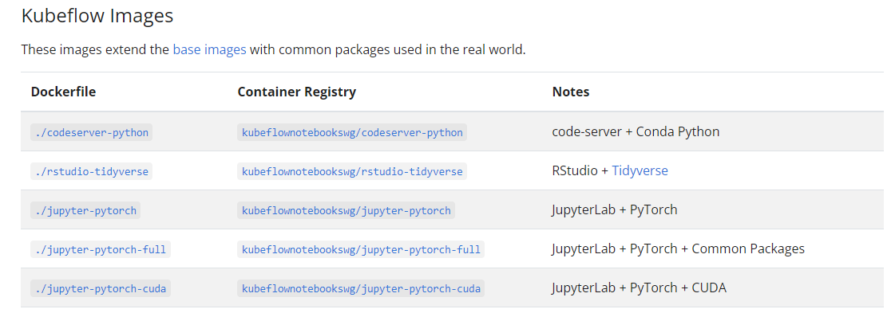

---
# 예제1
- docker/jupyter 폴더 참고 
- docker login을 해야만 Custom Image를 사용할 수 있음 

---
### 단계1: Dockerfile 생성 
```shell
# 없으면, 생성: mkdir -p ~/kubeflow/noteboot/jupyter 
cd ~/kubeflow/noteboot/jupyter
# docker/jupyter 폴더 참고 
vim Dockerfile 
```


---
### 단계2: docker 로그인 
```shell
docker login
```
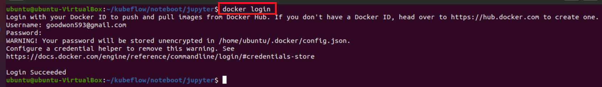

---
### 단계3: build Dockerfile > 이미지 생성
- 명령어: docker build -t <도커허브아이디>/<이미지명>:<테크> .
```shell
# 이미지 생성
docker build -t goodwon593/kubeflow_jupyter:latest .
# 이미지 확인
docker images
```


---
### 단계4: 도커허브로 이미지 업로드 
- 명령어: docker push <도커허브아이디>/<이미지명>:<테크>
```shell
docker push goodwon593/kubeflow_jupyter
```
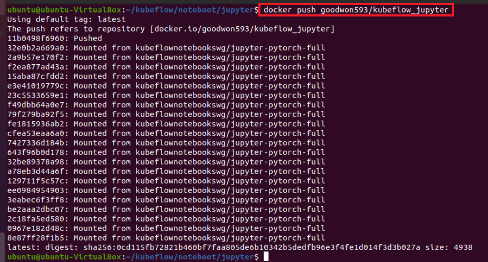

---
### 단계5: 도커허브에서 이미지 업로드 확인 


---
### 단계6: workspace를 사용하는 Notebook delete
- workspace 볼륨을 하나의 인스턴스만 접근하도록 설정되어 있음
- 따라서 my-notebook2 delete


---
### 단계7: Notebooks 생성
- Name: my-notebook3
- image: goodwon593/kubeflow_jupyter:latest 
- CPU / RAM: 1 / 1
- Data Volumes
  - 기존에 만든 workspace 적용

---


---
### 단계8: Notebooks 확인
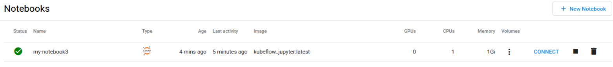

### 단계9: Pod 확인 
```shell
kubectl get pod -n kubeflow-user-example-com
```
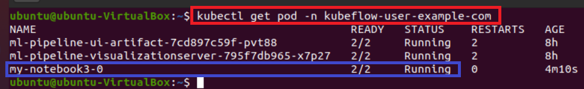

---
### 단계10: describe my-notebook3
- 도커허브에서 Custom Image를 다운로드하는 것을 확인 
```shell
kubectl describe pod my-notebook3-0 -n kubeflow-user-example-com
```
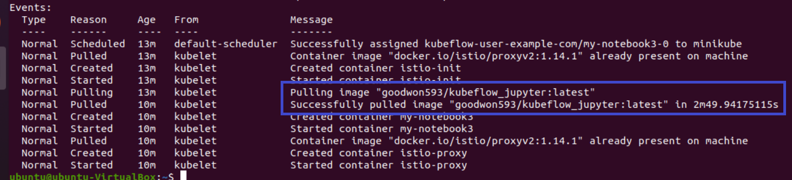

---
### 단계11: workspace 데이터 확인 
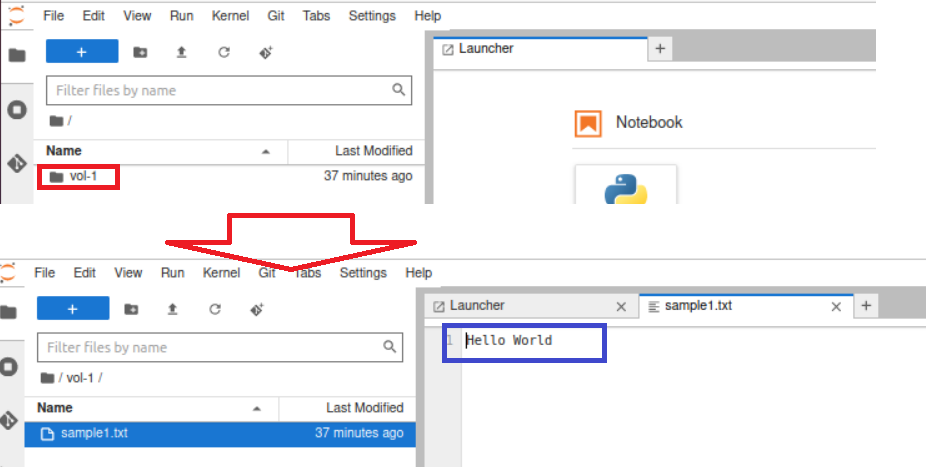

---
### 단계12: Terminal > sudo 확인 
- 비번: jovyan
```shell
sudo ls
sudo passwd root # root 게정 비번 정의 
su - root # root 계정으로 변경 
```


---
### 단계13: jupyter1.ipynb
- Custom Image도 문제가 없다는 것 확인 
```shell
import torch
torch.__version__
```
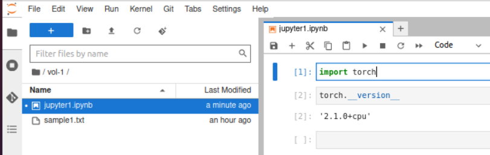

---
# 예제2
- docker/codeserver 폴더 참고 
- docker login을 해야만 Custom Image를 사용할 수 있음 

---
### 단계1: Dockerfile 생성 
```shell
# 없으면, 생성: mkdir -p ~/kubeflow/noteboot/codeserver 
cd ~/kubeflow/noteboot/codeserver
# docker/codeserver 폴더 참고 
vim Dockerfile 
```


---
### 단계2: docker 로그인 
```shell
docker login
```


---
### 단계3: build Dockerfile > 이미지 생성
- 명령어: docker build -t <도커허브아이디>/<이미지명>:<테크> .
```shell
# 이미지 생성
docker build -t goodwon593/kubeflow_codeserver:latest .
# 이미지 확인
docker images
```
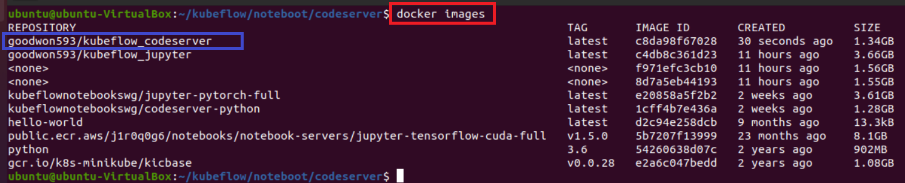

---
### 단계4: 도커허브로 이미지 업로드 
- 명령어: docker push <도커허브아이디>/<이미지명>:<테크>
```shell
docker push goodwon593/kubeflow_codeserver
```
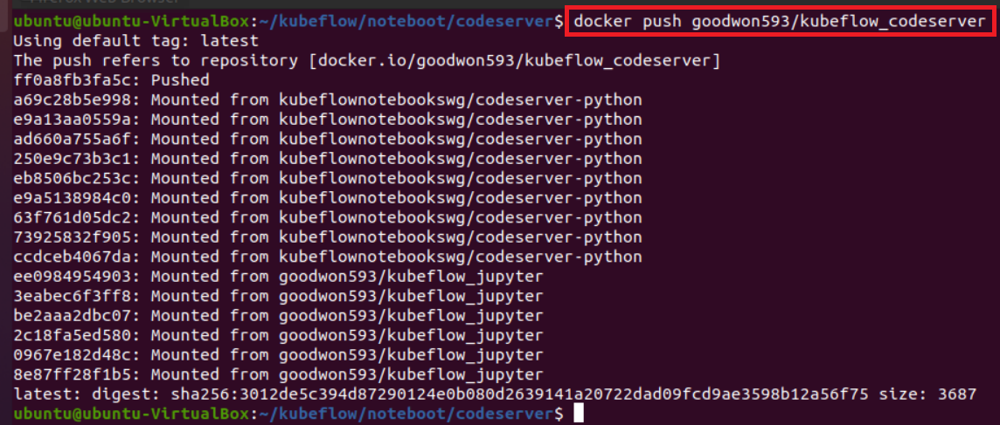

---
### 단계5: Notebooks 생성
- Name: my-notebook4
- image: goodwon593/kubeflow_codeserver:latest
- CPU / RAM: 1 / 1

---
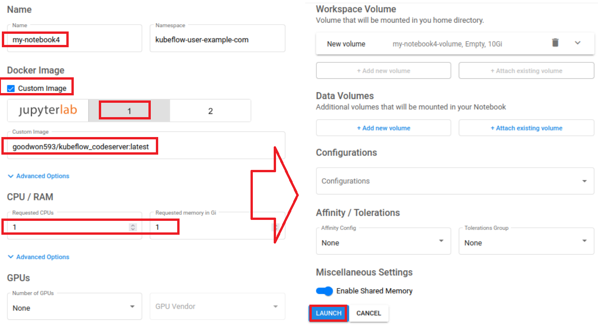

---
### 단계6: Notebooks 확인


### 단계7: Pod 확인 
```shell
kubectl get pod -n kubeflow-user-example-com
```
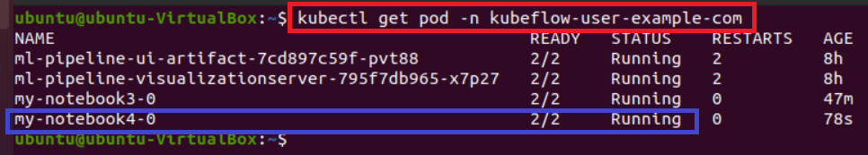

---
### 단계8: my-notebook4 접속 
- 비번: jovyan
```shell
sudo ls
sudo passwd root # root 게정 비번 정의 
su - root # root 계정으로 변경 
```
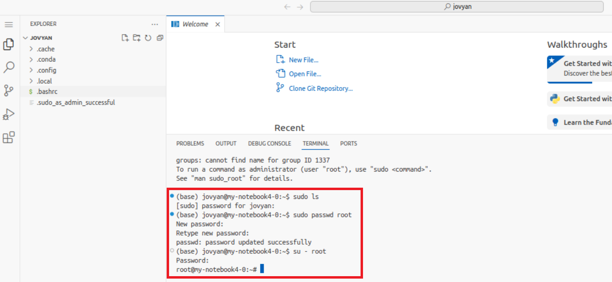


