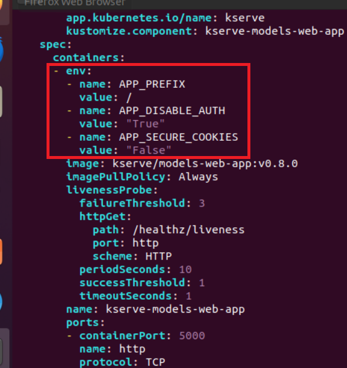
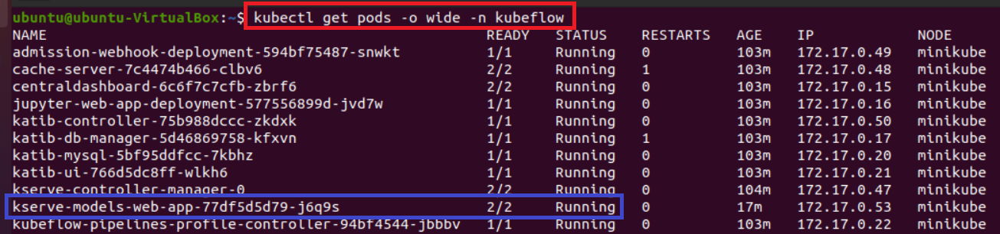
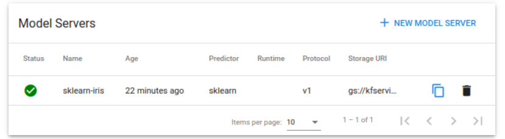

# [KServe](https://kserve.github.io/website/master/)
- KServe는 만들어진 ML/DL 모델을 실제로 서비스하기 위해 API를 쉽게 만들 수 있도록 도와주는 툴이다.


---
### Kserve 장점
- KServe는 확장성이 뛰어난 사용 사례를 위해 구축된 Kubernetes의 표준 모델 추론 플랫폼입니다.
- ML 프레임워크 전반에 걸쳐 고성능의 표준화된 추론 프로토콜을 제공합니다.
- GPU에서 Scale to Zero를 포함한 Auto Scaling을 통해 최신 서버리스 추론 워크로드를 지원합니다.
- ModelMesh를 사용하여 높은 확장성, 밀도 패킹 및 지능형 라우팅 제공
- 예측, 사전/사후 처리, 모니터링 및 설명 기능을 포함하는 프로덕션 ML 서비스를 위한 간단한 플러그 가능한 프로덕션 서비스입니다.

---
# 예제1
- kserve/1_tutorial.ipynb

---
### 단계1: [kserve-models-web-app 환경변수](https://www.kubeflow.org/docs/external-add-ons/kserve/webapp/) 
```shell
kubectl edit deploy kserve-models-web-app -n kubeflow
# 아내내용 추가 
- env:
  - name: APP_PREFIX
    value: /
  - name: APP_DISABLE_AUTH
    value: "True"
  - name: APP_SECURE_COOKIES
    value: "False"
```


---
- pod의 running 확인 
```shell
kubectl get pods -o wide -n kubeflow
```


---
### 단계2: New Model Server
- Email: user@example.com
- Password: 12341234


---
- kserve/1_tutorial.ipynb > iris-example.yaml 입력 


---
### 단계3: Model Server 생성 확인 

```shell
kubectl get pod -n kubeflow-user-example-com
```


---
### 단계3: url internal 확인 


---
### 단계4: 


---
- https://kserve.github.io/website/0.9/get_started/first_isvc/#2-create-an-inferenceservice


Could not find CSRF cookie XSRF-TOKEN in the request. http://192.168.49.2:32052/kserve-endpoints/api/namespaces/kubeflow-user-example-com/inferenceservices


- https://www.kubeflow.org/docs/external-add-ons/kserve/kserve/


kubectl edit deployment kserve-models-web-app -n kubeflow

kubectl edit clusterrole kserve-models-web-app-cluster-role 

kubectl edit -n kubeflow deployments.apps kserve-models-web-app

---
- https://www.youtube.com/watch?v=XNqzcIcwuW4&list=PL6ZWs3MJaiphOwtHQvBCA4GNw-EPDely-&index=8


- https://github.com/myoh0623/kubeflow/tree/master


kserve-models-web-app-config-87f7mg8b2f

---
- env:
  - name: APP_PREFIX
    value: "/"
  - name: APP_DISABLE_AUTH
    value: "True"
  - name: APP_SECURE_COOKIES
    value: "False"


# APP_PREFIX: /
# APP_DISABLE_AUTH: "True"
# APP_SECURE_COOKIES: "False"


