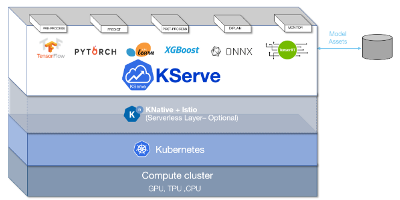
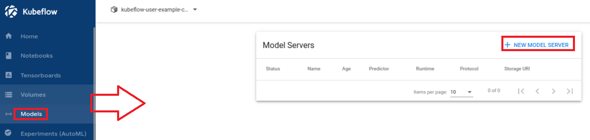

# [KServe](https://kserve.github.io/website/master/)
- KServe는 만들어진 ML/DL 모델을 실제로 서비스하기 위해 API를 쉽게 만들 수 있도록 도와주는 툴이다.

---
### Kserve 장점
- KServe는 확장성이 뛰어난 사용 사례를 위해 구축된 Kubernetes의 표준 모델 추론 플랫폼입니다.
- ML 프레임워크 전반에 걸쳐 고성능의 표준화된 추론 프로토콜을 제공합니다.
- GPU에서 Scale to Zero를 포함한 Auto Scaling을 통해 최신 서버리스 추론 워크로드를 지원합니다.
- ModelMesh를 사용하여 높은 확장성, 밀도 패킹 및 지능형 라우팅 제공
- 예측, 사전/사후 처리, 모니터링 및 설명 기능을 포함하는 프로덕션 ML 서비스를 위한 간단한 플러그 가능한 프로덕션 서비스입니다.

---
# 예제1
- kserve/1_tutorial.ipynb

---
### 단계1 New Model Server

---
- kserve/1_tutorial.ipynb > iris-example.yaml 입력 

---
- https://kserve.github.io/website/0.9/get_started/first_isvc/#2-create-an-inferenceservice

---
- https://www.youtube.com/watch?v=XNqzcIcwuW4&list=PL6ZWs3MJaiphOwtHQvBCA4GNw-EPDely-&index=8

- https://github.com/myoh0623/kubeflow/tree/master

