# Default 계정
- Email: `user@example.com`
- Password: `12341234`
- Namespace: `kubeflow-user-example-com`

---
### 단계1: Dashboard
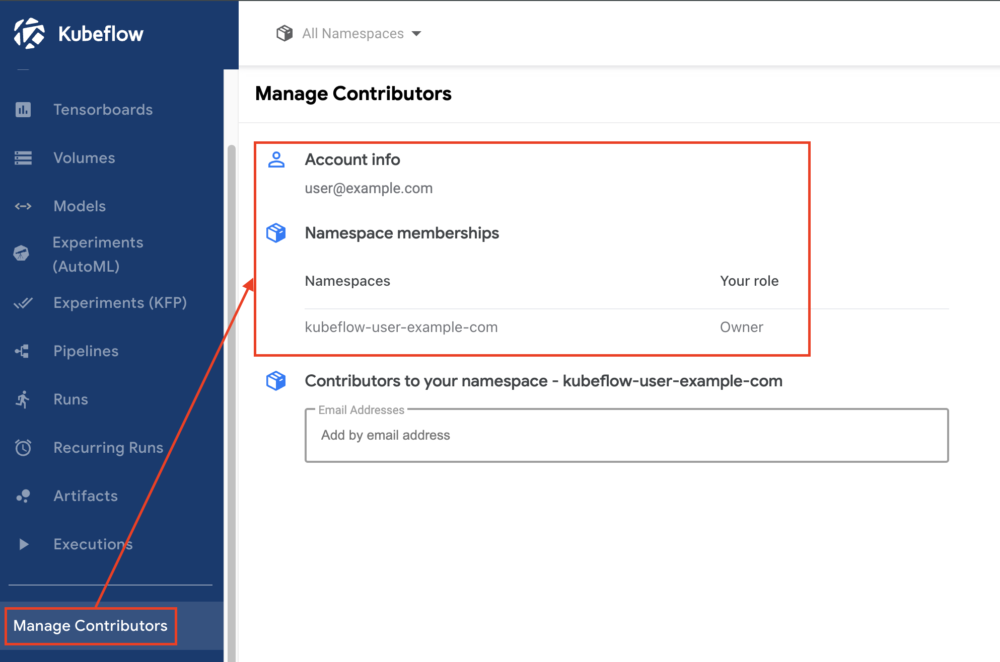

---
### 단계2: Namespace
```shell
kubectl get namespaces | grep kubeflow
```
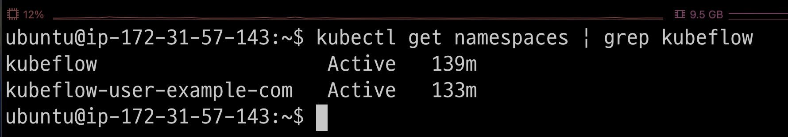

---
### 단계3: all of namespaces
```shell
kubectl get all -n kubeflow-user-example-com
```
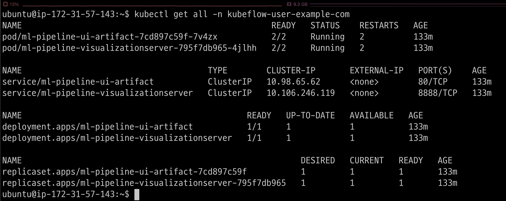

---
# [Create User](https://v1-5-branch.kubeflow.org/docs/components/multi-tenancy/getting-started/)
- Email: `user1@email.com`
- Password: `123456789`
- Namespace: `namespace1`

---
### 단계1: profile.yaml 작성
```shell
vim profile.yaml
# profile.yaml 참고
```
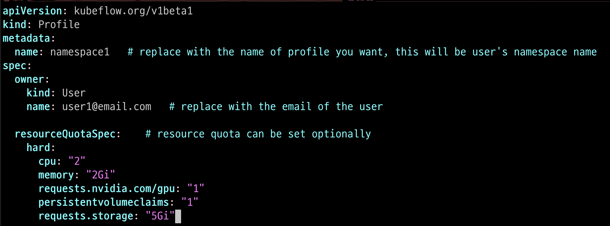

---
### 단계2: profile.yaml 생성
```shell
kubectl apply -f profile.yaml
```
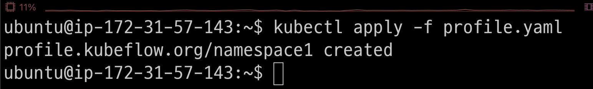

---
### 단계3: profile.yaml 확인
```shell
kubectl get profile -A
```
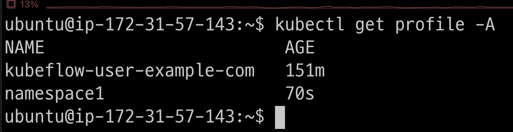

---
### 단계4: all of namespaces
```shell
kubectl get all -n namespace1
```
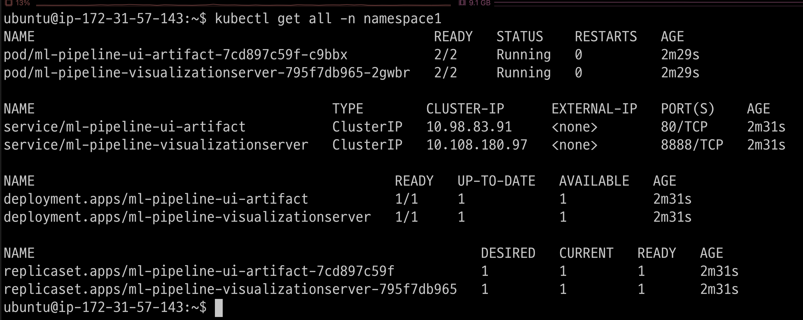

---
### 단계5: 비번을 hash값으로 변경
1. 접속: https://bcrypt-generator.com
2. 비번: 123456789


3. hash값 복사 


---
### 단계6: dex > 생성한 계정 추가
```shell
vim ~/manifests/common/dex/base/config-map.yaml
# 아래내용 추가 
- email: user1@email.com
  hash: 복사한 hash값
  username: user1
  userID: "123456789"
```
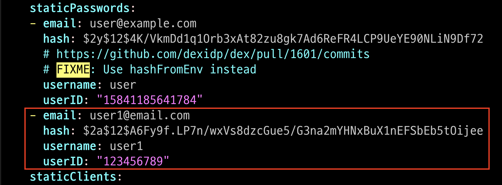

---
### 단계7: dex > 변경된 내용 반영 
1. delete deployments.apps dex
```shell
kubectl delete deployments.apps dex -n auth
```
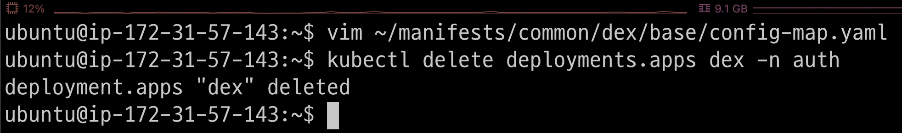

---
2. build deployments.apps dex
```shell
kustomize build ~/manifests/common/dex/overlays/istio | kubectl apply -f -
```


---
### 단계8: Kubeflow dashboard 로그인
- Email / Password: `user1@email.com / 123456789`

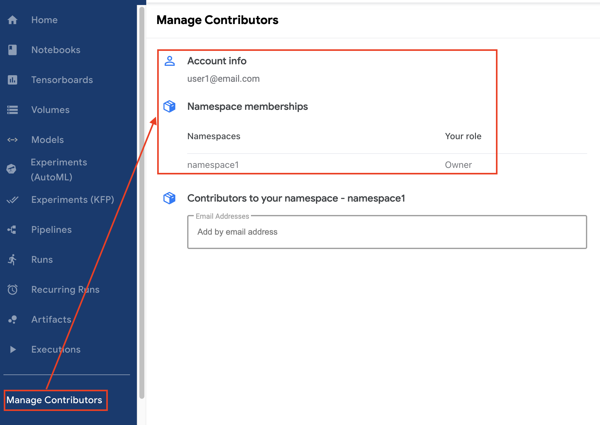

---
# Delete User

---
### 단계1: dex > 계정 삭제
```shell
vim ~/manifests/common/dex/base/config-map.yaml
```
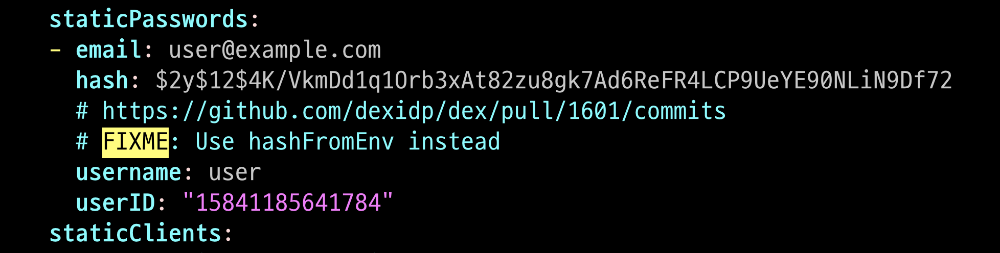

---
### 단계2: dex > 변경된 내용 반영 
1. delete deployments.apps dex
```shell
kubectl delete deployments.apps dex -n auth
```


---
2. build deployments.apps dex
```shell
kustomize build ~/manifests/common/dex/overlays/istio | kubectl apply -f -
```


---
### 단계3: delete profile
```shell
kubectl delete profile namespace1
kubectl get profile -A
```
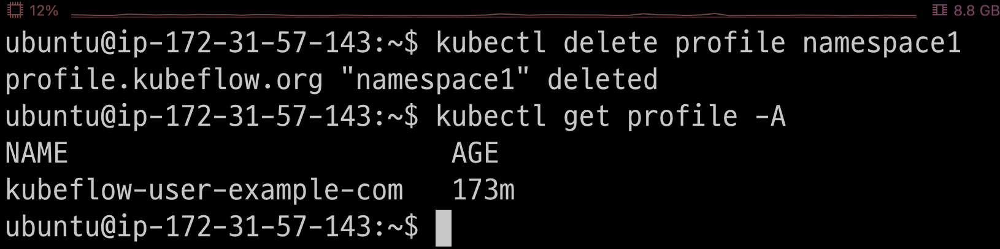

---
### 단계4: 확인
```shell
kubectl get all -n namespace1
kubectl get namespace | grep namespace1
```
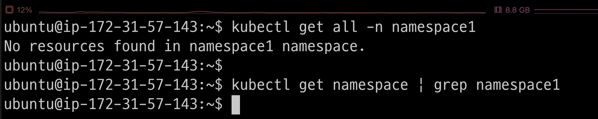

