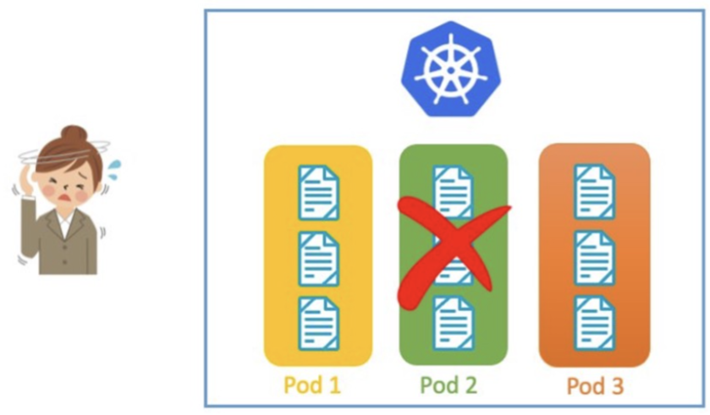
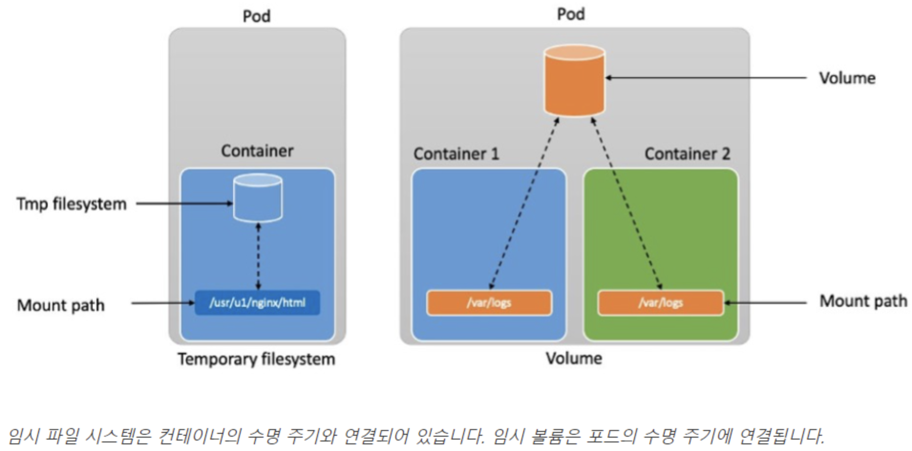
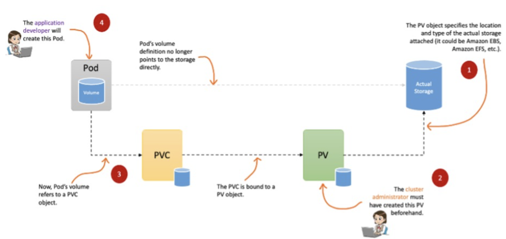
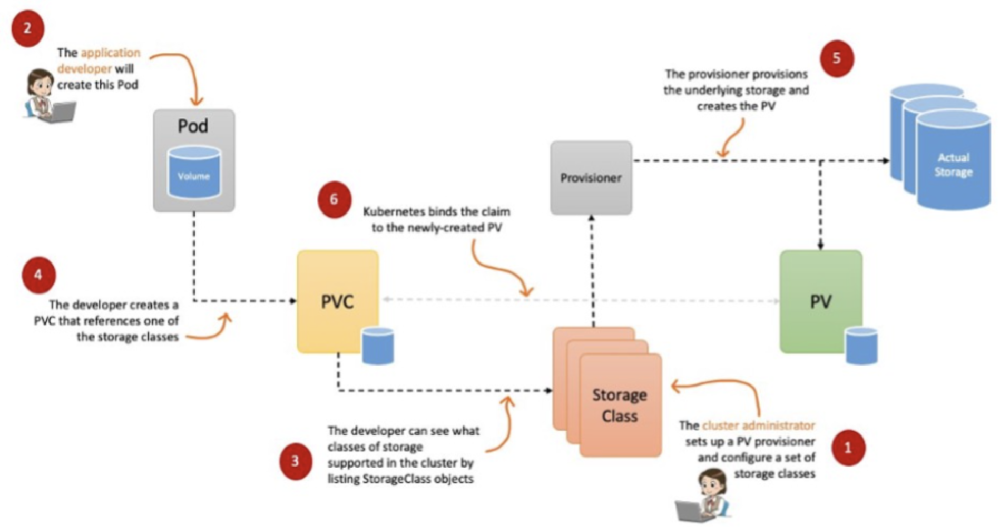
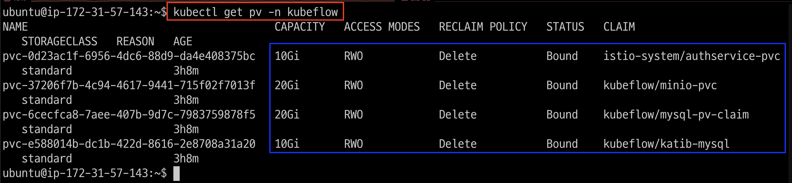
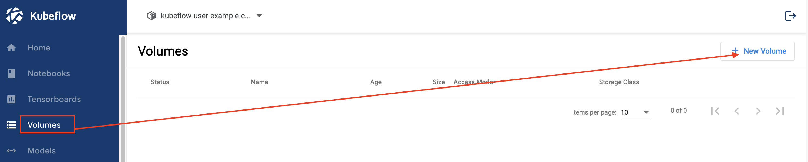
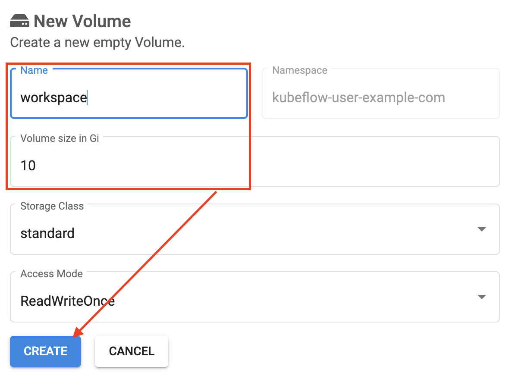
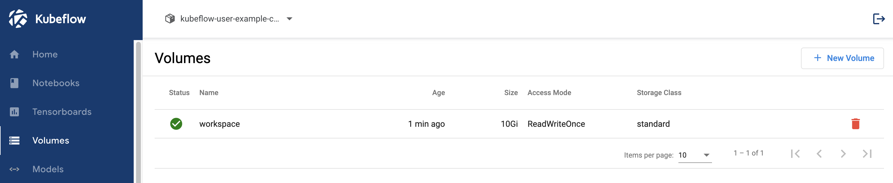
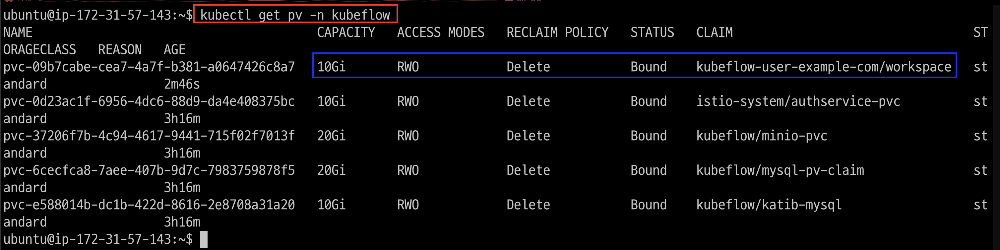

# [Kubernetes Persistent Volumes](https://aws.amazon.com/ko/blogs/tech/persistent-storage-for-kubernetes/)
- 상태 저장 애플리케이션이 올바르게 실행되기 위해서는 데이터가 저장되어 유지되고 읽을 수 있어야 합니다. 
- Kubernetes를 사용하여 상태 저장 애플리케이션을 실행할 때 컨테이너, 포드, 또는 노드 충돌이나 종료에 관계없이 상태가 유지되어야 합니다.
- 이를 위해서는 영구 스토리지, 즉 컨테이너, 포드, 또는 노드의 수명 후에도 지속되는 스토리지가 필요합니다.

---
## Kubernetes의 데이터 지속성
- 상태 저장 애플리케이션을 실행할 때, 영구 스토리지가 없으면 데이터는 포드 또는 컨테이너의 수명 주기에 연결됩니다. 포드가 충돌하거나 종료되면 데이터는 손실됩니다.



---
이러한 데이터 손실을 방지하고 Kubernetes에서 상태 저장 애플리케이션을 실행하려면 세 가지 간단한 스토리지 요구 사항을 준수해야 합니다:

1. 스토리지는 포드의 수명 주기에 의존해서는 안 됩니다.
2. 스토리지는 Kubernetes 클러스터의 모든 포드 및 노드에서 사용할 수 있어야 합니다.
3. 스토리지는 충돌이나 애플리케이션 오류에 관계없이 가용성이 높아야 합니다.

### Kubernetes볼륨(Kubernetes volumes)
Kubernetes에는 여러 가지 유형의 스토리지 옵션이 있으며, 모두 영구적인 것은 아닙니다.

---
### 임시 스토리지(Ephemeral storage)
컨테이너는 temporary filesystem(tmpfs)를 사용하여 파일을 읽고 쓸 수 있습니다. 그러나 임시 스토리지는 세 가지의 저장소 요구 사항을 충족하지 않습니다. 컨테이너가 충돌하는 경우 temporary filesystem은 손실되고, 컨테이너는 깨끗한 상태로 다시 시작됩니다. 또한 여러 컨테이너가 temporary filesystem을 공유할 수 없습니다.

### 임시 볼륨(Ephemeral volumes)
임시 Kubernetes Volume은 임시 스토리지가 직면한 두 가지 문제를 모두 해결합니다. 임시 Volume의 수명은 Pod와 연결됩니다. 이를 통해 컨테이너를 안전하게 재시작하고 Pod내의 컨테이너간 데이터를 공유할 수 있습니다. 그러나 Pod가 삭제되는 즉시 Volume도 삭제가 되므로, 이는 여전히 세 가지 요구 사항을 충족하지 못합니다.

---


---
## 스토리지와 포드 분리: 영구 볼륨(Persistent Volumes)
- Kubernetes는 Persistent Volumes도 지원합니다. Persistent Volumes을 사용하면 애플리케이션, 컨테이너, 포드, 노드 또는 클러스터 자체의 수명 주기와 관계없이 데이터가 지속됩니다.

## 영구 볼륨 클레임(Persistent volume claims)
- Persistent Volume(PV)은 실제 스토리지 볼륨을 나타냅니다. Kubernetes는 PV를 포드에 연결하는데 필요한 추가 추상화 계층인 PersistentVolumeClaim(PVC)을 가지고 있습니다.
- 간단히 말해서, Kubernetes는  PV객체는 클러스터 관리자 범위에 속하고, 반면에 PVC 객체는 애플리케이션 개발자 범위에 속해야 한다는 개념으로 구축되었습니다.

---
## 정적 프로비저닝(Static provisioning)
- "영구 볼륨 클레임" 섹션에서 설명한 바와 같이, 먼저 관리자가 하나 이상의  PV를 생성하고 애플리케이션 개발자는  PVC를 생성합니다. 이를 정적 프로비저닝이라고 합니다. 
- Kubernetes에서 PV 및 PVC를 수동으로 만들어야 하므로 정적 입니다.  
- 대규모 환경에서는 관리하기가 점점 더 어려워질 수 있으며, 특히 수백 개의 PV와 PVC를 관리하는 경우에는 더욱 그렇습니다.

---


---
## 동적 프로비저닝(Dynamic provisioning)
- 동적 프로비저닝을 사용하면 PV객체를 생성할 필요가 없습니다. 대신에, PVC를 생성할 때 내부적으로 자동으로 생성됩니다. Kubernetes는 Storage Class라는 다른 객체를 사용하여 이를 수행합니다.
- Storage Class는 컨테이너 애플리케이션에 사용되는 백엔드 영구 스토리지(예: Amazon EFS 파일 스토리지, Amazon EBS 블록 스토리지 등)의 클래스를 정의하는 추상화입니다.
- Pod 관점에서 볼 때, EFS 볼륨, EBS 볼륨, NFS 드라이브 또는 기타 어떤 것이든, 그 Pod는 PVC 객체만 보게 됩니다. 
- 실제 스토리지 기술을 다루는 모든 내부적인 논리는  Storage Class 객체가 사용하는 프로비저너에 의해 구현됩니다.

---


---
### 단계1: Persistent Volumes 확인
```shell
kubectl get pv -n kubeflow
```


---
### 단계2: Persistent Volumes 생성


---
### 단계3: New Volume
- Name: workspace
- Volume Size: 10


---
- 결과 확인 


---
### 단계4: Persistent Volumes 확인
```shell
kubectl get pv -n kubeflow
```


