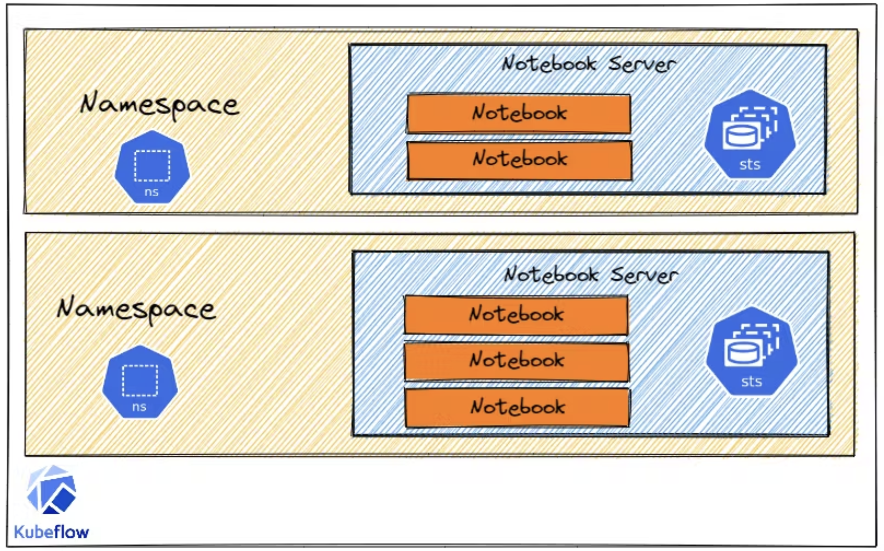
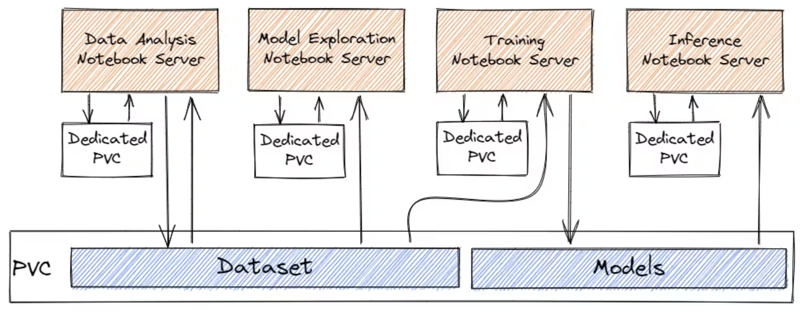
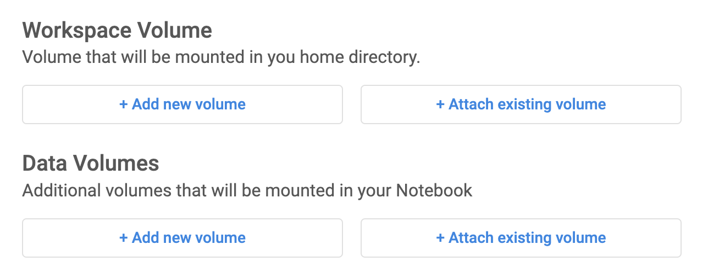
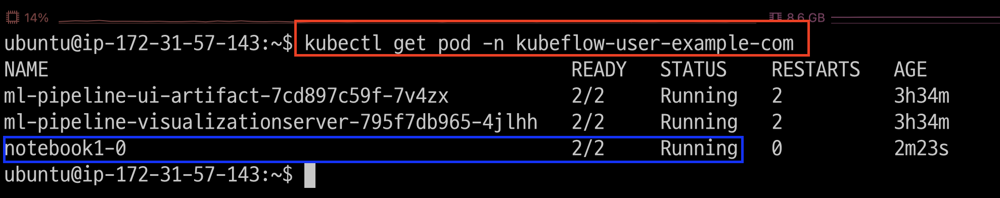
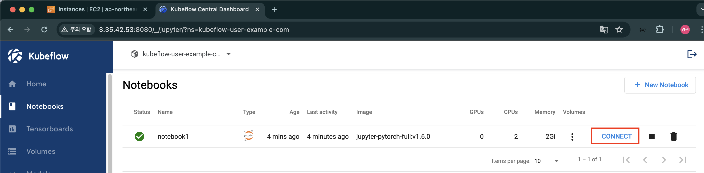
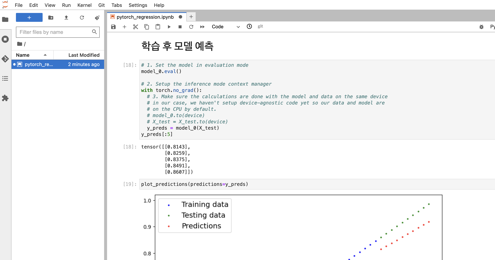
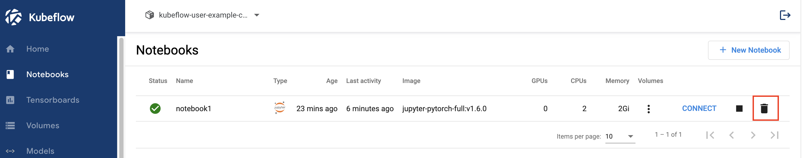

# [Notebook Server](https://blog.kubesimplify.com/kubeflow-notebooks-ml-experimentation-made-easier-part-2)
- Kubeflow Notebooks는 Pod 내에서 웹 기반 개발 환경을 실행하여 Kubernetes 클러스터 내에서 웹 기반 개발 환경을 실행하는 방법을 제공합니다.



---
## Kubeflow Notebooks 장점
- 노트북 컨테이너를 생성하고 로컬에서 실행하는 대신 클러스터에서 직접 실행할 수 있습니다.
- 사전 구성된 이미지 또는 사용자 정의 이미지를 사용하여 환경을 생성할 수 있으며, 이를 통해 환경이나 설치 문제가 아닌 현재 작업에 집중할 수 있습니다.
- JupyterLab, RStudio 및 VS Code를 즉시 지원하지만 다른 IDE도 사용할 수 있습니다.
- 마지막으로 Kubeflow의 역할 기반 액세스 제어 기능을 사용하면 쉽고 안전하게 노트북을 공유할 수 있습니다.

---
## Kubeflow Notebooks 스토리지 볼륨
- 각 노트북 컨테이너들은 PVC를 통해서 Dataset 및 Models 등을 공유할 수 있습니다. 



---
### 단계1: New Notebook


---
### 단계2: Name & Docker Image


---
### 단계3: CPU / RAM 


---
### 단계4: Volume


---
### 단계5: Launch


---
### 단계6: pod
```shell
kubectl get pod -n kubeflow-user-example-com
```


---
### 단계7: notebook 접속 


---
### 단계8: 모델학습 및 예측 
- 참고문서: `pytorch_regression.ipynb`



---
### 단계9: Notebook 삭제 
- Notebook이 삭제가 되면, `pytorch_regression.ipynb` 역시 삭제가 된다.




