# Notebook1
- 모델 학습 후 모델 저장

---
### 단계1: New Notebook
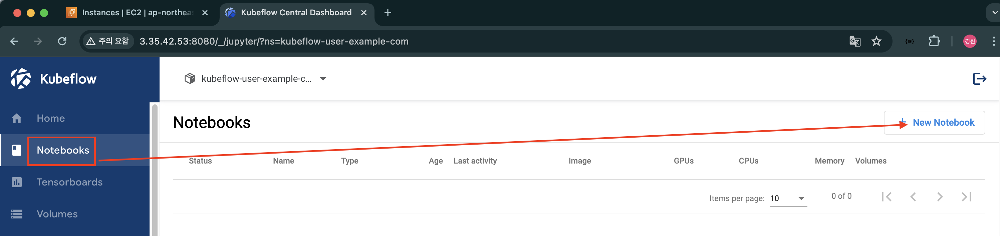

---
### 단계2: Name & Docker Image
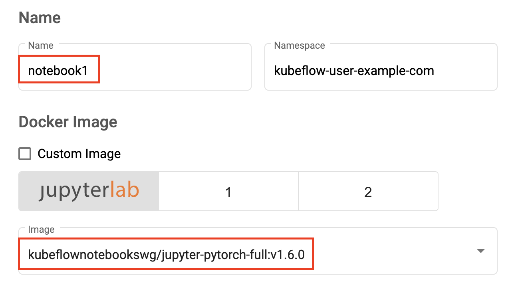

---
### 단계3: CPU / RAM 
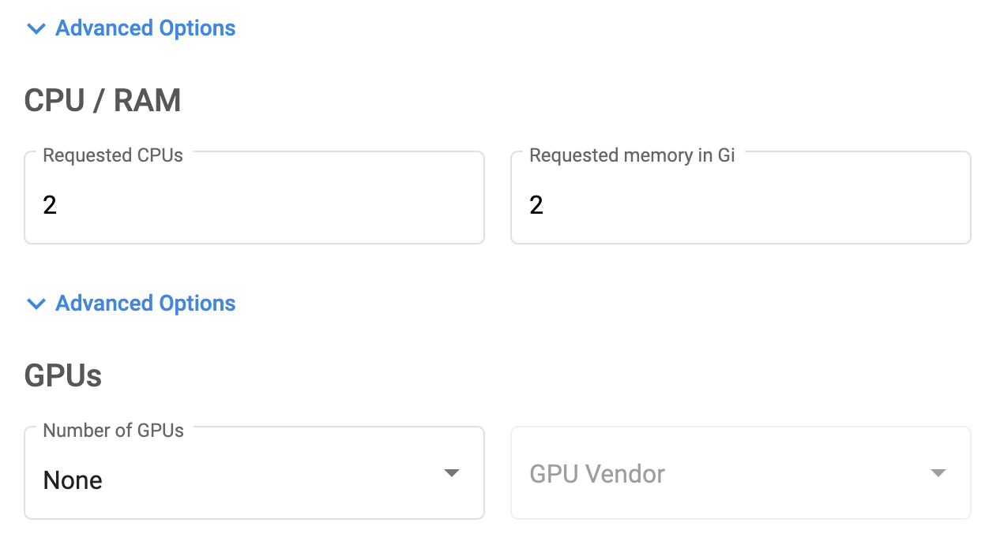

---
### 단계4: Volume
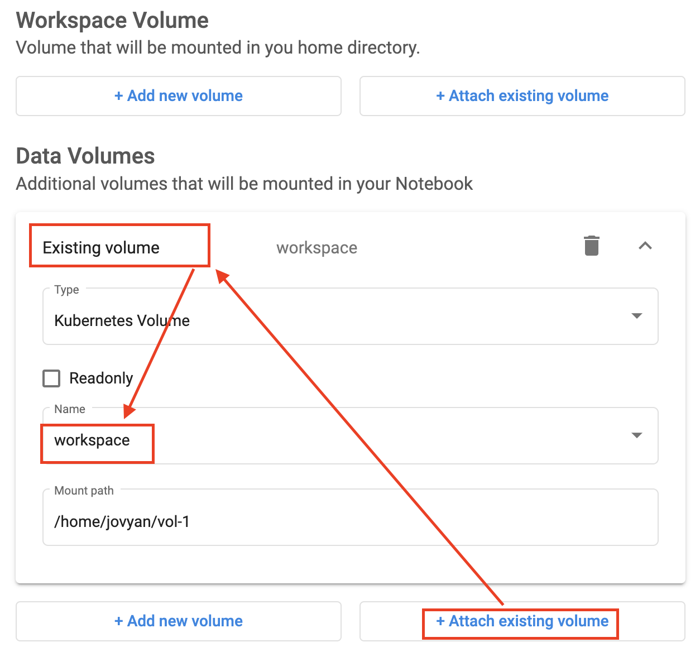

---
### 단계5: Launch
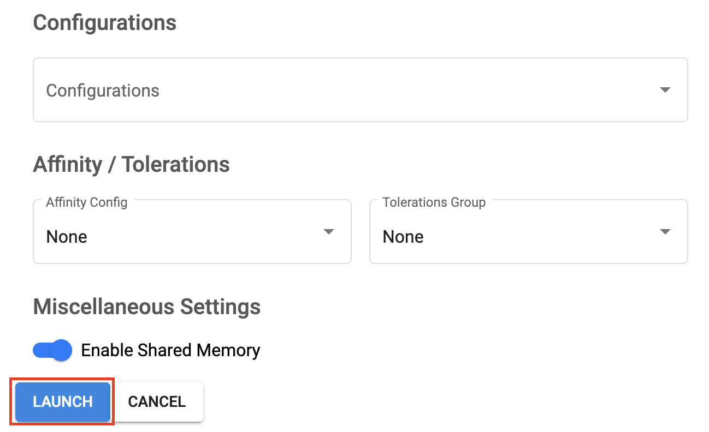

---
### 단계6: Connect Notebook1
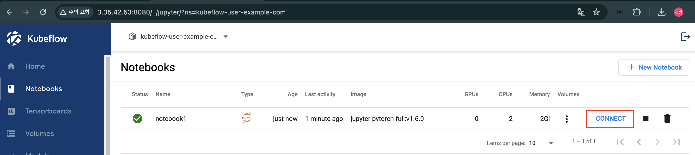

---
### 단계7: 모델 학습 및 저장
- 참고파일: `save_model.ipynb`
- PV에 마운트된 폴더: `vol-1`

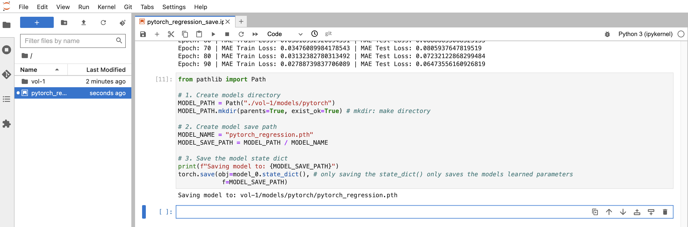

---
### 단계8: 저장된 모델 확인 
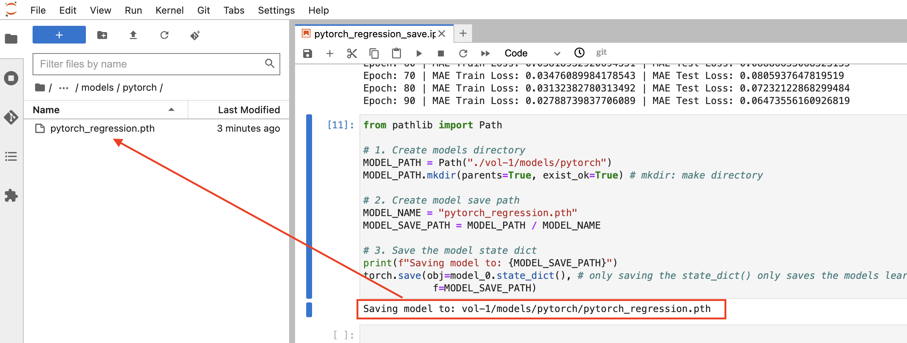 

---
### 단계9: notebook1 삭제  
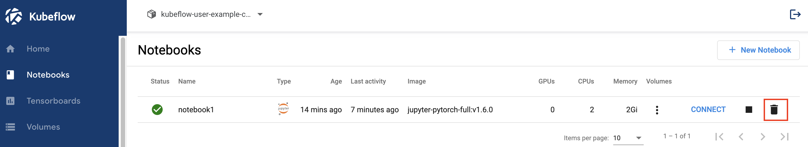

---
# Notebook2
- 모델 업로드하여 예측하기 

---
### 단계1: New Notebook

---
### 단계2: Name & Docker Image
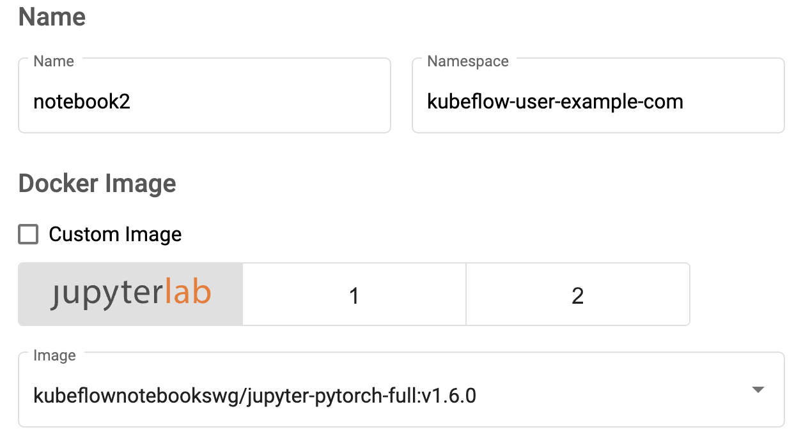

---
### 단계3: CPU / RAM 

---
### 단계4: Volume

---
### 단계5: Launch

---
### 단계6: Connect Notebook1
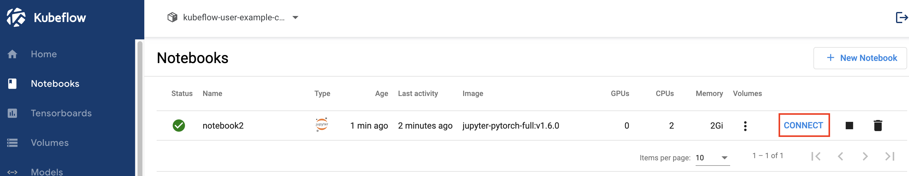

---
### 단계7: 저장된 모델 확인 
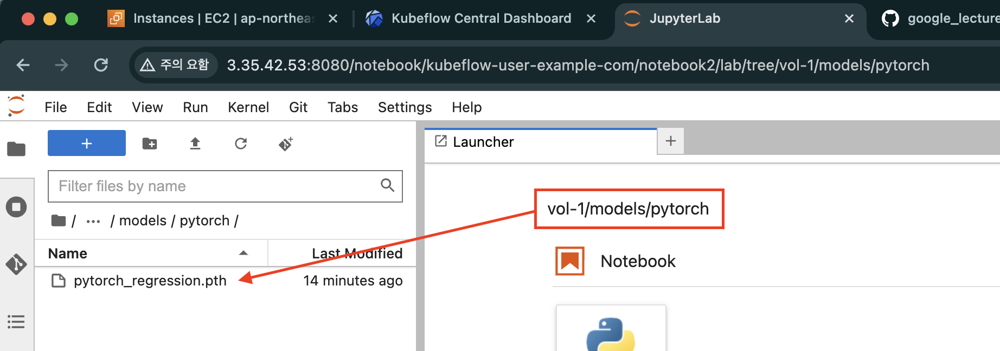

---
### 단계8: 저장된 모델을 이용하여 예측하기 
- 참고문서: `load_model.ipynb`

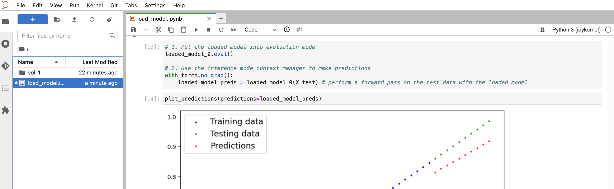

---
### 단계9: notebook2 삭제  
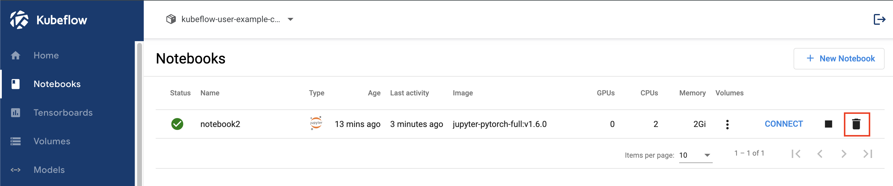

