# Custom Image

---
### 단계1: Docker 로그인 
- docker hub에 image를 업로드하기 위해 로그인 
```shell
docker login
```
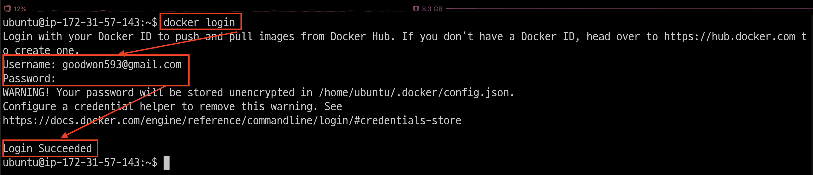

---
### 단계2: Codeserver Dockerfile
- 참고파일: `./docker/codeserver/`
```shell
mkdir -p ~/docker/codeserver && cd ~/docker/codeserver

touch requirements.txt
vim Dockerfile 
```
---
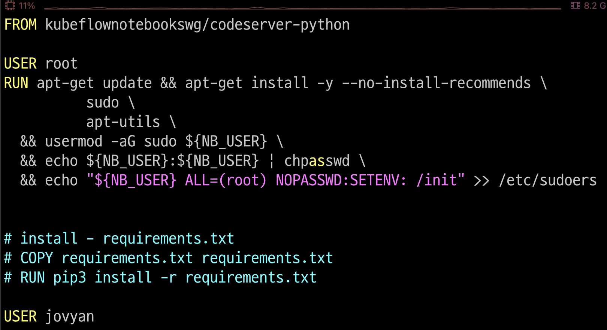

---
### 단계3: image > kubeflow_codeserver
- 명령어: `docker build -t <도커허브아이디>/<이미지명>:<테크> .`
```shell
# 이미지 생성
docker build -t goodwon593/kubeflow_codeserver:latest .
# 이미지 확인
docker images
```
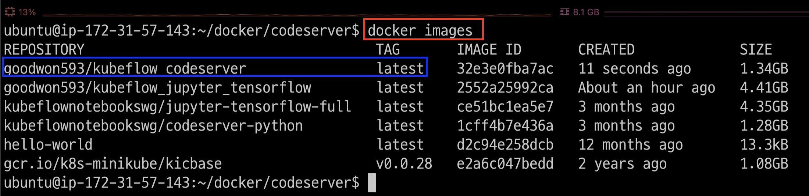

---
### 단계4: 도커허브로 이미지 업로드
- 명령어: `docker push <도커허브아이디>/<이미지명>:<테크>`
```shell
docker push goodwon593/kubeflow_codeserver
```
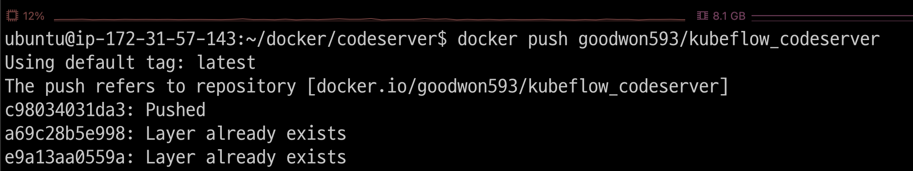

---
### 단계5: [Docker Hub 확인](https://hub.docker.com/)
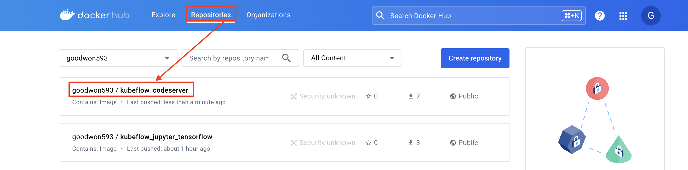

---
# Notebook

---
### 단계1: New Notebook
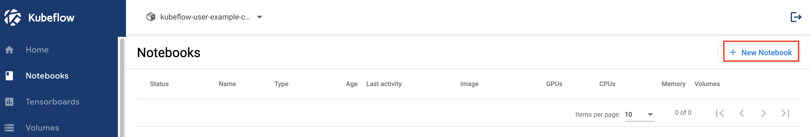

---
### 단계2: Name & Docker Image
- Name: `notebook-custom-codeserver`
- Docker Image: `goodwon593/kubeflow_codeserver`

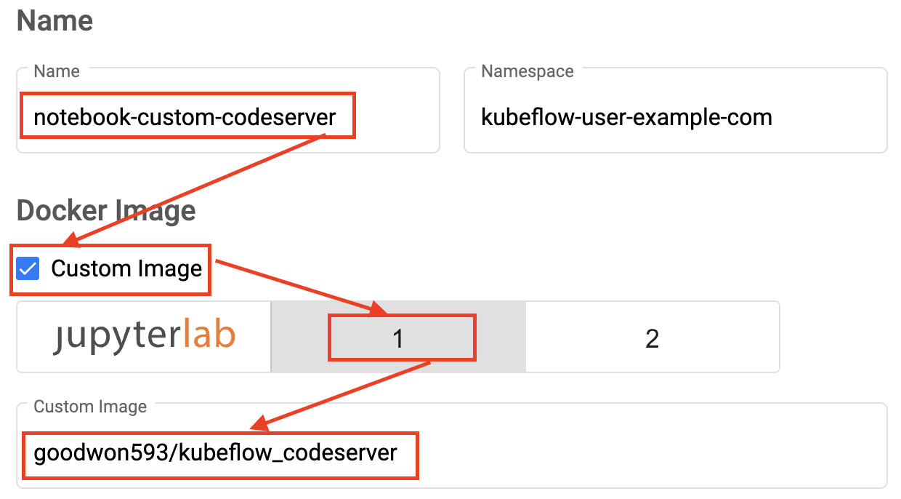

---
### 단계3: CPU / RAM
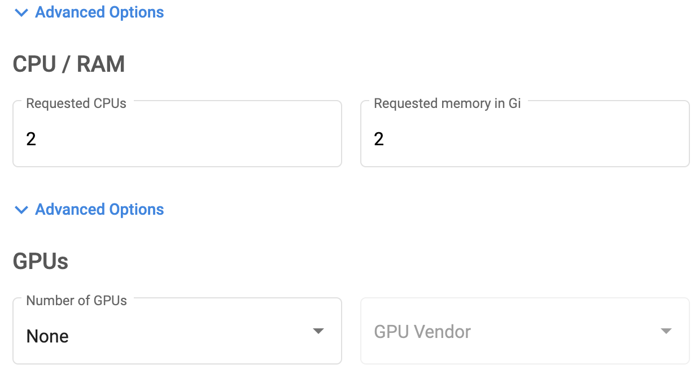

---
### 단계4: Volume & Configurations
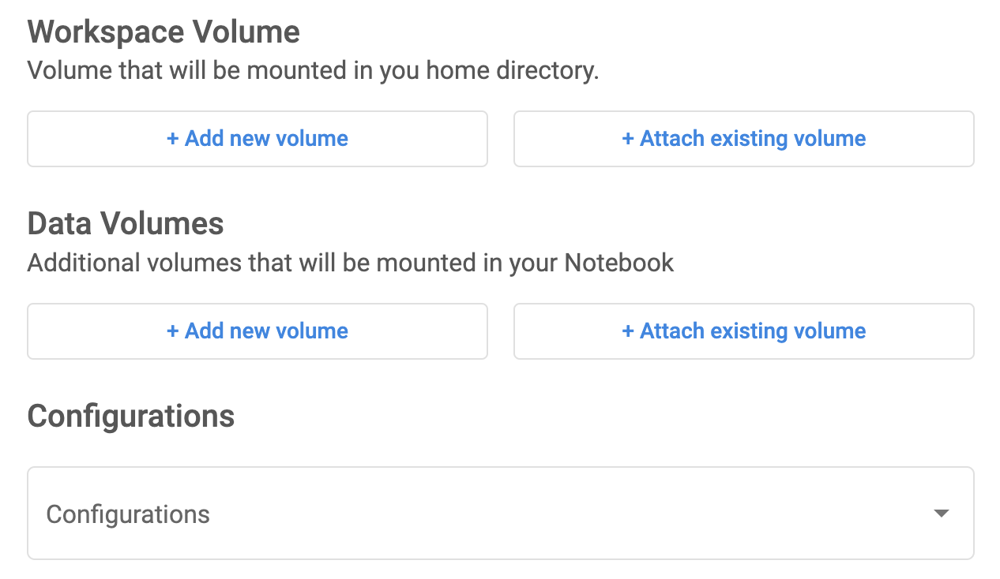

---
### 단계5: Launch
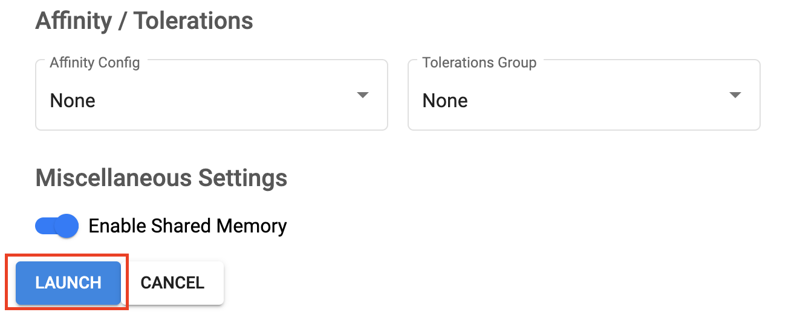

---
### 단계6: Pod > Events
```shell
kubectl get pod -n kubeflow-user-example-com
kubectl describe pod notebook-custom-codeserver-0 -n kubeflow-user-example-com
```
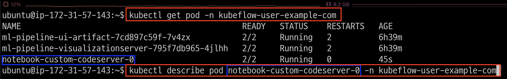

---
- Pod > Event

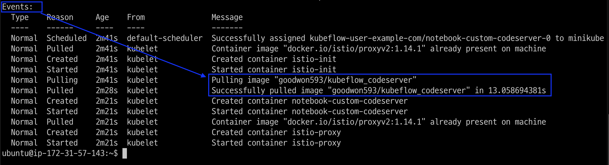

---
### 단계7: Connect
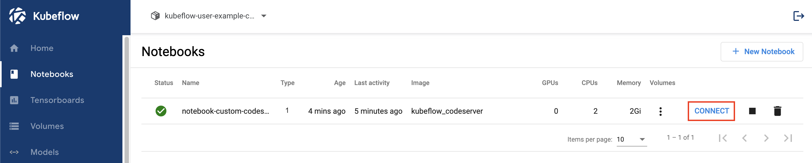

---
### 단계8: sudo 권한 사용 
- 비번: `jovyan` 
```shell
sudo ls -al
```
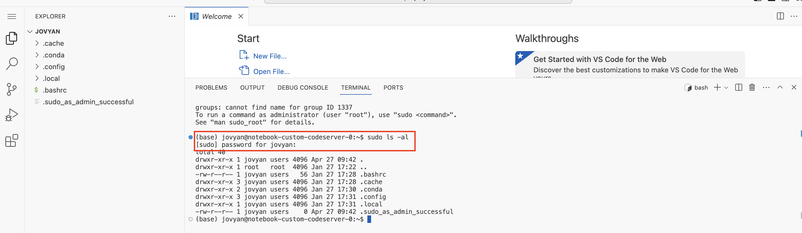

---
### 단계9: test.py
- 파일 생성
```python
import time 

print("Hello World")
```
- 파일 실행 
```shell
python test.py
```
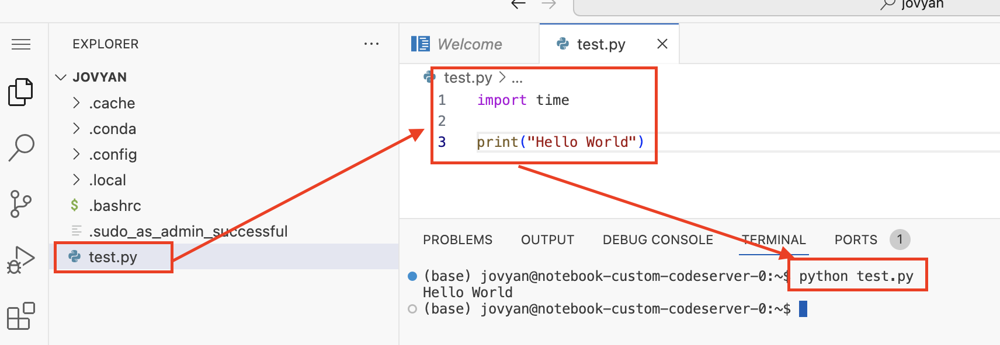

---
# Notebook 삭제 
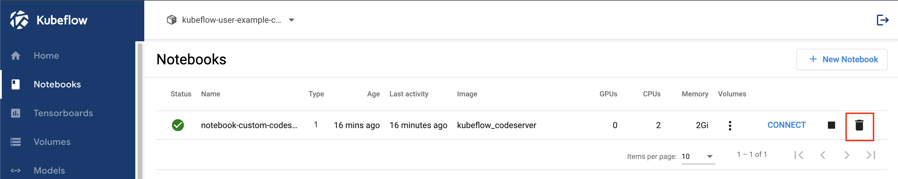

