# [Tensorboard](https://www.tensorflow.org/tensorboard?hl=ko)
- 텐서보드는 머신러닝 실험에 필요한 시각화 및 도구를 제공합니다.

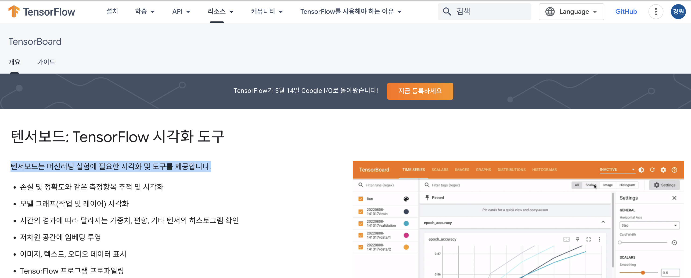

---
# Notebook 

---
### 단계1: New Notebook
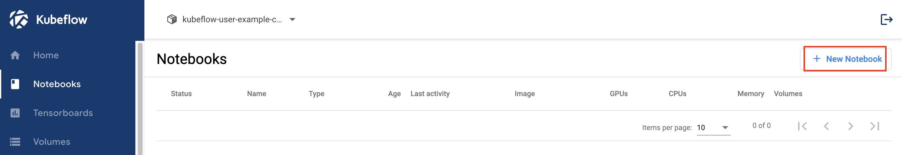

---
### 단계2: Name & Docker Image
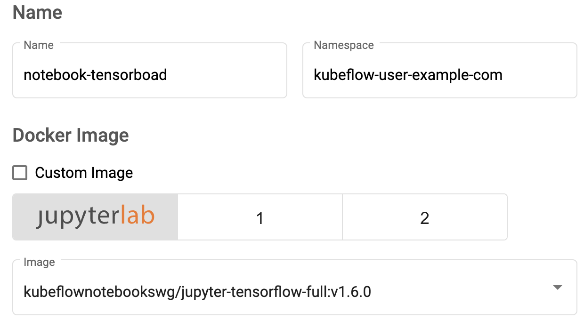

---
### 단계3: CPU / RAM 
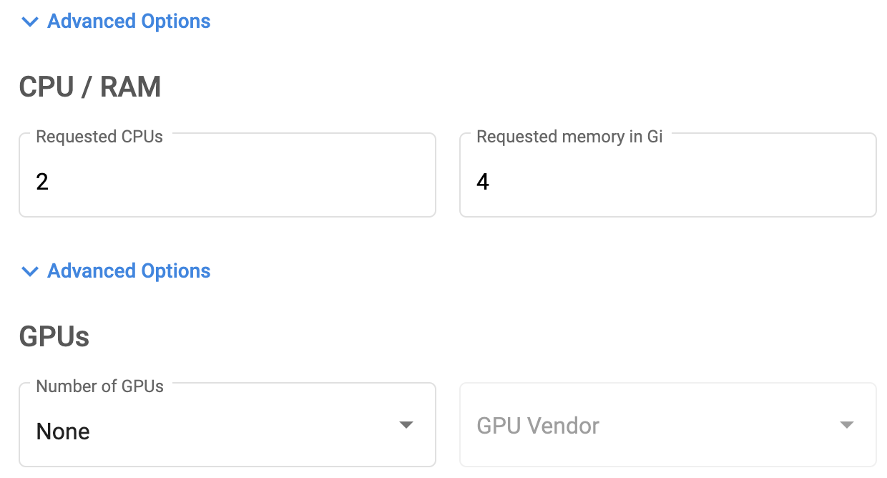

---
### 단계4: Volume & Configurations
- Data Volumes: `workspace`

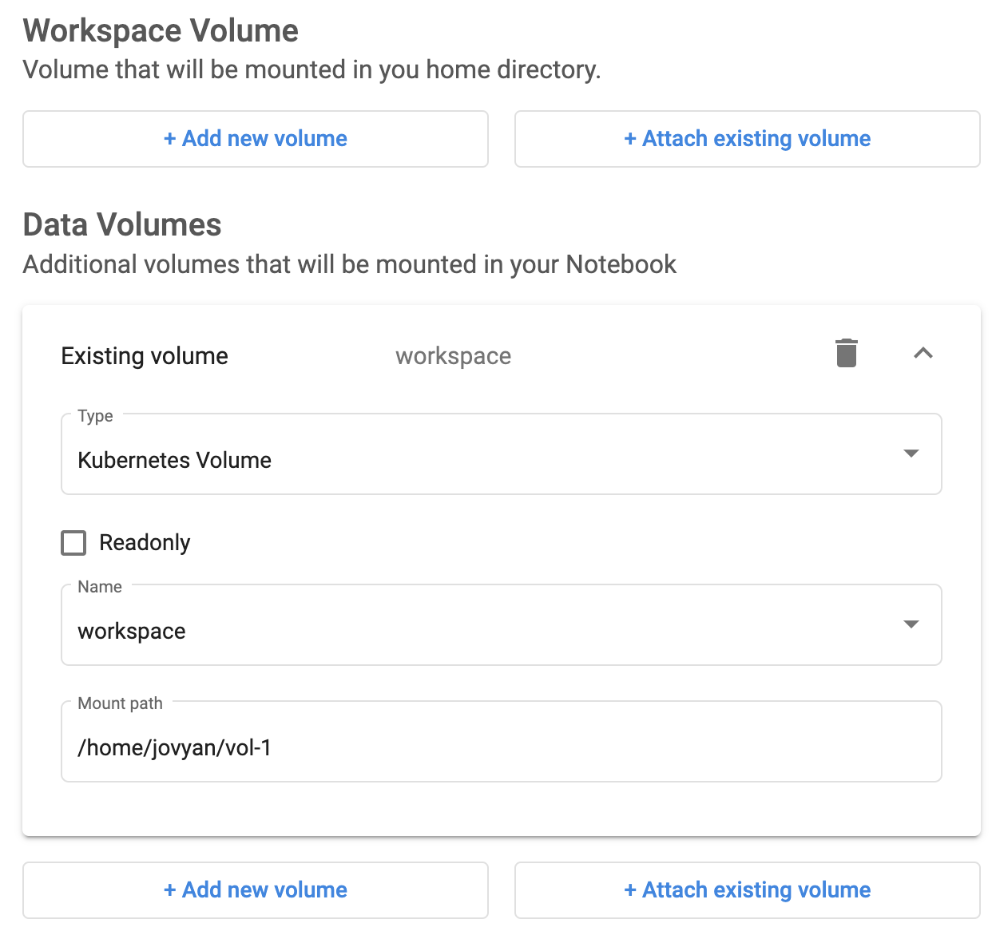

---
### 단계5: Launch
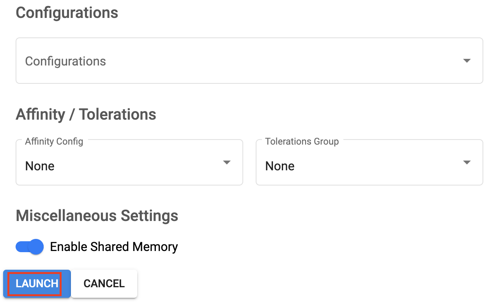

---
### 단계6: Connect
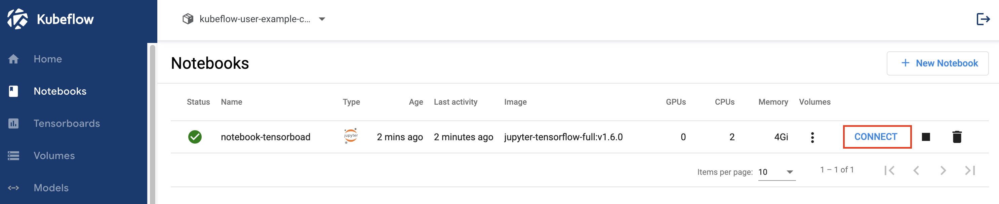

---
### 단계7: tensorboard_cnn.ipynb
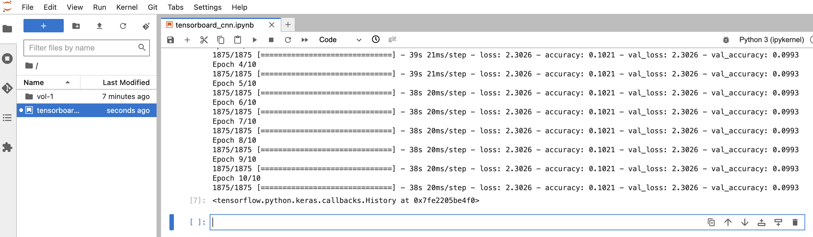

---
### 단계8: logs 확인 
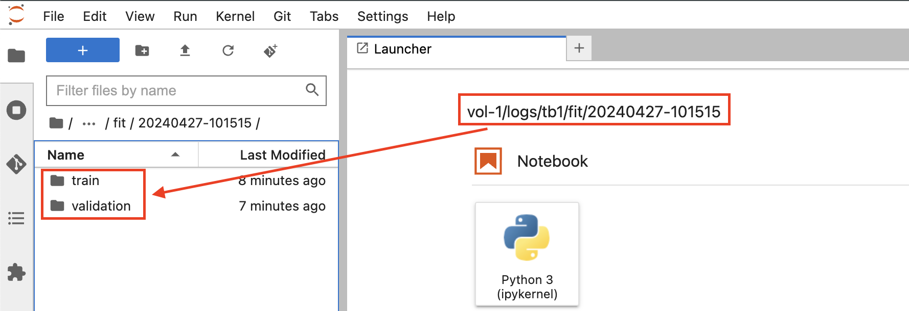

---
### 단계9: 삭제
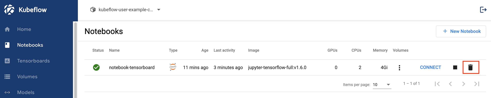

---
# Tensorboard

---
### 단계1: New TensorBoard
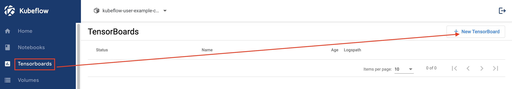

---
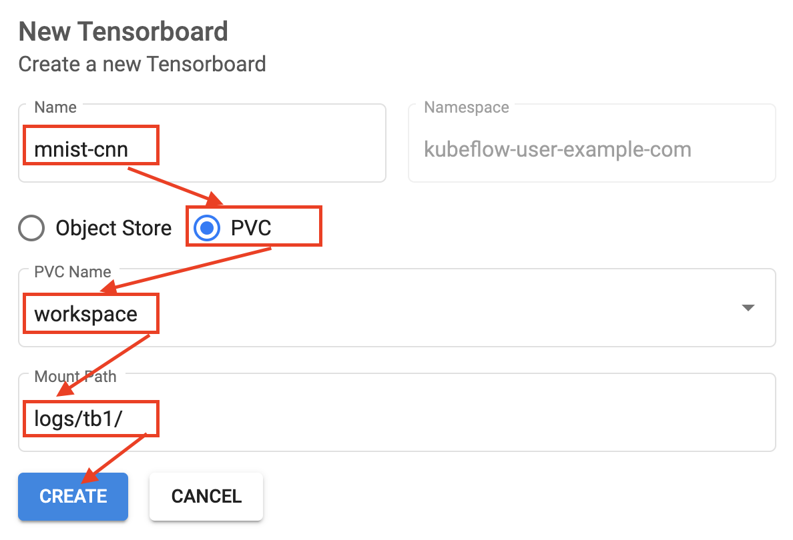

---
### 단계2: Connect
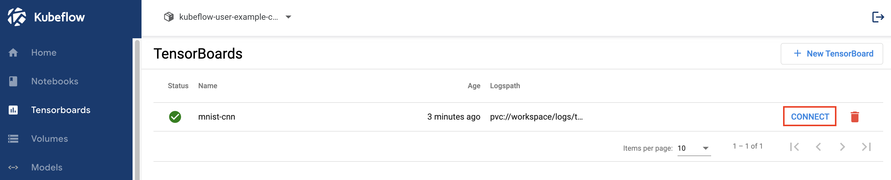

---
### 단계3: TensorBoard > Scalars
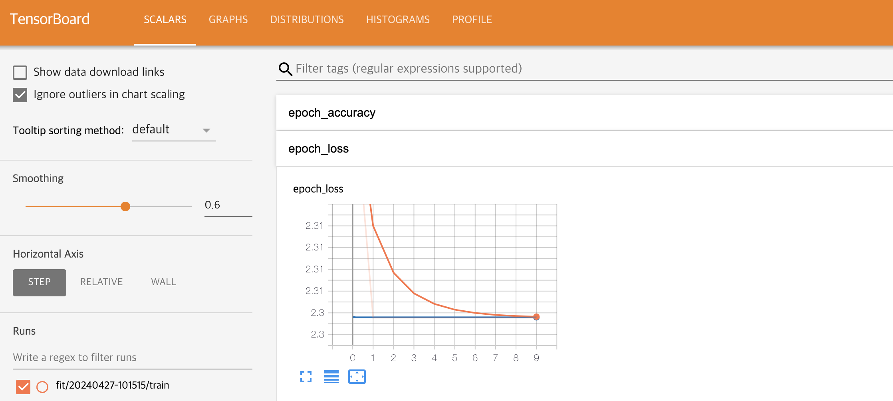

---
### 단계4: TensorBoard > Graphs
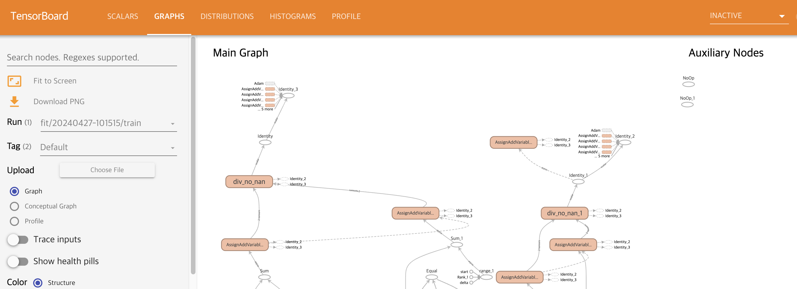

---
### 단계5: 삭제
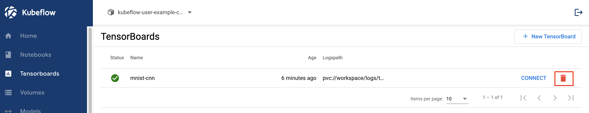

