# [MINIO](https://blogs.cisco.com/developer/machinelearningops03)
- 파이프라인 아키텍처의 기반은 공유 저장소입니다.
- Kubeflow는 대규모 프라이빗 클라우드 인프라용으로 설계된 고성능 분산 객체 저장소인 MinIO를 제공합니다.

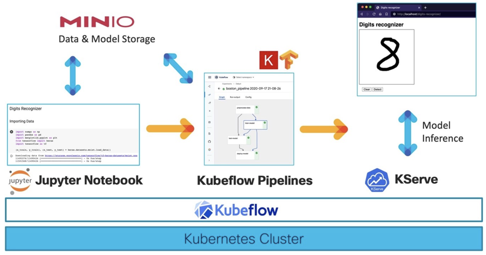

---
## [MINIO 특징](https://shuu.tistory.com/145)
- AWS S3 API 호환
> MiniO는 AWS S3의 API를 완벽하게 똑같이 구현하여 100% 호환되기 때문에 MiniO를 스토리지로 사용하다

- Erasure Coding을 통한 데이터 복구
> 디스크를 JBOD, JBOF로 사용하는 경우, Erasure Coding을 통해 데이터를 보호할 수 있다.

---
- 고가용성 (High Availability)
> 스토리지 클러스터를 구축하여 데이터의 용량과 처리 능력을 확장하고 데이터를 분산하여 저장 및 복제한다.

- Kubernetes 환경에서 손쉽게 설치 가능
> MiniO는 Kubernetes의 Native Object Storage로 k8s 환경에서 일관된 경험을 제공한다.

- 암호화 (Encryption)
> MiniO는 전송 중인 데이터를 암호화하거나, 데이터를 암호화하여 보관할 수 있다.

---
### 단계1: minio-service > port forward
- port: 9000
```shell
kubectl get svc -n kubeflow minio-service
kubectl port-forward --address="0.0.0.0" svc/minio-service -n kubeflow 9000:9000
```
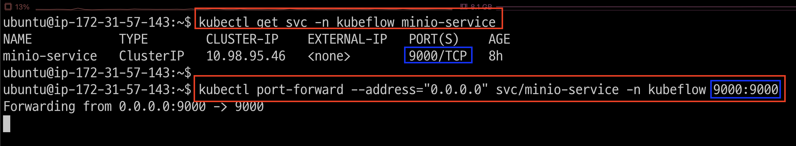

---
### 단계2: EC2 > Security Groups
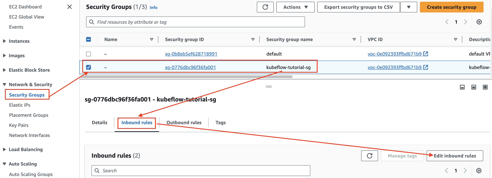

---
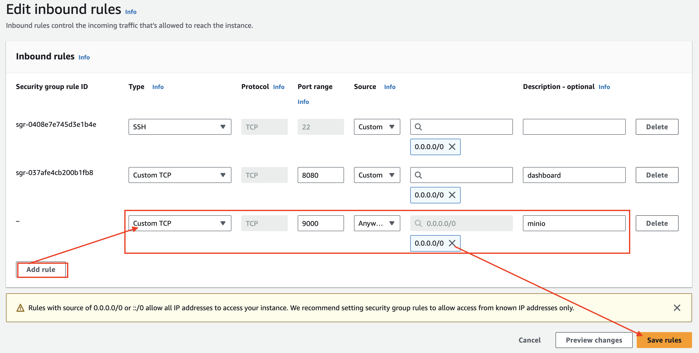

---
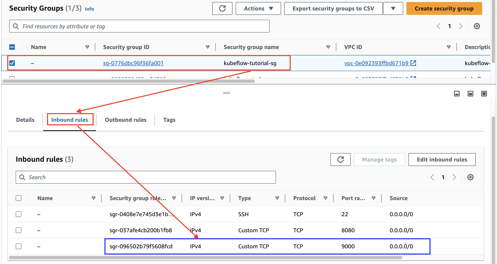

---
### 단계3: Public IPv4
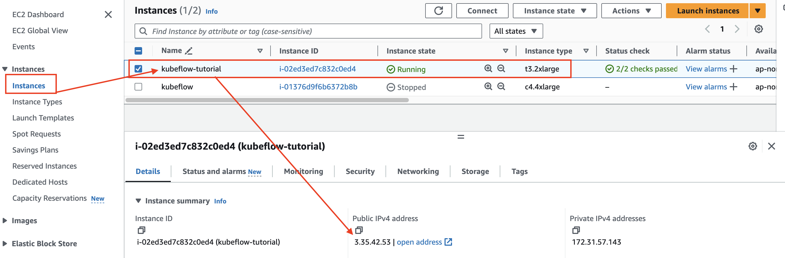

---
### 단계4: MINIO Web UI > Login
- url: `http://[Public IP]:9000`
- Access Key / Secret Key: `minio / minio123`

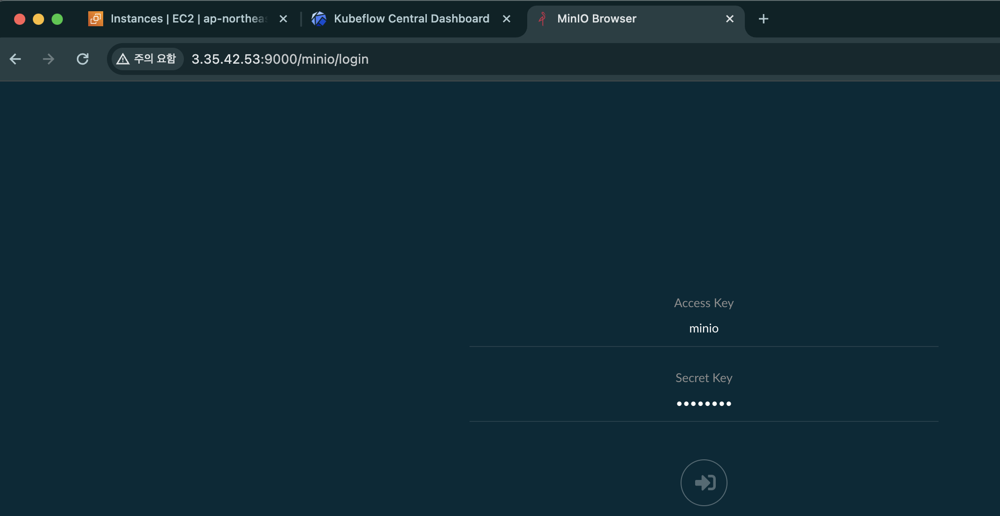

---
### 단계5: Ceate bucket
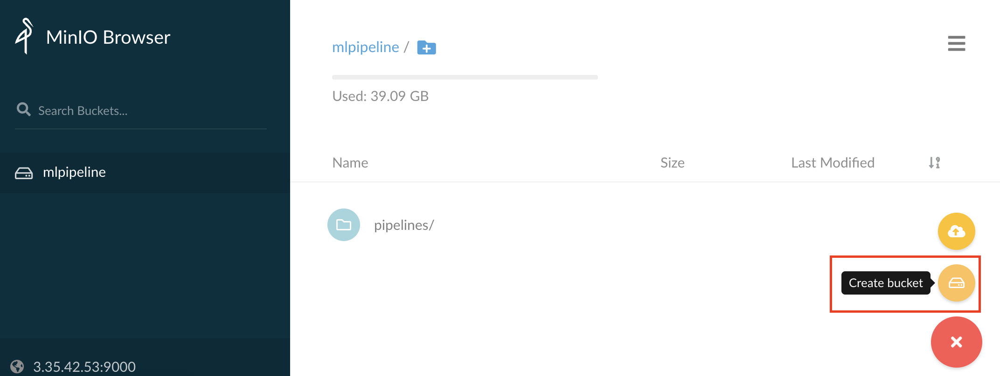

---
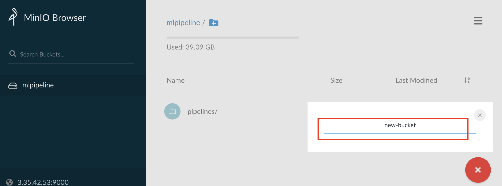

---
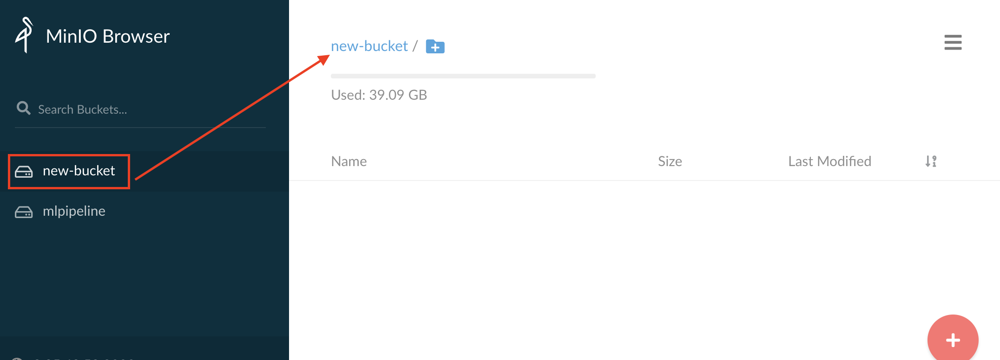

---
### 단계6: upload file
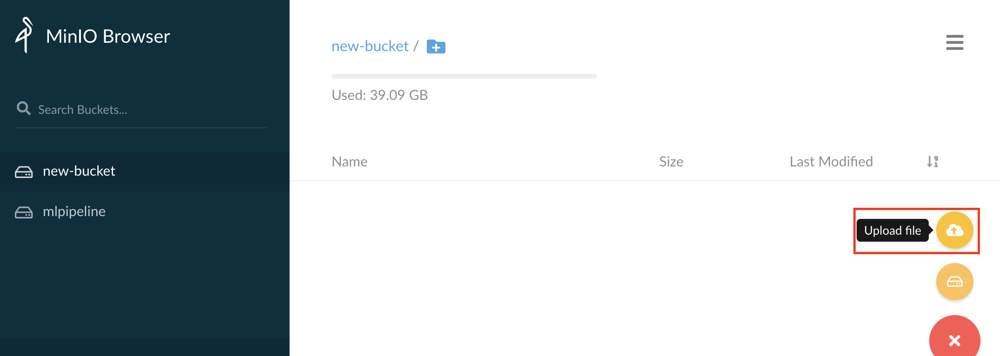

---
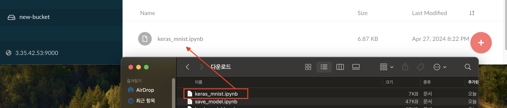

