# Notebook

---
### 단계1: New Notebook
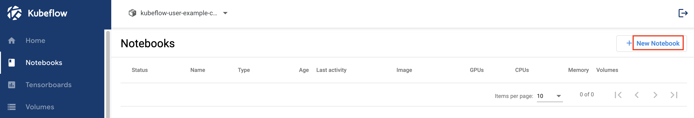

---
### 단계2: Name & Docker Image
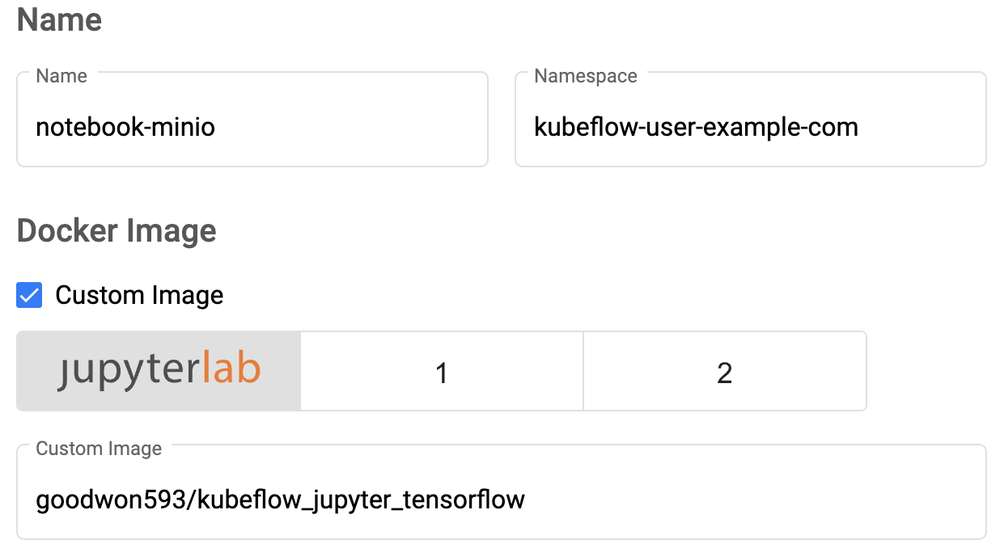

---
### 단계3: CPU / RAM
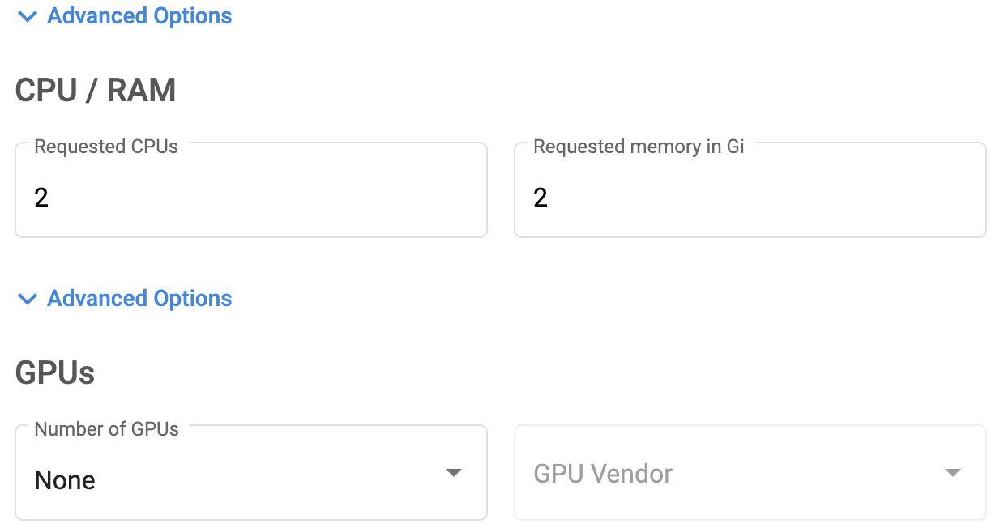

---
### 단계4: Volume & Configurations
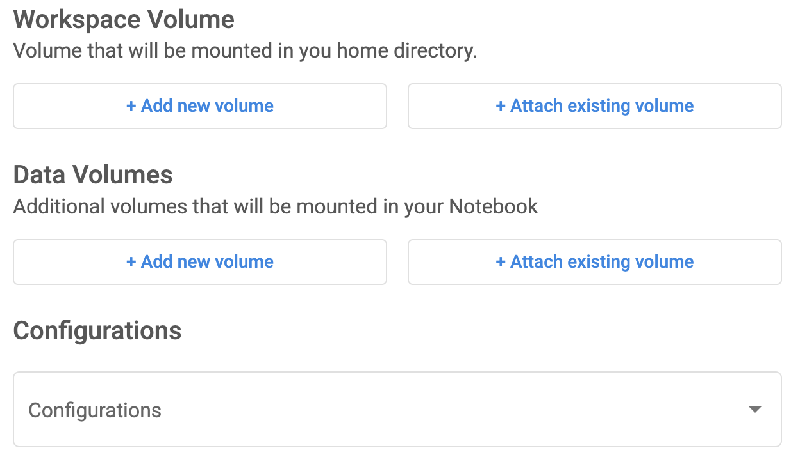

---
### 단계5: Launch
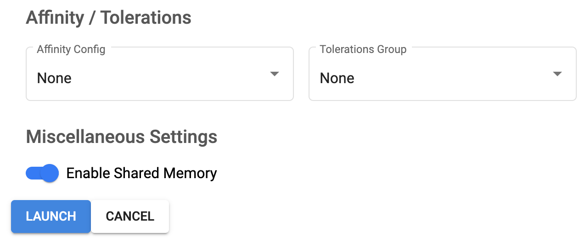

---
### 단계6: Connect
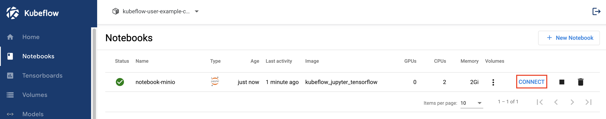

---
# MINIO

---
### 단계1: [Minio Client](https://github.com/minio/mc)
```shell
wget https://dl.min.io/client/mc/release/linux-amd64/mc
chmod +x mc
mv mc /usr/local/bin/
ls -l /usr/local/bin/
```
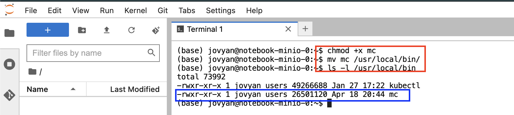

---
### 단계2: Minio Client 설치 확인 
```shell
mc
```
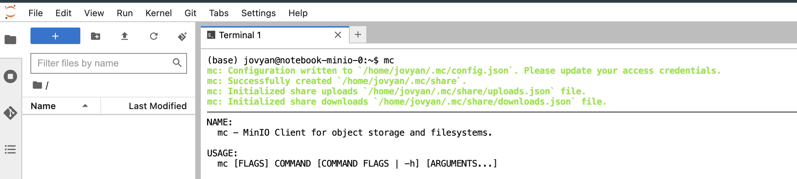

---
### 단계3: host 확인
- gcs: 구글에서 제공하는 storage
- local: 사용자가 설정한 storage
- play: Minio에서 제공하는 storage
- s3: aws에서 제공하는 storage
```shell
mc config host ls
```
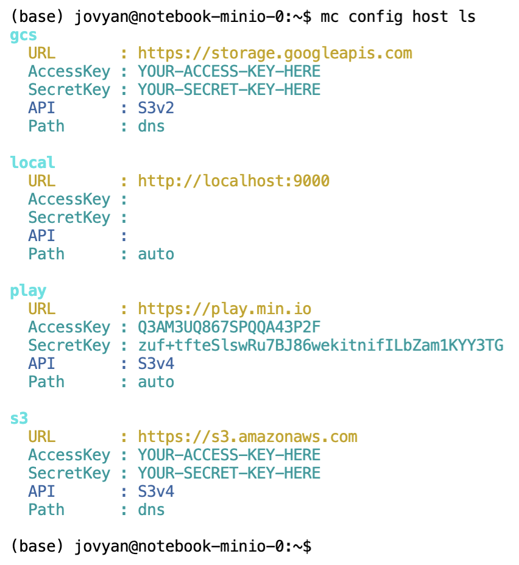

---
### 단계4: install dnsutils
```shell
sudo apt-get install -y dnsutils
```
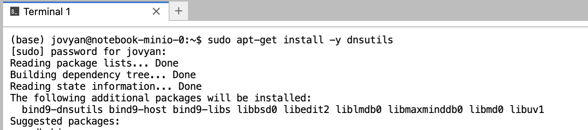

---
### 단계5: host add kubeflow
```shell
mc config host add kubeflow http://minio-service.kubeflow.svc.cluster.local:9000 minio minio123
```
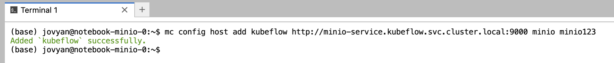

---
- host 확인
```shell
mc config host ls
```
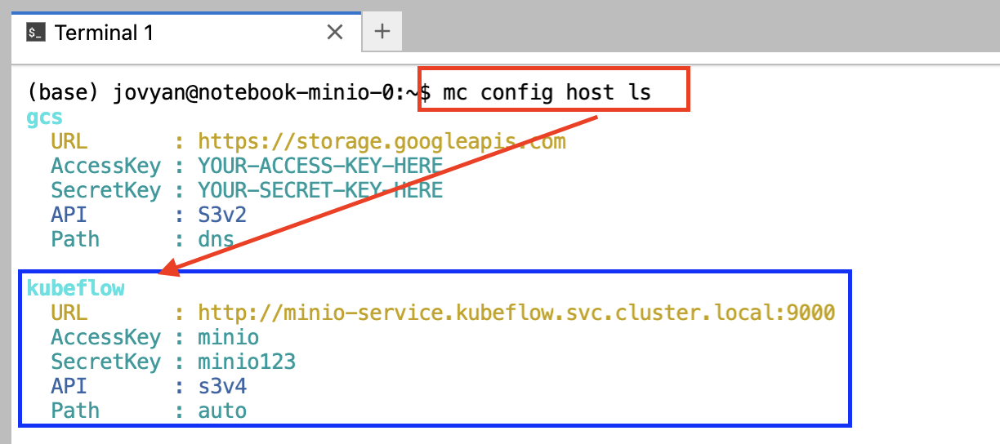

---
### 단계6: bucket list 조회
```shell
mc ls kubeflow
```
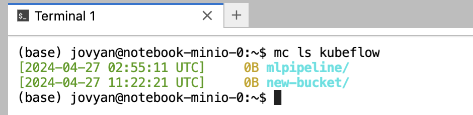

---
### 단계7: Create bucket
- 명령어: `mc mb kubeflow/[bucket name]`
```shell
mc mb kubeflow/test-client
mc ls kubeflow
```
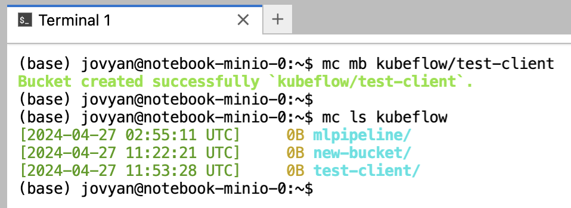

---
- MinIO Browser 확인 
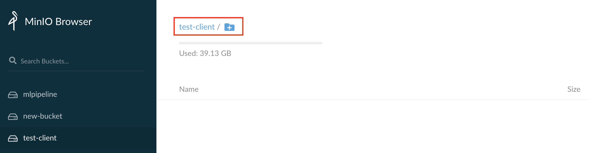

---
### 단계8: upload file
- 명령어: `mc cp [file name] kubeflow/[bucket name]`
```shell
touch test.txt # create file
mc cp test.txt kubeflow/test-client/
```
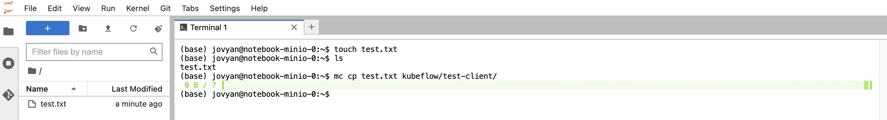

---
- MinIO Browser 확인 
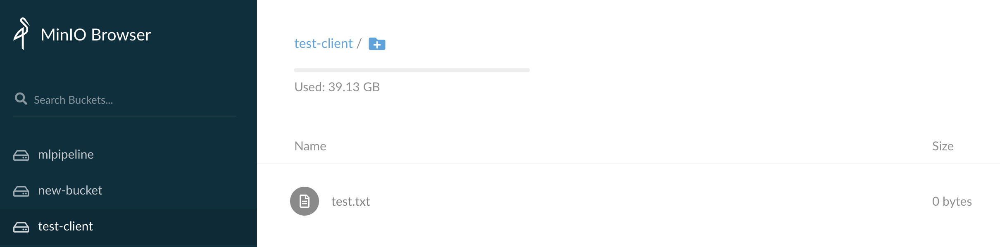

