# [KServe](https://kserve.github.io/website/master/)
- KServe는 만들어진 ML/DL 모델을 실제로 서비스하기 위해 API를 쉽게 만들 수 있도록 도와주는 툴이다.

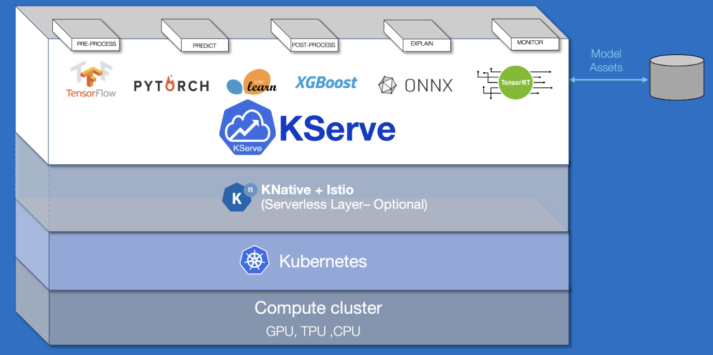

---
### KServe 장점
- KServe는 확장성이 뛰어난 사용 사례를 위해 구축된 Kubernetes의 표준 모델 추론 플랫폼입니다.
- ML 프레임워크 전반에 걸쳐 고성능의 표준화된 추론 프로토콜을 제공합니다.
- GPU에서 Scale to Zero를 포함한 Auto Scaling을 통해 최신 서버리스 추론 워크로드를 지원합니다.
- ModelMesh를 사용하여 높은 확장성, 밀도 패킹 및 지능형 라우팅 제공
- 예측, 사전/사후 처리, 모니터링 및 설명 기능을 포함하는 프로덕션 ML 서비스를 위한 간단한 플러그 가능한 프로덕션 서비스입니다.

---
### [KServe 동작원리](https://kserve.github.io/website/0.9/modelserving/control_plane/) 
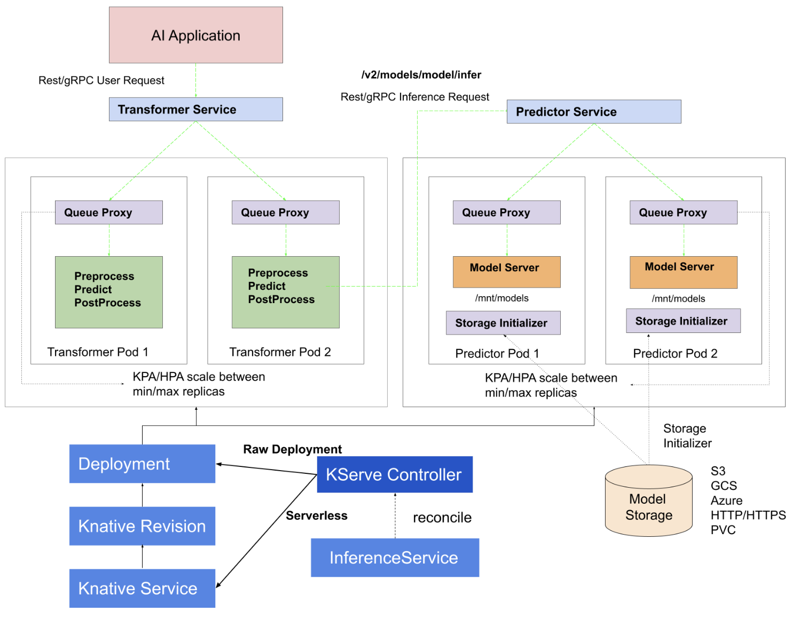

---
1. HTTP/GRPC 프로토콜로 Transformer에 inference 요청 
2. Transformer에는 2개의 Container가 들어있다.
    - Queuve Proxy를 거쳐 전처리(Preprocess)가 수행된다. 
3. 전처리 결과를 HTTP/GRPC 프로토콜로 Predictor로 보낸다. 
4. Predictor에는 3개의 Container가 들어있다.
    - Queuve Proxy를 거쳐 Storage Initializer가 모델을 갖고와서 마운트한다.
    - Model Server를 이용하여 예측을 한 후, Transformer에게 전달한다. 
5. Transformer에서는 예측값을 받아서 후처리(Postprocess)를 해서 최종결과를 전달한다. 

#### 이 모든 동작은 InferenceService라는 Custom Resource를 배포함으로써 이루어지게 할 수 있다.
---
# 예제1: Kserve 모델 배포 및 예측하기 

---
## KServe 모델 배포

---
### 단계1: [kserve-models-web-app 환경변수](https://www.kubeflow.org/docs/external-add-ons/kserve/webapp/)
```shell
kubectl edit deploy kserve-models-web-app -n kubeflow
# 아래내용 추가 
- env:
  - name: APP_PREFIX
    value: /kserve-endpoints
  - name: APP_DISABLE_AUTH
    value: "true"
  - name: APP_SECURE_COOKIES
    value: "false"
```
---
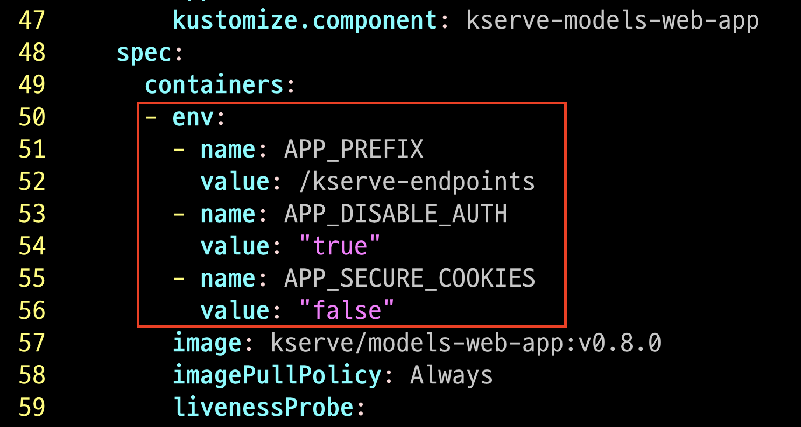

---
- pod의 running 확인
```shell
kubectl get pods -o wide -n kubeflow | grep kserve
```
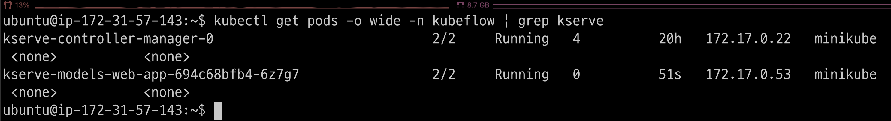

---
### 단계2: New Model Server
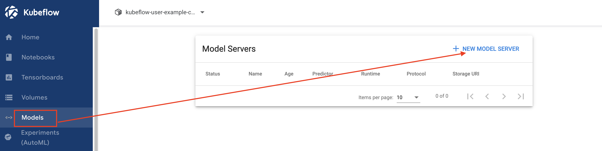

---
### 단계3: Create Model Server 
- 참고문서: `iris-example.yaml`

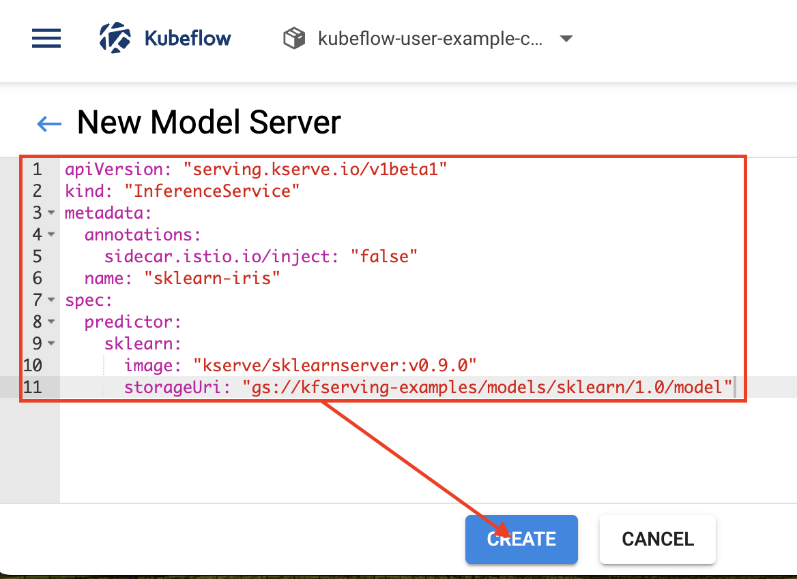

---
### 단계4: 확인 
```shell
kubectl get pod -n kubeflow-user-example-com
kubectl describe pod sklearn-iris-predictor-default-00001-deployment-9d8c84ffd-dtvj5 -n kubeflow-user-example-com
```


---
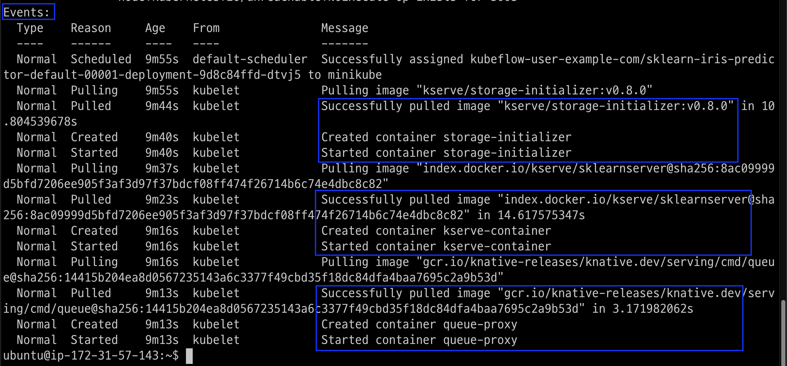

---
### 단계5: URL 주소 확인 
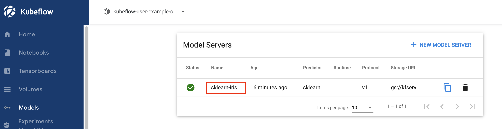

---


---
## KServe 모델 예측 

---
### 단계1: New Notebook
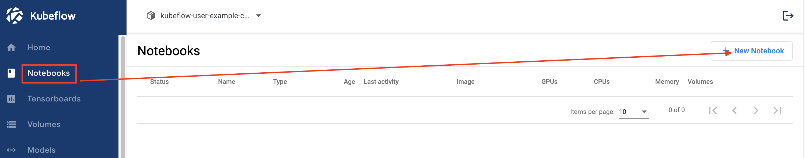

---
### 단계2: Name & Docker Image
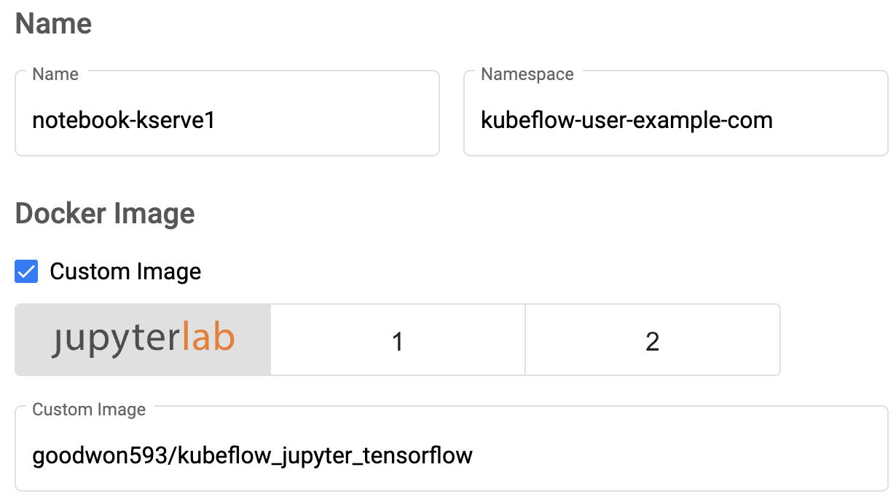

---
### 단계3: CPU / RAM
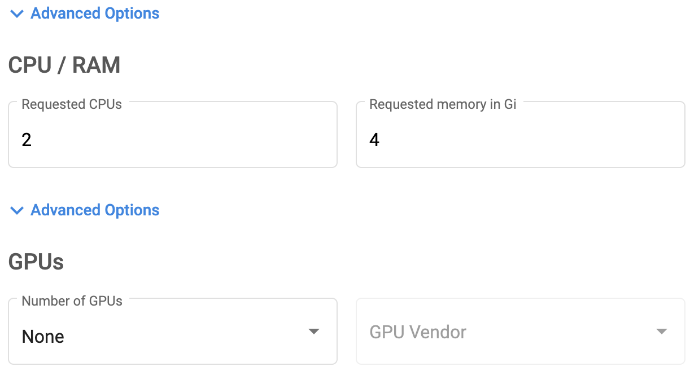

---
### 단계4: Volume
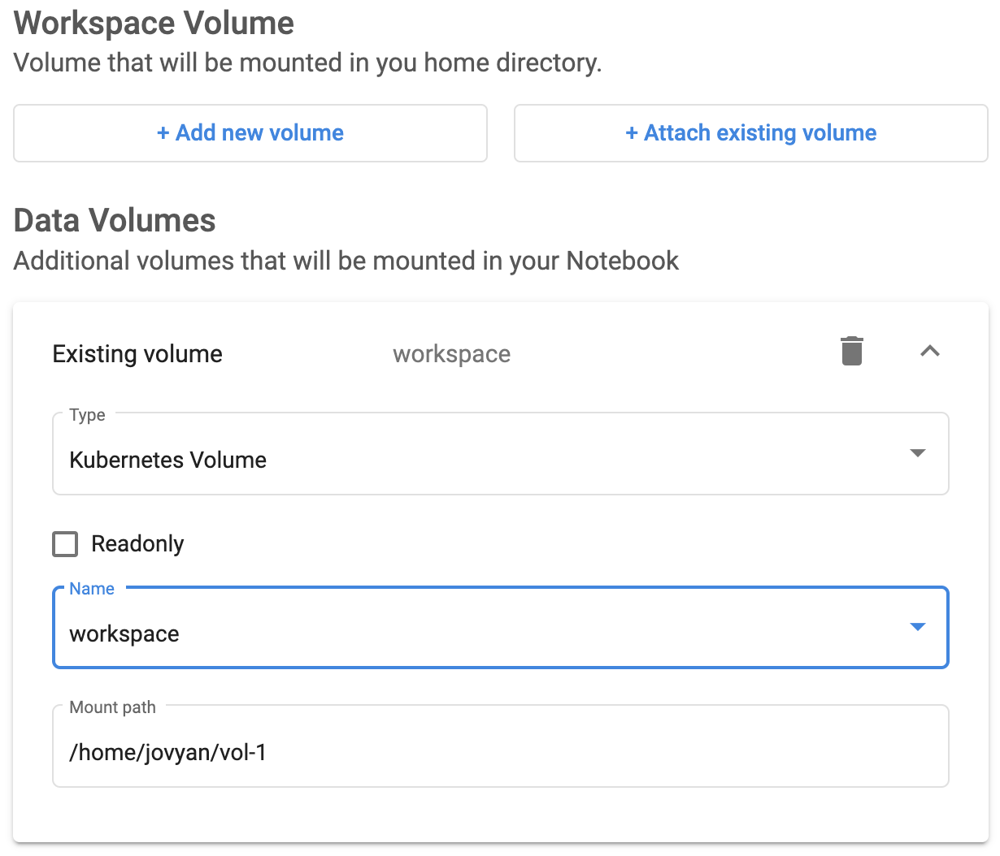

---
### 단계5: Launch


---
### 단계6: Connect
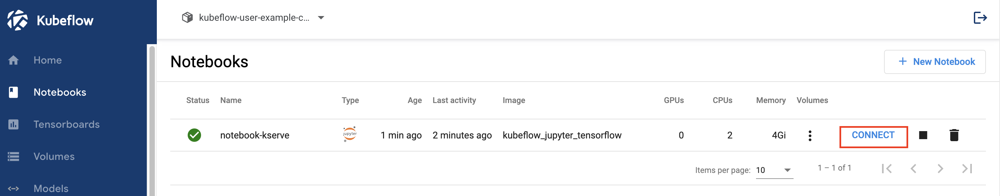

---
### 단계7: deploy_1.ipynb
- url internal 호출
- 이미 생성된 모델 호출

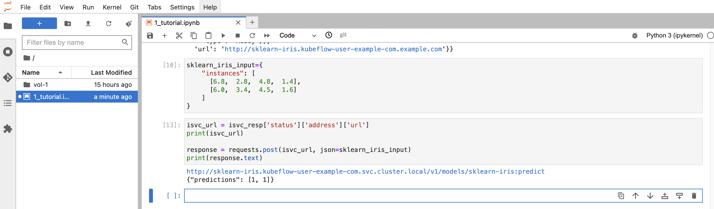

---
# 예제2: Python SDK를 이용하여 Kserve 모델 배포 및 예측하기 
- python sdk를 이용하여 모델 배포 및 예측하기 

---
### 단계1: deploy_2.ipynb
- url internal 호출
- 모델 생성 후 호출

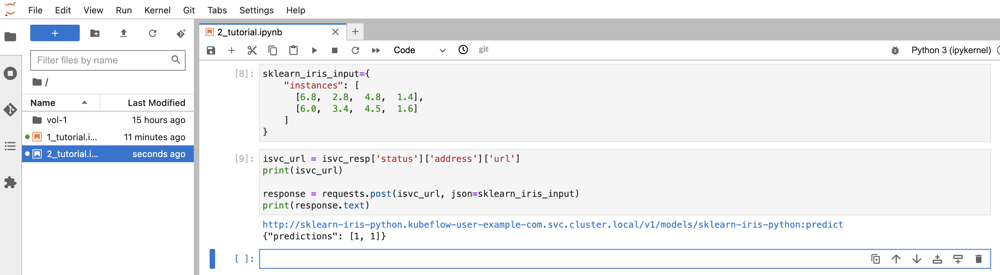

---
### 단계2: Model Server
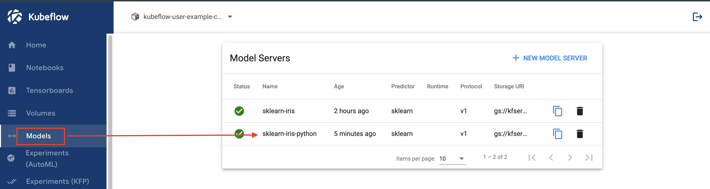

