# [KServe Data Plane](https://kserve.github.io/website/0.9/modelserving/data_plane/)
- Transformer: Predictor Service에 대한 데이터 전/후처리
- Predictor: Data를 Model에게 전달한 후 추론 결과 전달 
- Explain: 추론 결과에 대한 추가 설명 전달 
- Default Endpoint: Inference service 생성시 대부분의 트래픽이 지나가는 곳
- Canary Endpoint: Model 수정 후 Test 목적으로 사용

---
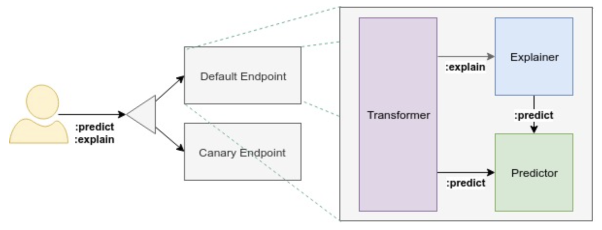

---
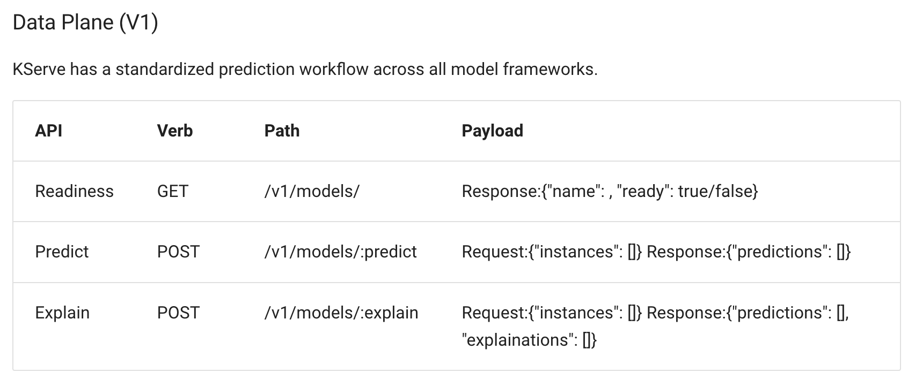

---
### 단계1: Notebook 접속 
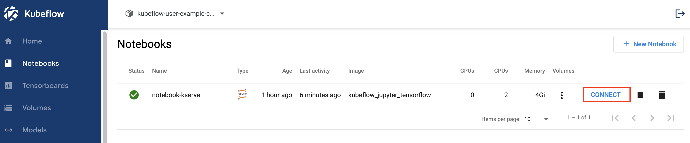

---
### 단계2: Terminal > MINIO 설치 
```shell
# Minio Client
wget https://dl.min.io/client/mc/release/linux-amd64/mc
chmod +x mc
mv mc /usr/local/bin/
# add kubeflow
sudo apt-get install -y dnsutils
mc config host add kubeflow http://minio-service.kubeflow.svc.cluster.local:9000 minio minio123
# 조회하기 
mc ls kubeflow
```
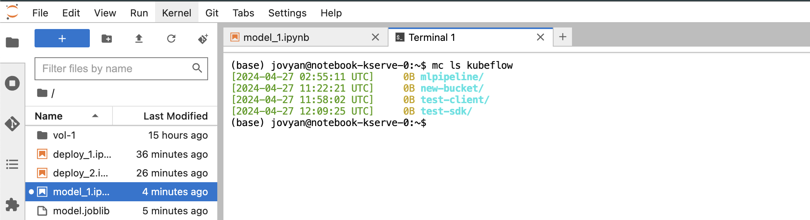

---
### 단계3: minio_credential.yaml
```shell
vim minio_credential.yaml
```
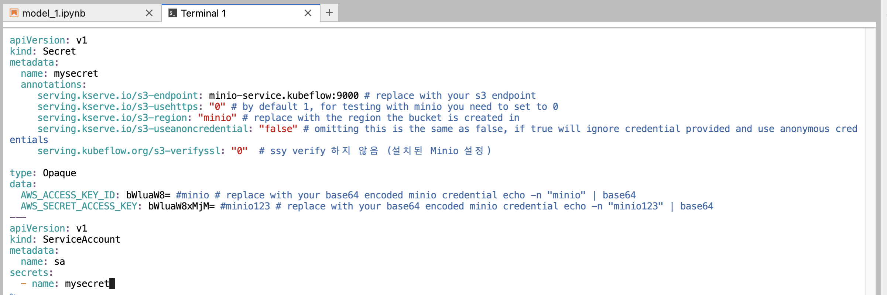

---
### 단계3: apply
```shell
kubectl apply -f minio_credential.yaml 
kubectl get serviceaccount
```
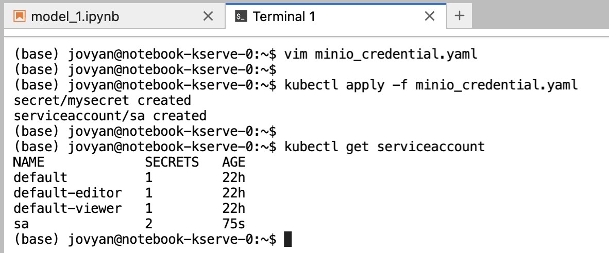

---
### 단계4: model_1.ipynb
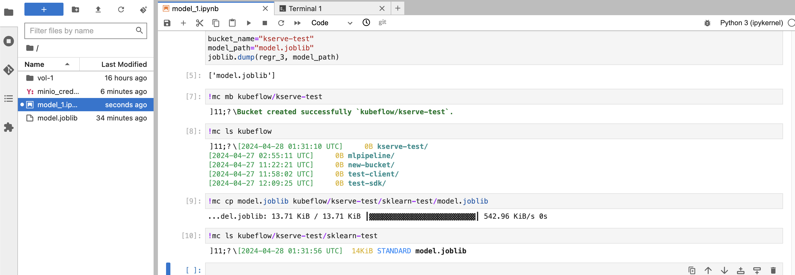

---
### 단계5: MinIO Browser
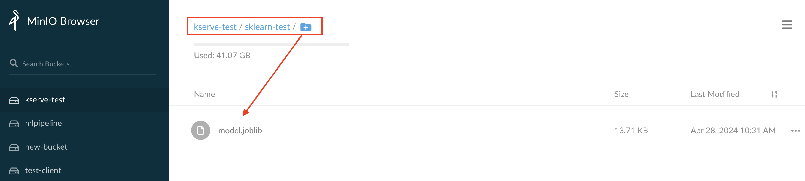

---
### 단계6: Model Server
- 기존 생성된 모델 모두 삭제 

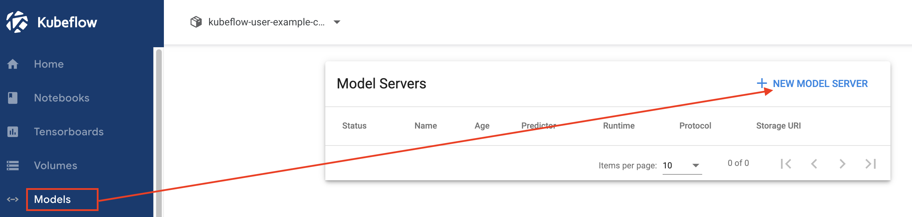

---
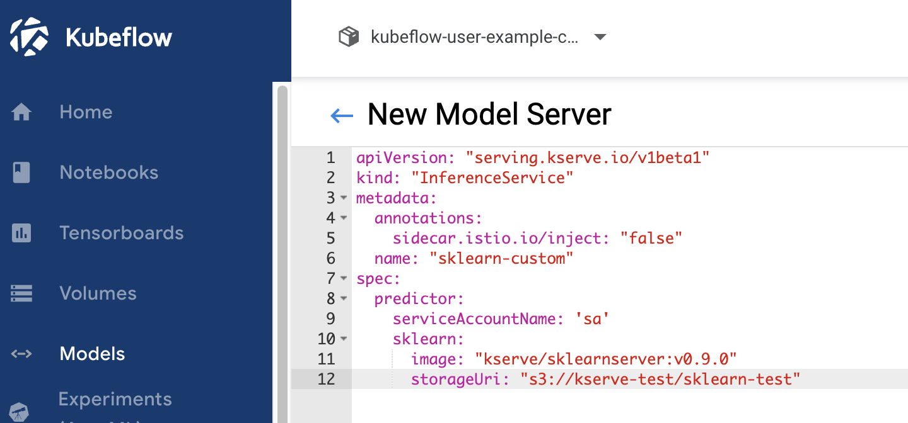

---
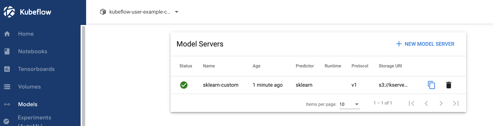

---
### 단계7: model_2.ipynb
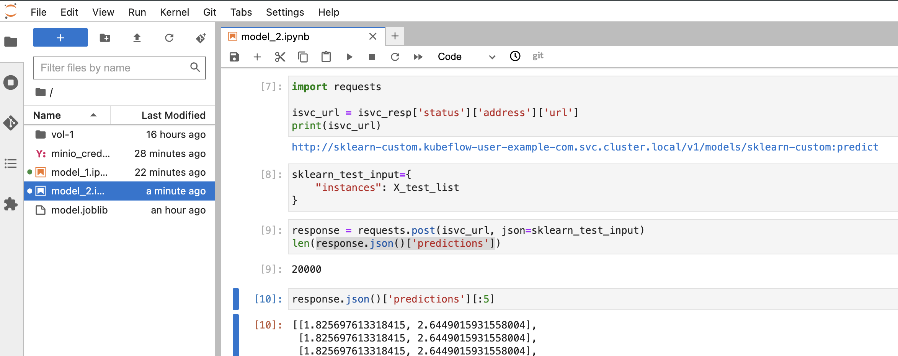

---
### Model Server 삭제 
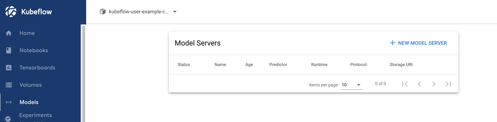


