# [Kubeflow Pipelines](https://www.kubeflow.org/docs/components/pipelines/v1/introduction/)
- Machine learning workflow
- 구성요소
  - UI: Experiment, Job 또는 Run을 관리하는 추적 
  - Engine: 단계별 ML 워크플로를 예약
  - SDK: Pipelines 및 Components를 정의하고 조작하기 
  - Notebook: SDK를 사용하여 시스템과 상호작용 

---
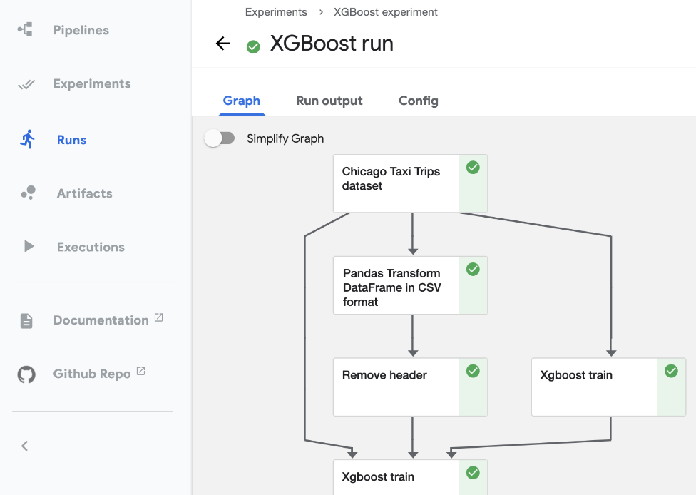

---
### [Airflow + MLflow vs Kubeflow Pipelines](https://aicurious.io/blog/2022-03-26-airflow-mlflow-or-kubeflow-for-mlops)
- MLOps 시스템의 전체 기능을 위해서는 Airflow를 MLflow와 결합해야 함.
- Kubeflow는 MLOps 시스템에 필요한 모든 기능을 거의 제공할 수 있음.

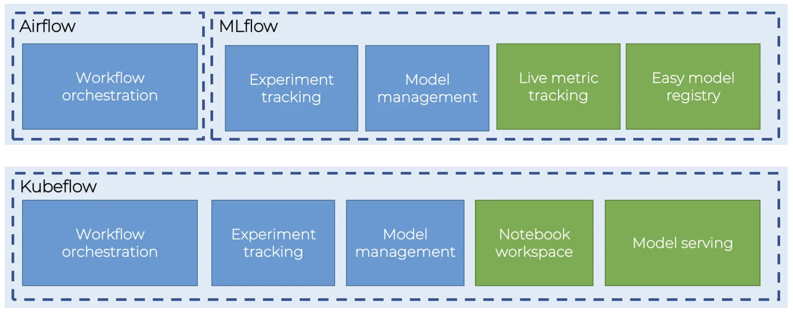

---
### [Kubeflow Component](https://www.kubeflow.org/docs/components/pipelines/v1/concepts/component/)
- Component Code
  - Client code: 작업을 제출하기 위해 엔드포인트와 통신하는 코드 
  - Runtime code: 실제 작업을 수행하고 일반적으로 클러스터에서 실행되는 코드
- [Component definition](https://www.kubeflow.org/docs/components/pipelines/v1/reference/component-spec/)
  - Metadata: 이름, 설명 등
  - Interface: 입력/출력 사양(이름, 유형, 설명, 기본값 등)
  - Implementation: 구성 요소 입력에 대한 일련의 인수 값이 주어지면 구성 요소를 실행하는 방법에 대한 사양

---
### 단계1: AuthorizationPolicy.yaml
```shell
vim AuthorizationPolicy.yaml
kubectl apply -f AuthorizationPolicy.yaml

kubectl get authorizationpolicy -n kubeflow | grep bind
```
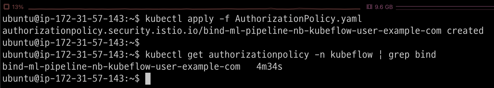

---
### 단계2: poddefault.yaml
```shell
vim poddefault.yaml
kubectl apply -f poddefault.yaml

kubectl get poddefault -A
```
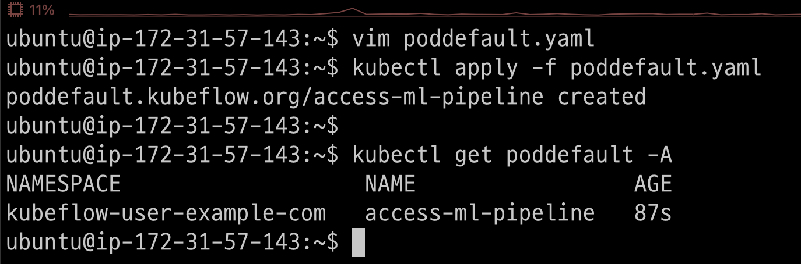

---
### 단계3: New Notebook
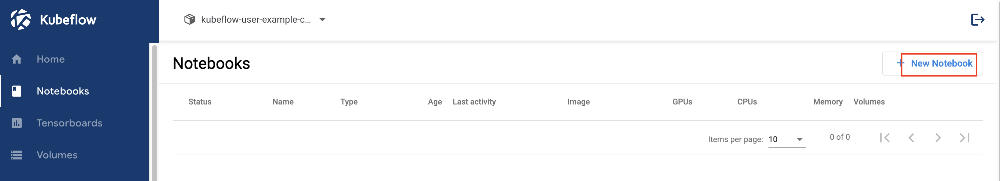

---
### 단계4: Name & Docker Image
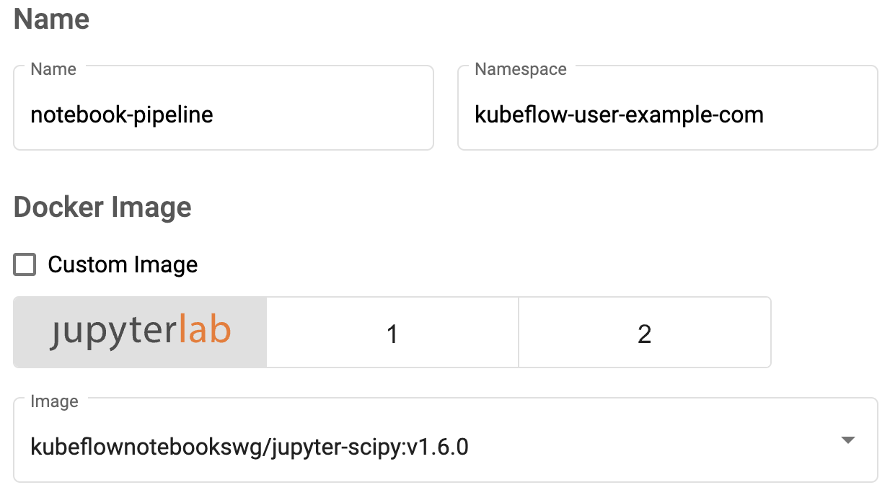

---
### 단계5: CPU / RAM
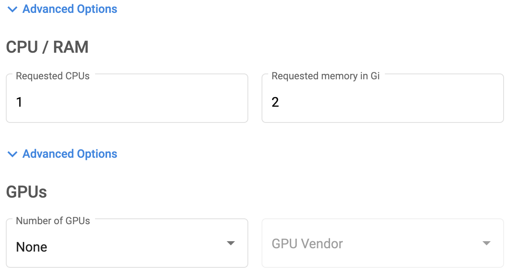

---
### 단계6: Volume
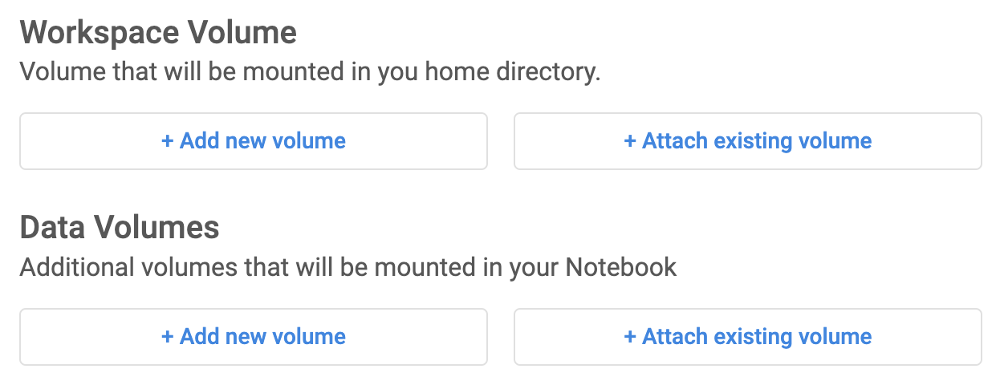

---
### 단계7: Configuration & Launch
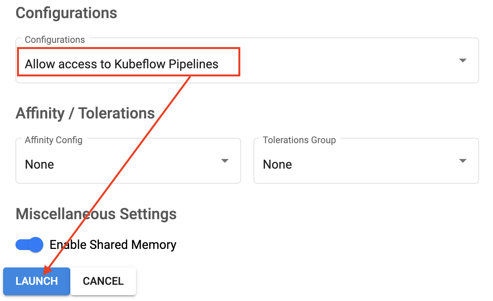

---
### 단계8: Connect
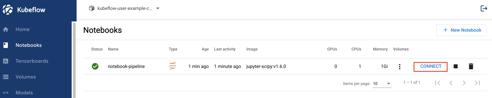

---
### 단계9: create_component.ipynb
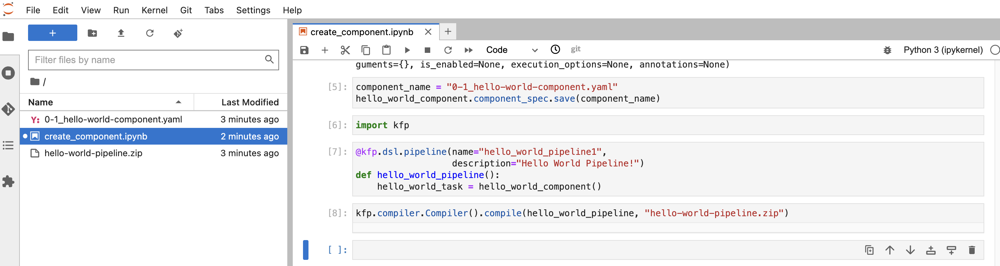

---
### 단계10: Download > hello-world-pipeline.zip
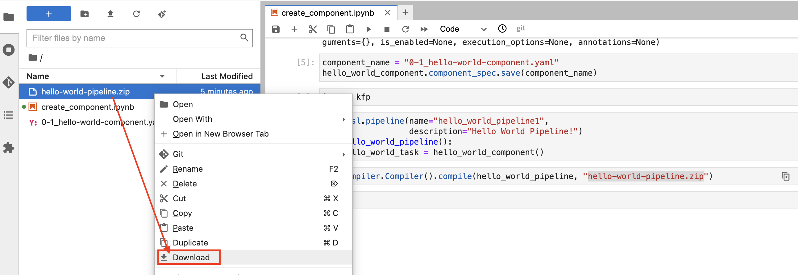

---
### 단계11: Upload pipeline


---
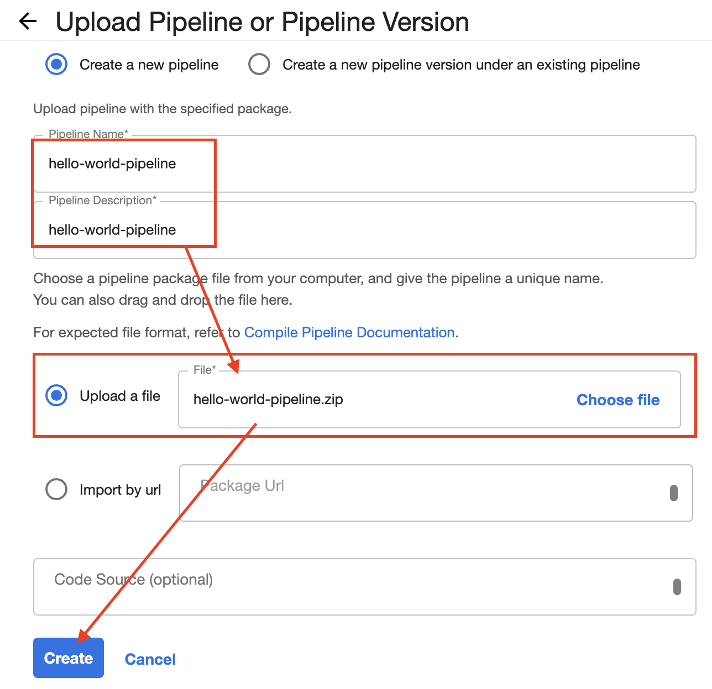

---
### 단계12: Create experiment
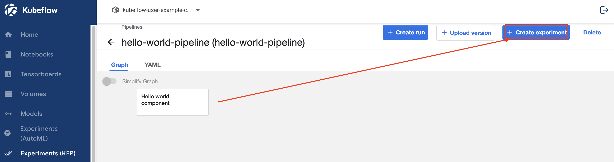

---
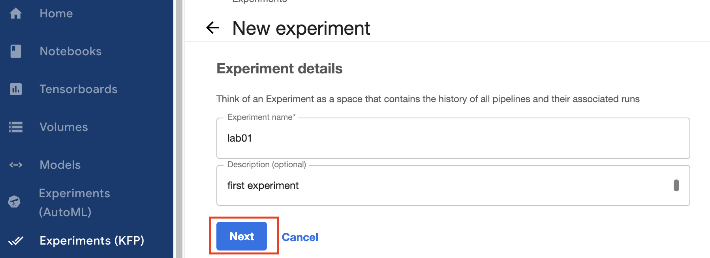

---
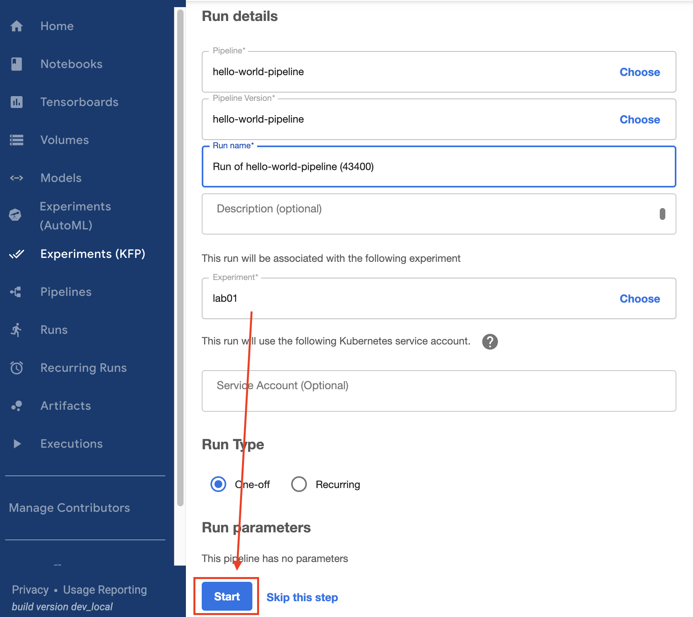

---
### 단계13: 결과 확인 
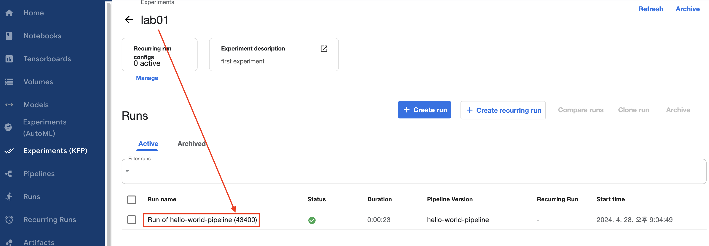

---


