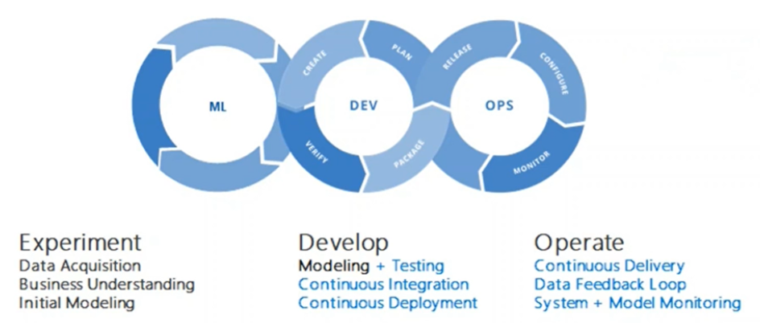
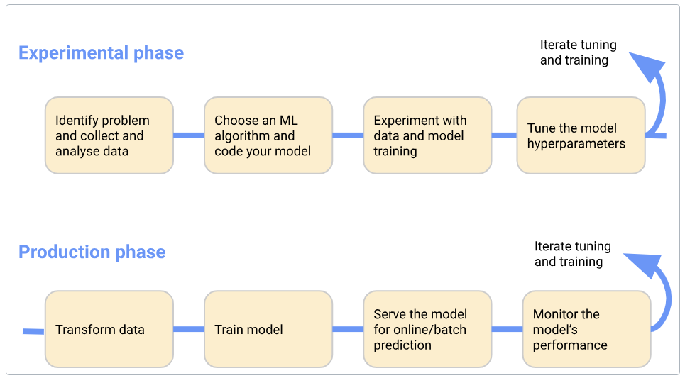
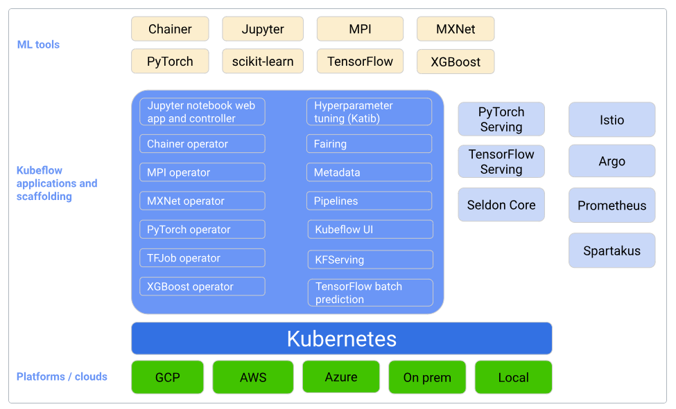
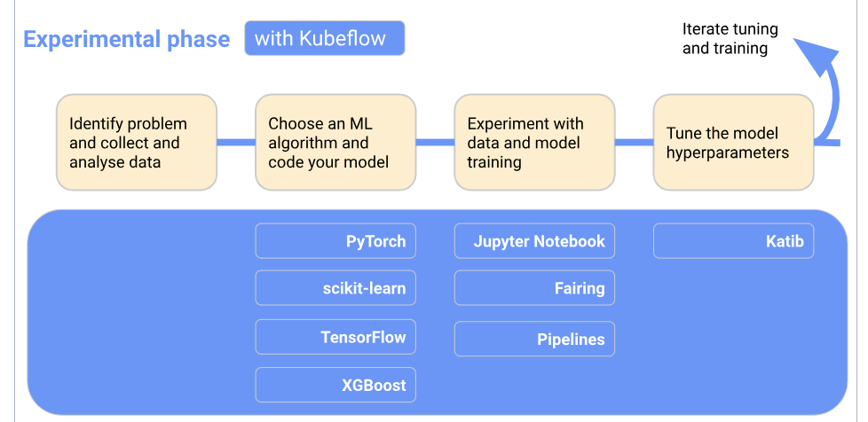
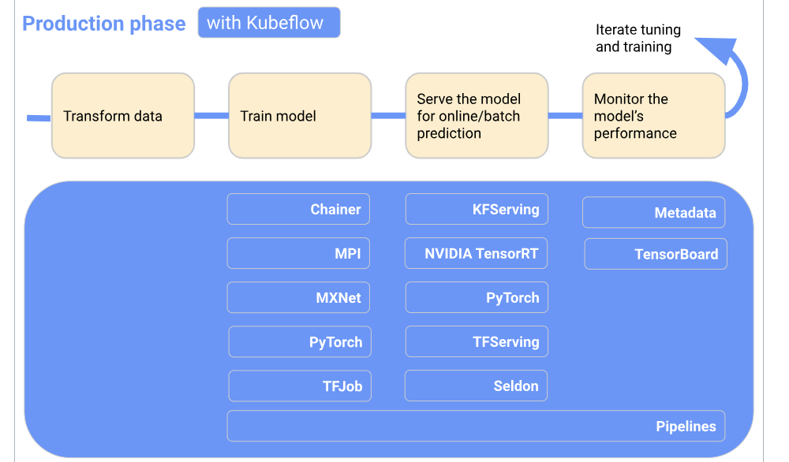

# MLOps = ML + DevOps
- 프로덕션에서 ML\DL 모델을 안정적이고 효율적으로 배포하고 유지 관리하는 것을 목표로 하는 일련의 사례 

---
- Experimental phase: 초기 가정을 기반으로 모델을 개발하고 모델을 반복적으로 테스트 및 업데이트하여 원하는 결과를 생성합니다.
- Production phase: 다음 프로세스를 수행하는 시스템을 배포합니다.

---
# [Kubeflow](https://www.kubeflow.org/docs/started/architecture/)
- Kubeflow는 Kubernetes용 ML 툴킷 입니다 .
- 다음 다이어그램은 Kubernetes 위에 ML 시스템의 구성 요소를 배열하기 위한 플랫폼인 Kubeflow를 보여줍니다.

---
### Experimental phase

---
### Production phase

---
### 강의자료 중 성능/용량 이슈로 강의 제외
> 1-1. kubeflow 설치 with Kubespray
> 2. kubeflow 기초/9. KServe - Transformer.md

### 참고문서
- https://www.youtube.com/watch?v=aL_f8fZXK3E&list=PL6ZWs3MJaiphOwtHQvBCA4GNw-EPDely-&index=11
- https://github.com/myoh0623/kubeflow/blob/master/section8_pipeline/1-1_add_pipeline.ipynb