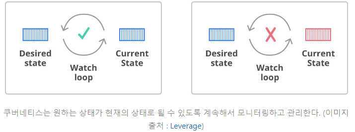
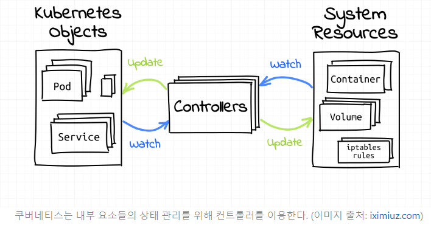
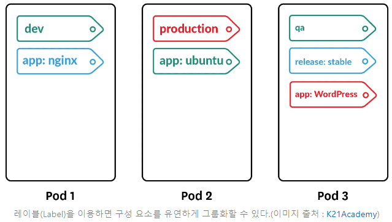
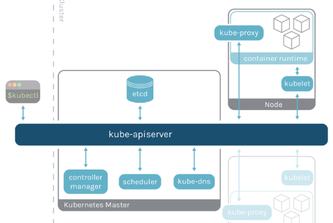

# [쿠버네티스](https://seongjin.me/kubernetes-core-concepts/)
- 쿠버네티스(Kubernetes)는 컨테이너화 된 애플리케이션의 대규모 배포, 스케일링 및 관리를 간편하게 만들어주는 오픈 소스 기반 컨테이너 오케스트레이션(Container Orchestration) 도구다.
- 같은 역할을 하는 도구로서 도커 스웜(Docker Swarm), 아파치 메소스(Apache Mesos), 노마드(Nomad) 등이 대규모 컨테이너의 효율적 제어라는 동일한 목적 아래 발전되어 왔으나, 2022년 현재는 쿠버네티스가 컨테이너 기반 인프라 시장에서 사실상의 표준으로 자리 잡은 상태다.

---
## 컨테이너 오케스트레이션(Container Orchestration)란?
- 컨테이너 오케스트레이션(Container Orchestration)을 해석하자면, "컨테이너화 된 애플리케이션에 대한 자동화된 설정, 관리 및 제어 체계"를 의미한다.
- 마이크로서비스 아키텍처(MSA; Microservice Architecture)에서는 프로젝트에 포함된 세부 기능들이 작은 서비스 단위로 분리되어 구축된다. 이 각각의 서비스를 구현할 때 컨테이너 기술이 흔하게 이용된다. 

---
- 컨테이너를 배포하고 관리해야 하는 상황이라면 아래의 4가지 이슈에 대한 해답을 반드시 찾아야 한다.
  1. 배포 관리 : 어떤 컨테이너를 어느 호스트에 배치하여 구동시킬 것인가? 각 호스트가 가진 한정된 리소스에 맞춰 어떻게 최적의 스케줄링을 구현할 것인가? 어떻게 하면 이러한 배포 상태를 최소한의 노력으로 유지 관리할 수 있을 것인가?
  2. 제어 및 모니터링 : 구동 중인 각 컨테이너들의 상태를 어떻게 추적하고 관리할 것인가?
  3. 스케일링 : 수시로 변화하는 운영 상황과 사용량 규모에 어떻게 대응할 것인가?
  4. 네트워킹 : 이렇게 운영되는 인스턴스 및 컨테이너들을 어떻게 상호 연결할 것인가?

`위의 4가지 이슈를 해결하기 위해 나타난 개념이 바로 컨테이너 오케스트레이션(Container Orchestration)이다.`

---
## 쿠버네티스의 핵심 설계 사상 5가지
### 1. 선언적 구성 기반의 배포 환경
- 쿠버네티스에서는 동작을 지시하는 개념(예: 레플리카를 5개 만들어라)보다는 원하는 상태를 선언하는 개념(예: 내 호스트의 레플리카를 항상 5개로 유지하라)을 주로 사용한다.

---
### 2. 기능 단위의 분산
- 쿠버네티스에서는 각각의 기능들이 개별적인 구성 요소로서 독립적으로 분산되어 있다.
- 실제로 노드(Node), 레플리카셋(ReplicaSet), 디플로이먼트(Deployment), 네임스페이스(Namespace) 등 클러스터를 구성하는 주요 요소들이 모두 컨트롤러(Controller)로서 구성되어 있다.

---
### 3. 클러스터 단위 중앙 제어
- 쿠버네티스에서는 전체 물리 리소스를 클러스터 단위로 추상화하여 관리한다. 
- 클러스터 내부에는 클러스터의 구성 요소들에 대해 제어 권한을 가진 컨트롤 플레인(Control Plane) 역할의 마스터 노드(Master Node)를 두게 되며, 관리자는 이 마스터 노드를 이용하여 클러스터 전체를 제어한다.

---
### 4. 동적 그룹화
- 쿠버네티스의 구성 요소들에는 쿼리 가능한 레이블(Label)과 메타데이터용 어노테이션(Annotation)에 임의로 키-값 쌍을 삽입할 수 있다.

---
### 5. API 기반 상호작용
- 쿠버네티스의 구성 요소들은 오직 Kubernetes API server(kube-apiserver)를 통해서만 상호 접근이 가능한 구조를 가진다. 

