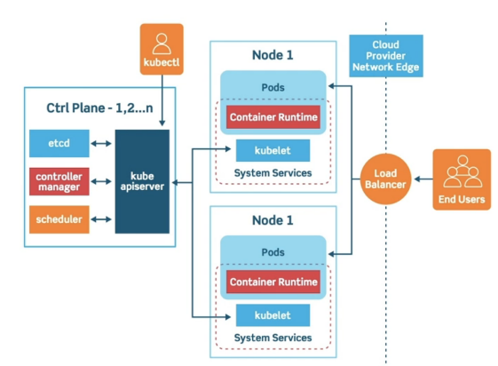
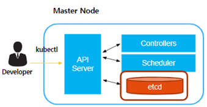
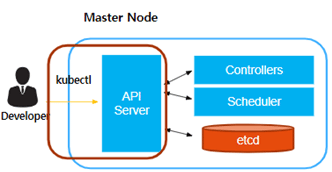
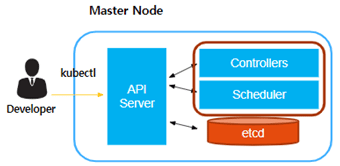
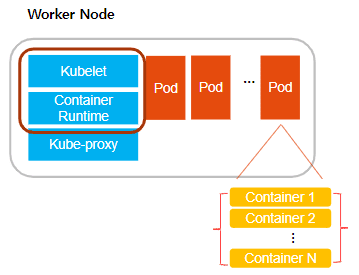
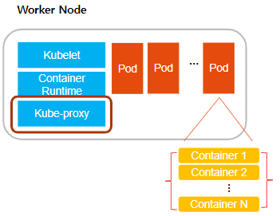
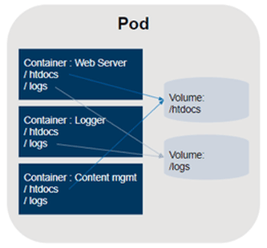
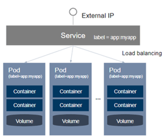
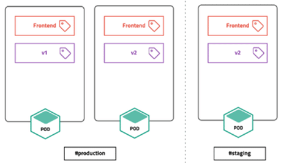

# [쿠버네티스 클러스터](https://blog.bespinglobal.com/post/k8s-%EA%B0%9C%EB%85%90-%EB%B0%8F-cluster-%EA%B5%AC%EC%B6%95-%EC%8B%A4%EC%8A%B5/)
- 쿠버네티스 아키텍처에서 클러스터(Cluster)란 컨테이너 형태의 애플리케이션을 호스팅하는 물리/가상 환경의 노드들로 이루어진 집합을 의미한다.

---
## [쿠버네티스 클러스터 구성요소](https://velog.io/@pinion7/Kubernetes-%ED%81%B4%EB%9F%AC%EC%8A%A4%ED%84%B0%EB%A5%BC-%EC%9D%B4%ED%95%B4%ED%95%98%EA%B3%A0-%ED%81%B4%EB%9F%AC%EC%8A%A4%ED%84%B0-%EA%B5%AC%EC%84%B1%EC%9A%94%EC%86%8C%EB%A5%BC-%ED%8C%8C%EC%95%85%ED%95%B4%EB%B3%B4%EA%B8%B0)
- 쿠버네티스 클러스터는 크게 `Control Plane(또는 Master Node)`과 `Node(또는 Worker Node)`라고 하는 2가지 영역으로 구성되어 있다.

---
### Master Node
- 주요 컨트롤 유닛으로서 Worker Nodes를 관리하는 주체
- 클러스터에 관한 전반적인 결정 및 이벤트를 감지, 반응하는 역할

#### 1. kubectl
- 관리자가 쿠버네티스에 명령 및 관리하기 위해 사용하는 CLI 명령줄 도구
- API Server 로 요청

---
#### 2. ETCD
- 설정관리, 서비스 디스커버리, 스케줄링 등을 위한 데이터를 저장하는 저장소

#### 3. API Server
- 모든 조회나 요청을 담당
- 권한을 체크하여 적절한 권한 없을 경우 차단

---
#### 4. Controllers
- 논리적으로 다양한 컨트롤러가 존재(복제, 노드, 엔드포인트…)
- 지속적으로 상태를 체크하고 원하는 상태를 유지 (Desired State)
#### 5. Scheduler
- 새로 생성된 Pod 를 감지하고 실행할 노드를 선택
- Pod 생성을 위해 요청한 리소스, 우선순위 및 기타 제약조건에 따라서 노드에 바인드 역할

---
### Worker Node
- 할당된 task를 요청대로 수행하는 시스템
- 컨테이너들 간의 네트워크 등 서비스에 필요한 전반적인 일들을 마스터 노드와 통신하며 수행

---
#### 1. kubelet
- Pod 를 실행/중지하고 상태를 체크 후에 API Server 에 보고
- CRI (Container Runtime) – Docker, Containerd, CRI-O, ……

---
#### 2. kube-proxy
- 각 노드에서 실행되는 네트워크 프록시로 내/외부 통신 설정
- Pod간 통신(overlay network), 노드간의 통신 가능(Service)
- 로드밸런싱 기능 제공

---
#### 3. pod
- 가장 작은 배포 단위
- 단일 노드에 배포된 하나 이상의 컨테이너 그룹
- 전체 클러스터에서 고유한 IP 할당

---
## kubernetes Object
### 1. Volume
- DB와 같이 영구적으로 파일을 저장해야 하는 경우, 컨테이너 restart와 관련없이 파일을 영구적으로 저장해야 하는데, 이러한 Storage 형태를 뜻함
- Volume은 Pod 내의 컨테이너 간의 공유 가능

---
### 2. Service
- Pod를 Service로 제공할 때, 일반적으로 하나의 Pod로 Service 하는 경우는 드물고, 여러 개의 Pod로 Service하면서 이를 LB를 이용해서 하나의 IP와 Port로 묶어서 Service 제공
- Service는 특정 label을 가지고 있는 Pod간에만 Load Balancing을 통하여 외부로 서비스 제공한다.

---
### 3. Namespace
- Namespace는 쿠버네티스 클러스터 내의 논리적인 분리 단위
- 즉, 하나의 클러스터 내에 개발/운영/테스트 환경이 있을 때, 클러스터를 개발/운영/테스트 3개의 Namespace로 나눠서 운영

---
# 참고문서
- https://velog.io/@pinion7/Kubernetes-%ED%81%B4%EB%9F%AC%EC%8A%A4%ED%84%B0%EB%A5%BC-%EC%9D%B4%ED%95%B4%ED%95%98%EA%B3%A0-%ED%81%B4%EB%9F%AC%EC%8A%A4%ED%84%B0-%EA%B5%AC%EC%84%B1%EC%9A%94%EC%86%8C%EB%A5%BC-%ED%8C%8C%EC%95%85%ED%95%B4%EB%B3%B4%EA%B8%B0
- https://blog.bespinglobal.com/post/k8s-%EA%B0%9C%EB%85%90-%EB%B0%8F-cluster-%EA%B5%AC%EC%B6%95-%EC%8B%A4%EC%8A%B5/
- https://seongjin.me/kubernetes-cluster-components/

