# [Installing Kubernetes on Windows](https://phoenixnap.com/kb/kubernetes-on-windows#ftoc-heading-4)
## 사전조건
- Install Docker for Windows
- Minikube requires at least 2GB of RAM and 2CPUs.
- Kind requires 8GB of RAM to deliver good performance.
- Installing Kubernetes via `Docker settings` takes up to 8GB of RAM.
---
## [1. Hyper-V 설정](https://learn.microsoft.com/ko-kr/virtualization/hyper-v-on-windows/quick-start/enable-hyper-v) 


---
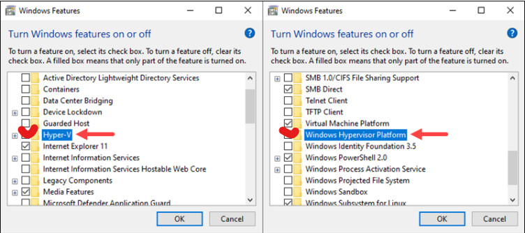
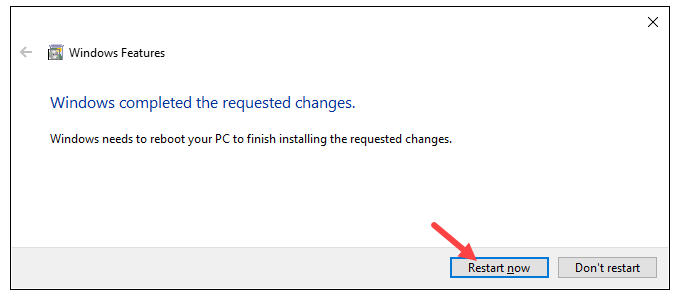

---
- Check if Hyper-V is correctly installed. Open Windows PowerShell as an administrator and run the following command:
```shell
Get-WindowsOptionalFeature -Online -FeatureName Microsoft-Hyper-V
```
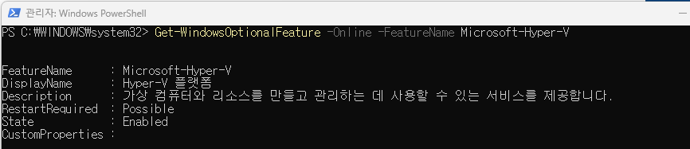

---
## [2. install kubectl](https://kubernetes.io/docs/tasks/tools/install-kubectl-windows/)
> 쿠버네티스 클러스터와 상호작용하기 위해 쿠버네티스 커맨드라인 인터페이스를 설치 

- Windows PowerShell 오픈

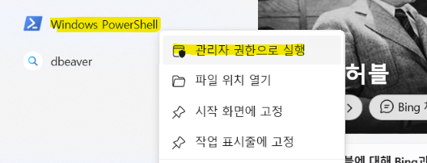

---
- 아래 명령어 실행 
```shell
curl.exe -LO "https://dl.k8s.io/release/v1.28.4/bin/windows/amd64/kubectl.exe"
```
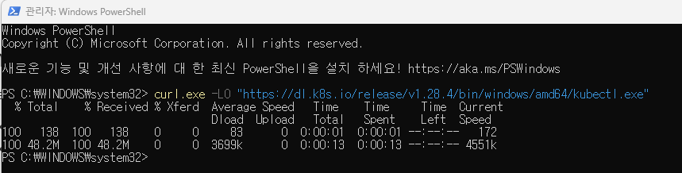
- 시스템 환경 변수 편집 실행 

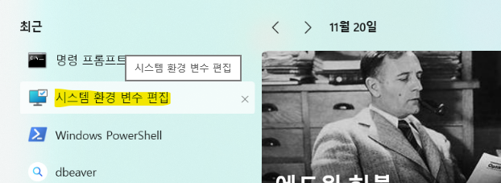

---
- 고급 -> 설정

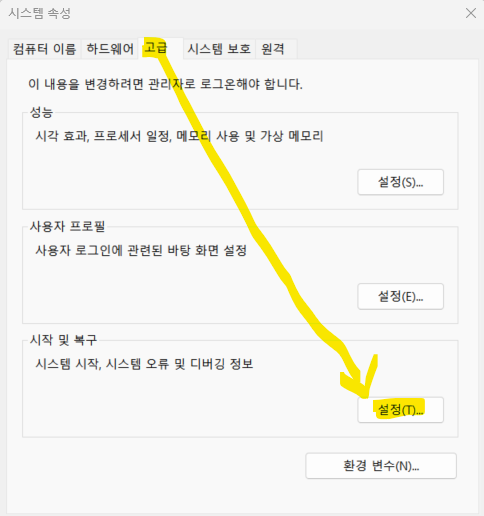

---
- 시스템 변수 -> Path 편집

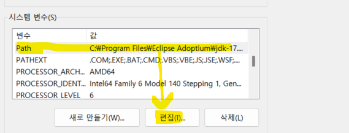
- 새로 만들기 -> `C:\kubectl`

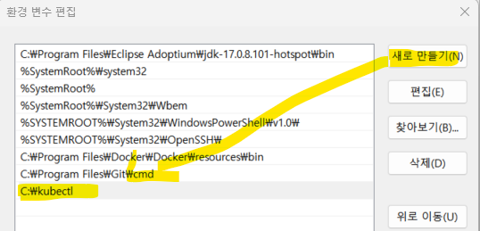

---
- PowerShell -> `kubectl` 실행 

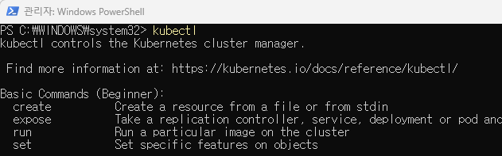

---
## 3. Via Docker GUI
> Docker Desktop을 이용하여 Kubernetes Cluster 설치 

- Docker Desktop -> 설정 

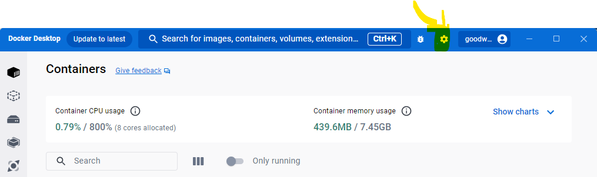

---
- Kubernetes -> Enable Kubernetes -> Apply & restart

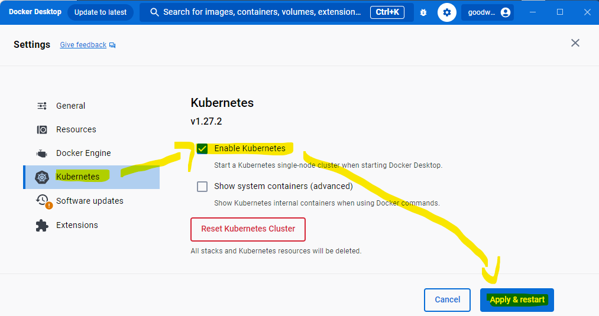

---
- Kubernetes Cluster Installation


---
- 결과 확인 

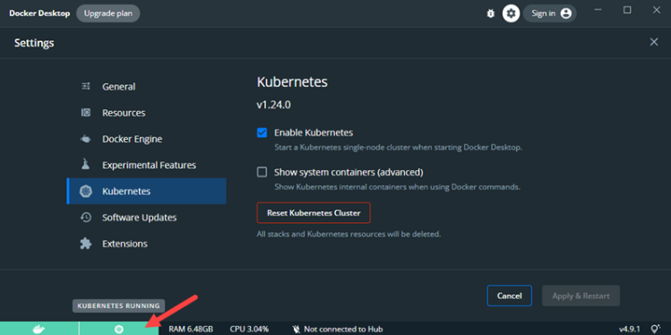

---
## 4. Via Minikube
> 로컬 머신에서 쿠버네티스를 테스팅, 개발 또는 학습 목적으로 사용함 
- [Minikube Installation](https://minikube.sigs.k8s.io/docs/start/)
```shell
New-Item -Path 'c:\' -Name 'minikube' -ItemType Directory -Force
Invoke-WebRequest -OutFile 'c:\minikube\minikube.exe' -Uri 'https://github.com/kubernetes/minikube/releases/latest/download/minikube-windows-amd64.exe' -UseBasicParsing
```
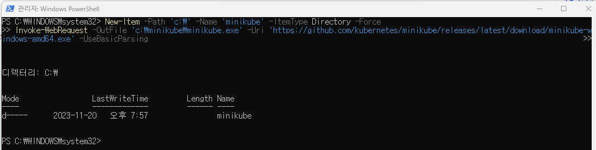

---
- Add the minikube.exe binary to your PATH.
```shell
$oldPath = [Environment]::GetEnvironmentVariable('Path', [EnvironmentVariableTarget]::Machine)
if ($oldPath.Split(';') -inotcontains 'C:\minikube'){
  [Environment]::SetEnvironmentVariable('Path', $('{0};C:\minikube' -f $oldPath), [EnvironmentVariableTarget]::Machine)
}
```
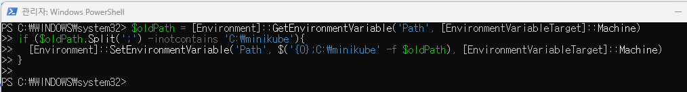

---
- 컴퓨터 재실행 후 minikube를 이용한 cluster 생성!!
```shell
minikube start
```
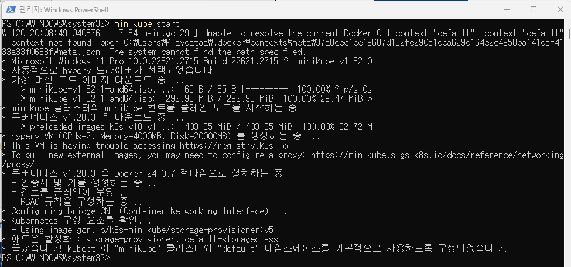

---

- minikube를 이용한 cluster 삭제 
```shell
minikube delete
```
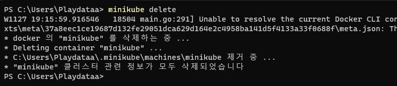

---
## [4. Via Kind(옵션)](https://kmaster.tistory.com/26)
> Kind 는 Docker Container를 노드로 사용하여 로컬 Kubernetes 클러스터를 실행하기 위한 도구이다.
- [Install Kind](hhttps://kind.sigs.k8s.io/docs/user/quick-start/#installation)
```shell
curl.exe -Lo kind-windows-amd64.exe https://kind.sigs.k8s.io/dl/v0.20.0/kind-windows-amd64
```
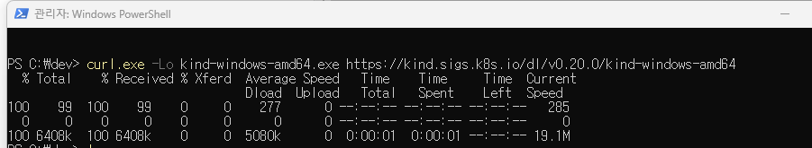

---
- 다운로드 파일 이동 
```shell
Move-Item .\kind-windows-amd64.exe c:\dev\kind.exe
```
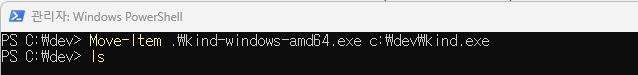
- 환경변수에 path 추가 

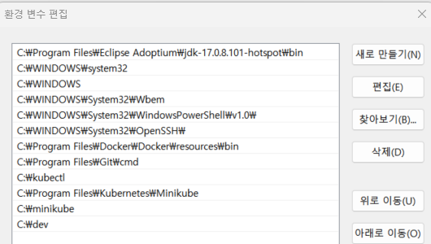

---
- kind를 이용하여 cluster 생성  
```shell
kind create cluster --name <이름>
```
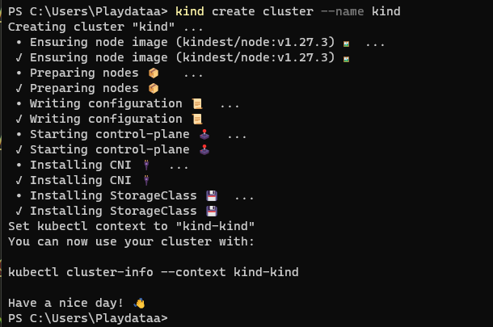

---
- 생성된 cluster확인 

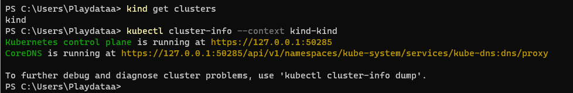
- cluster 삭제
```shell
kind delete cluster --name <이름>
```
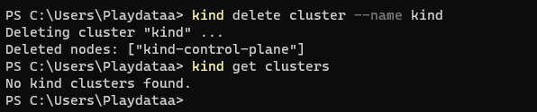

---
## [MiniKube vs Kind](https://www.padok.fr/en/blog/minikube-kubeadm-kind-k3s)


---
## [5. Install Kubernetes Dashboard(옵션)](https://kubernetes.io/docs/tasks/access-application-cluster/web-ui-dashboard/)
```shell
kubectl apply -f https://raw.githubusercontent.com/kubernetes/dashboard/v2.7.0/aio/deploy/recommended.yaml
```
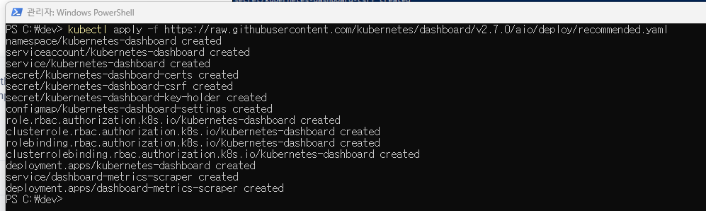

---
```shell
kubectl proxy
```
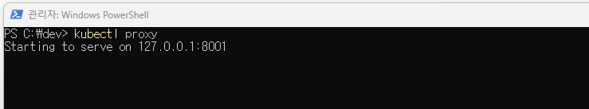

- [token 생성](https://github.com/kubernetes/dashboard/blob/master/docs/user/access-control/creating-sample-user.md)
```shell
kubectl -n kubernetes-dashboard create token kubernetes-dashboard
```
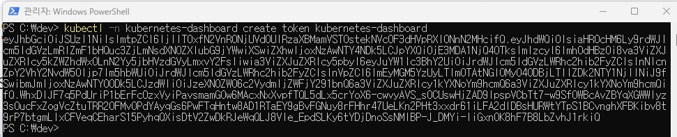

---
- Access the Dashboard Login page 
  - 위에서 생성한 토큰 적용 
```http
http://localhost:8001/api/v1/namespaces/kubernetes-dashboard/services/https:kubernetes-dashboard:/proxy/
```
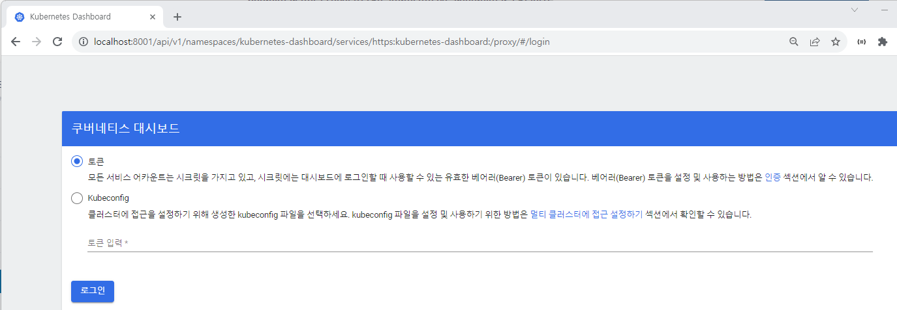

---
- Kubernetes Dashboard 로그인 성공!!
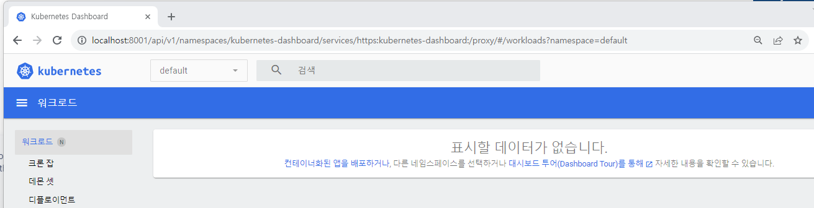

