# [MiniKube](https://minikube.sigs.k8s.io/docs/)
- [참고용](https://www.padok.fr/en/blog/minikube-kubeadm-kind-k3s)

Minimum requirements for the host machine:
- CPU: 2
- Memory: 2 GB
- Disk space: 20 GB

---
## MiniKube Architecture
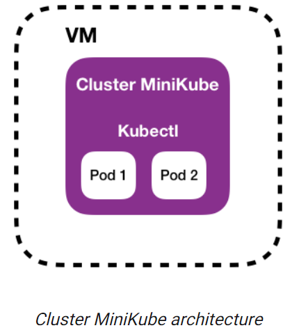

---
## MiniKube 장단점
- The inconvenience of this solution is this is not possible to add other nodes

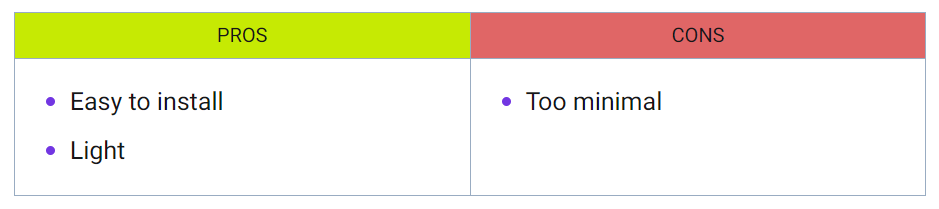

---
# [Hello Minikube](https://kubernetes.io/docs/tutorials/hello-minikube/)
## 1. Create a minikube cluster
```shell
minikube start
```

---
## 2. Open the Dashboard
```shell
minikube dashboard
```
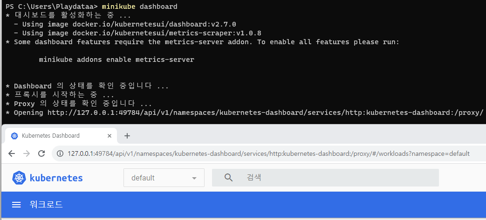

---
- [요류 발생: Unable to resolve the current Docker CLI context "default": context "default": context not found: on Windows](https://stackoverflow.com/questions/77208746/unable-to-resolve-the-current-docker-cli-context-default-context-default-c)
```shell
# 해결방법 
docker context use default
```

---
## 3. Create a Deployment
- create a Deployment that manages a Pod.
```shell
# Run a test container image that includes a webserver
kubectl create deployment hello-node --image=registry.k8s.io/e2e-test-images/agnhost:2.39 -- /agnhost netexec --http-port=8080
```
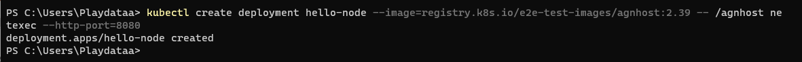

- View the Deployment
```shell
kubectl get deployments
```
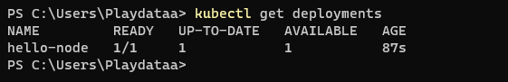

---
- View the Pod
```shell
kubectl get pods
```
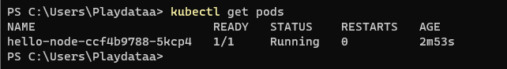

- View cluster events
```shell
kubectl get events
```
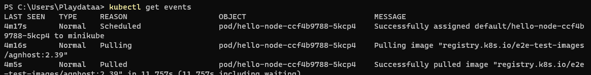

---
- View the kubectl configuration
```shell
kubectl config view
```
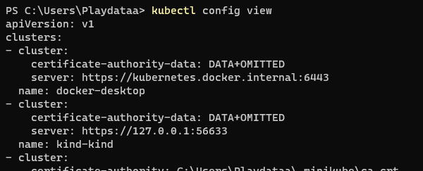

- View application logs for a container in a pod
```shell
kubectl logs <pod name>
```
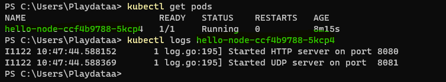

---
## 4. Create a Service
- Expose the Pod to the public internet
```shell
kubectl expose deployment hello-node --type=LoadBalancer --port=8080
```
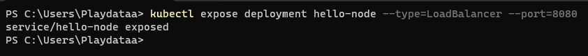

- View the Service
```shell
kubectl get services
```
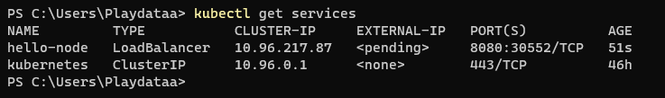

---
- Run the following command
    - This opens up a browser window that serves your app and shows the app's response.
```shell
minikube service hello-node
```
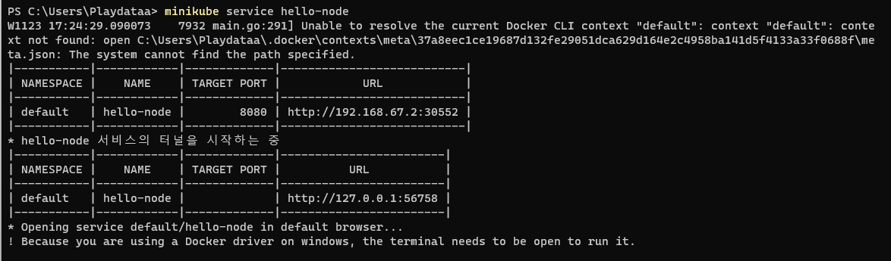

---
## 5. Enable addons
- List the currently supported addons
```shell
minikube addons list
```
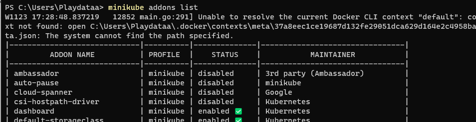

---
- Enable an addon, for example
```shell
minikube addons enable metrics-server
```
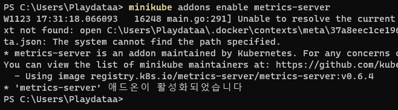

---
- View the Pod and Service you created by installing that addon
```shell
kubectl get pod,svc -n kube-system
```
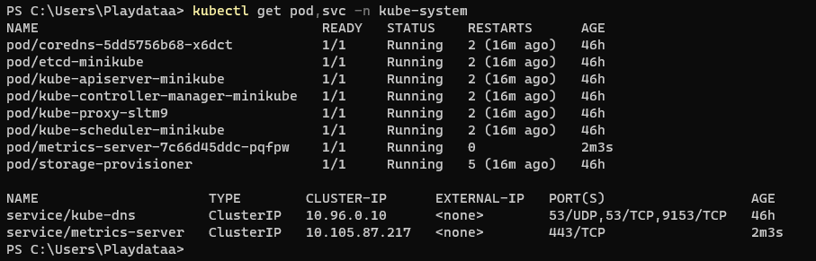

---
- Disable `metrics-server`
```shell
minikube addons disable metrics-server
```
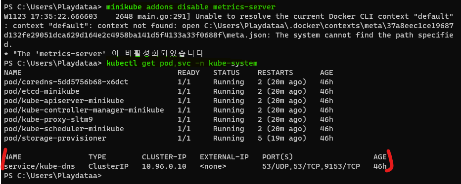

---
## 6. Clean up 
```shell
kubectl delete service hello-node
```
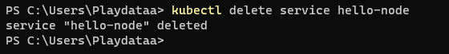
```shell
kubectl delete deployment hello-node
```
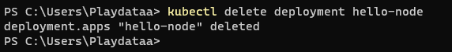
```shell
minikube stop
```
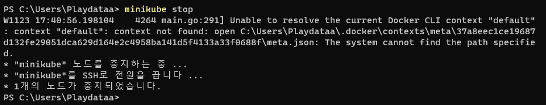

